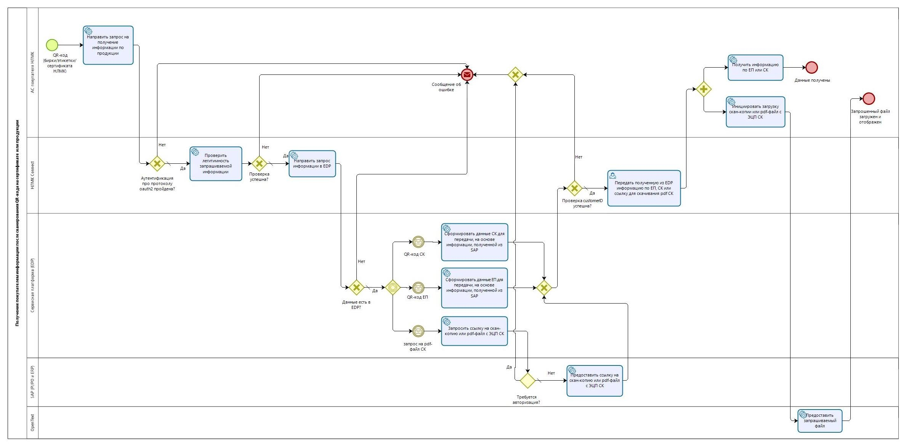

# Общая информация о API НЛМК Connect

В данной инструкции описаны шаги подключения информационной (автоматизированной) системы (далее - ИС) клиента к сервису API НЛМК Connect и работа с ним.

::: tip API НЛМК Connect 
Это сервис, с помощью которого покупатель может получить информацию о закупленной продукции в свои учётные системы и системы складского учёта посредством интеграционного API
:::

Модель бизнес-процесса приведена на следующем рисунке

[Открыть изображение в полном размере](https://doc.nlmk.online/images/api/01.jpeg) (файл jpg, 260кб)

Таблица 2.1 Шаги бизнес-процесса «Получение покупателем информации по характеристикам отгруженной продукции через API»

                                                                                                                                                               
|  № п/п |  Наименование шага |  Участники |  Входные данные | Выходные данные | Описание |
|---|---|---|---|---|---|
|	1	|	Направить запрос на получение информации по продукции (Вне рамок системы)	|	АС покупателя продукции Группы компаний НЛМК	|	QR-код продукции НЛМК (бирки/этикетки/сертификата)	|	Запрос на получение данных по QR-коду	| АС покупателя, направляет запрос в НЛМК Connect на получение данных по QR-коду |
|	2	|	Авторизация АС покупателя по протоколу oauth2	|	НЛМК Connect	|	Данные покупателя в составе: идентификатор клиента OAuth, зарегистрированный в Commerce, секрет клиента, логин клиента Commerce, пароль клиента Commerce.	|	Результат прохождения авторизации (успешно/неуспешно)	| АС покупателя [проходит аутентификацию по протоколу OAuth 2.0](/api/methods.html#аутентификация-и-токен-доступа) |
|	3	|	Проверить легитимность запрашиваемой информации	|	НЛМК Connect	|	Данные покупателя	|	Результат выполнения проверки (успешна/неуспешна)	| НЛМК Connect выполняет проверку легитимности запрошенных данных (логин от учетной записи Commerce, принадлежность данных, содержащихся в запрашиваемом QR-коде к учетной записи) |
|	4	|	Направить запрос информации в EDP	|	НЛМК Connect	|	Запрос на получение данных по QR-коду	|	Запрос на получение данных по QR-коду	| НЛМК Connect маршрутизирует запрос на получение данных по QR-коду в Сервисную платформу (EDP) |
|	5	|	Сформировать данные СК для передачи на основе информации, полученной из SAP	|	Сервисная платформа (EDP)	|	Запрос с QR-кодом, данные по продукции, полученные из SAP	|	Данные по СК	| Сервисная платформа (EDP) анализирует поступивший запрос, осуществляет по QR-коду поиск данных, переданных из SAP, формирует набор данных по СК |
|	6	|	Сформировать данные ЕП для передачи на основе информации, полученной из SAP	|	Сервисная платформа (EDP)	|	Запрос с QR-кодом, данные по продукции, полученные из SAP	|	Данные по ЕП	| Сервисная платформа (EDP) анализирует поступивший запрос, осуществляет по QR-коду поиск данных, переданных из SAP, формирует набор данных по ЕП |
|	7	|	Запросить ссылку на скан-копию или pdf-файл с ЭЦП СК	|	Сервисная платформа (EDP)	|	Запрос на pdf-файл СК	|	Запрос ссылки на скан-копию или pdf-файл с ЭЦП СК	| Сервисная платформа (EDP) направляет в SAP ERP запрос на ссылку скан-копии или pdf-файл с ЭЦП СК |
|	8	|	Предоставить ссылку на скан-копию или pdf-файл с ЭЦП СК	|	SAP ERP	|	Запрос ссылки на скан-копию или pdf-файл с ЭЦП СК	|	Ссылка на скан-копию или pdf-файл с ЭЦП СК	| SAP ERP по запросу выполняет проверку необходимости авторизованного доступа и, в случае отсутствия такой необходимости, передает в Сервисную платформу (EDP) ссылку на скан-копию или pdf- файл с ЭЦП СК |
|	9	|	Проверка «customerId»	|	НЛМК Connect	|	Значение «customerId» полученное из EDP, значение "customerId" полученное из Commerce	|	Результат проверки (успешна/неуспешна)	| НЛМК Connect выполняет проверку соответствия значения «customerId», полученного из EDP (что значение в SAP) значению «customerId», которое поступило из Commerce. Для того, чтобы понимать, может ли АС покупателя видеть запрошенные данные. Проверка считается успешной, если сравниваемые значения одинаковые.  |
|	10	|	Передать полученную из EDP информацию по ЕП, СК или ссылку для скачивания pdf СК	|	НЛМК Connect	|	Проверка «customerId» успешна, данные по СК или данные по ЕП или ссылка на скан-копию или pdf-файл с ЭЦП СК	|	Проверка «customerId» успешна, данные по СК или данные по ЕП или ссылка на скан-копию или pdf-файл с ЭЦП СК	| НЛМК Connect маршрутизирует полученные из Сервисной платформы (EDP) данные в АС покупателя |
|	11	|	Получить информацию по ЕП или СК	|	АС покупателя продукции Группы компаний НЛМК	|	Данные по СК, или данные по ЕП	|	Данные по СК, или данные по ЕП	| АС покупателя получила запрошенные данные в составе тегов, описанных в [Приложение 1. Описание перечня передаваемых НЛМК Connect тегов](https://doc.nlmk.online/Product_API_Data_Specification.xlsx) |
|	12	|	Инициировать загрузку скан-копии или pdf-файла с ЭЦП СК (Вне рамок системы)	|	АС покупателя продукции Группы компаний НЛМК	|	Ссылка на скан-копию или pdf-файл с ЭЦП СК	|	Запрос на загрузку pdf-файл СК по указанной ссылке	| АС покупателя направляет в OpenText запрос на загрузку pdf-файл СК по полученной от НЛМК Connect ссылке |
|	13	|	Предоставить запрашиваемый файл	|	OpenText	|	Запрос на загрузку pdf-файл СК по указанной ссылке	|	Переданный в АС покупателя pdf-файл СК	| OpenText передает АС покупателя запрошенный pdf-файл |
|	14	|	Сформировать сообщение об ошибке	|	НЛМК Connect	|	Авторизация неуспешна, и/или проверка легитимности запроса покупателя неуспешна, и/или информация об отсутствии запрашиваемых данных в EDP, и/или информация о необходимости авторизации для получения ссылки на pdf сертификата, и/или проверка «customerId» не успешна	|	Информационное сообщение об ошибке	| НЛМК Connect формирует и передает АС покупателя информационное сообщение об ошибке |

