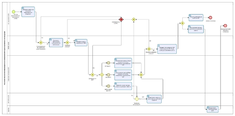

# Общая информация о API НЛМК Connect

API НЛМК Connect – сервис, с помощью которого покупатель может получить информацию о закупленной продукции в свои учётные системы и системы складского учёта посредством интеграционного API

В данной инструкции описаны шаги подключения информационной (автоматизированной) системы (далее - АС) покупателя к сервису НЛМК Connect и работа с ним.

Модель бизнес-процесса приведена на следующем рисунке

