# Претензии

## Общие сведения

Функционал работы с претензиями предназначен для предоставления клиенту возможности самостоятельно, посредством системы через личный кабинет, формировать и просматривать претензии по продукции ПАО “НЛМК”.

## Сценарий использования

Процесс работы с функционалом претензий включает в себя выполнение следующих процедур:

1. Переход к созданию новой претензии
2. Подбор позиций претензии
3. Заполнение полей претензии
4. Отправка претензии на рассмотрение
5. Просмотр списка претензий

::: warning Предусловия
Данному клиенту отгружены поставки, по которым может быть выставлена претензия.

У клиента имеется действующий договор с ПАО “НЛМК”.
:::

### 1. Переход к созданию новой претензии

Переход к форме создания претензии возможен:

* с главной страницы (вкладка “Претензии” → кнопка “Создать новую претензию”)
* из меню (пункт меню “Претензии” → пункт меню “Создать новую претензию”)
* со страницы списка претензий (кнопка “Создать новую претензию”)

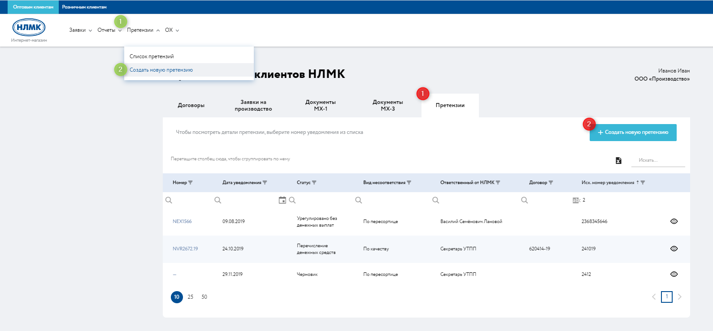
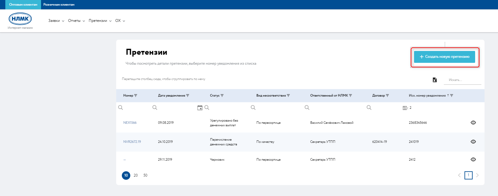

После перехода отобразится страница создания новой претензии с возможностью выбора договора и подбора позиций претензии. Есть возможность вернуться к списку претензии нажатием на кнопку “Вернуться”.

Предприятие-заявитель автоматически заполняется клиентом, связанным с текущим пользователем.

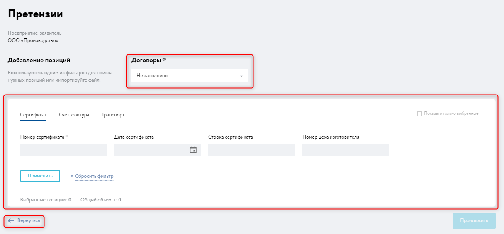

### 2. Подбор позиций претензии

Необходимо заполнить “Договор”, для этого нажмите на поле “Договор” и выбрать договор из списка доступных.
Для создания претензии доступны только договоры с ПАО “НЛМК”.

Далее следует осуществить подбор позиций, по которым выставляется претензия

Возможен подбор позиций по:

* сертификату
* счету-фактуре
* транспорту.

Для поиска позиций необходимо нажать кнопку «Применить» (4) – позиции будут отфильтрованы по заданным параметрам. При нажатии на кнопку «Сбросить фильтры» (5) поля фильтрации будут очищены.

В случае возникновения ошибки при подборе позиций рекомендуется обратиться в техническую поддержку.

При проставлении галки в чек-боксе «Показать только выбранные» (2) на странице поиска будут отображены только те позиции, которые отмечены галкой в чек-боксе.

Кнопки «Применить» и «Сбросить фильтры» работают для каждой вкладки поиска отдельно. Чтобы отфильтровать позиции по номеру счета-фактуры, необходимо нажать кнопку «Применить», находясь на вкладке «Счёт-фактура».

*Подбор по вкладке “Сертификат”*

Для того, чтобы подобрать позиции по номеру сертификата, необходимо перейти на вкладку «Сертификат» (1) и заполнить обязательное поле «Номер сертификата». Для более точного поиска можно заполнить поля «Дата сертификата», «Строка сертификата» и «Номер цеха изготовителя» (3).

Для того, чтобы добавить позиции в претензию, необходимо отметить их галкой в чек-боксе (9).

Над областью результатов подбора позиций (8) отображается количество выбранных позиций (6) и общий объем продукции (7).

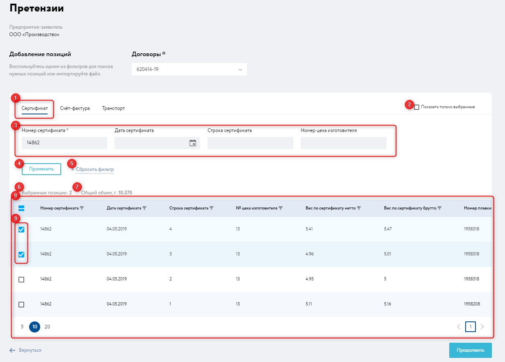

*Подбор по вкладке “Счет-фактура”*

Для того, чтобы подобрать позиции по Счету-фактуре, необходимо перейти на вкладку «Счет-фактура» (1) и заполнить обязательное поле «Номер счета-фактуры». Для более точного поиска можно заполнить поле «Позиция счета-фактуры» (2).

Для того, чтобы добавить позиции в претензию, необходимо отметить их галкой в чек-боксе.

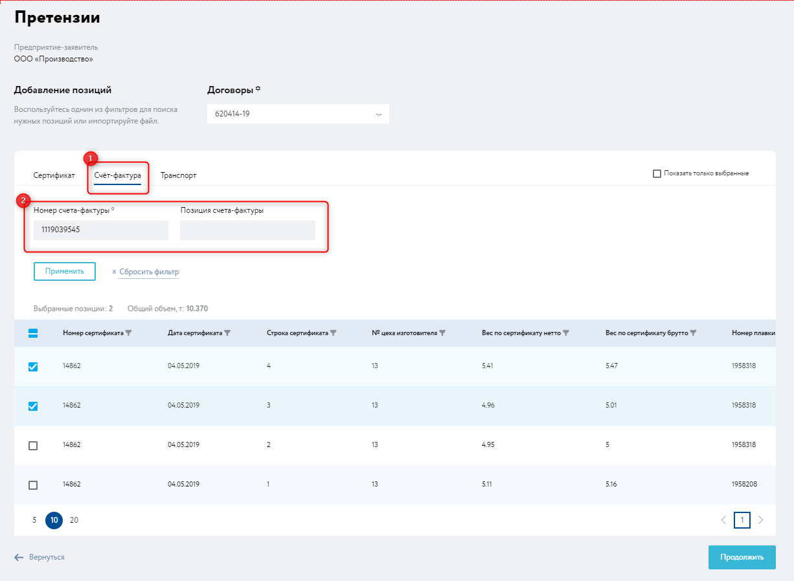

*Подбор по вкладке “Транспорт”*

Для того, чтобы подобрать позиции по Счету-фактуре, необходимо перейти на вкладку «Счет-фактура» (1) и заполнить обязательное поле «Номер счета-фактуры». Для более точного поиска можно заполнить поле «Позиция счета-фактуры» (2).

Для того, чтобы добавить позиции в претензию, необходимо отметить их галкой в чек-боксе.

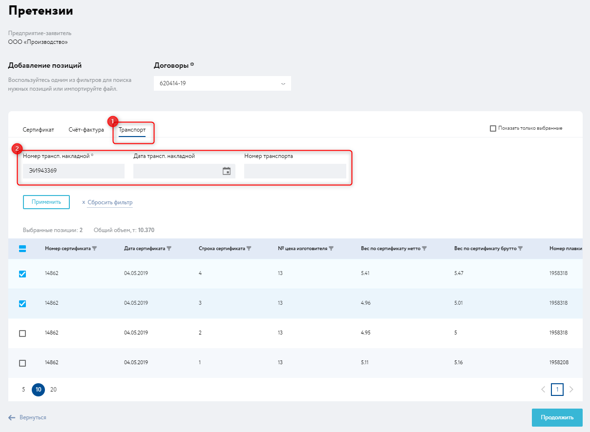

Далее следует нажать на кнопку «Продолжить»

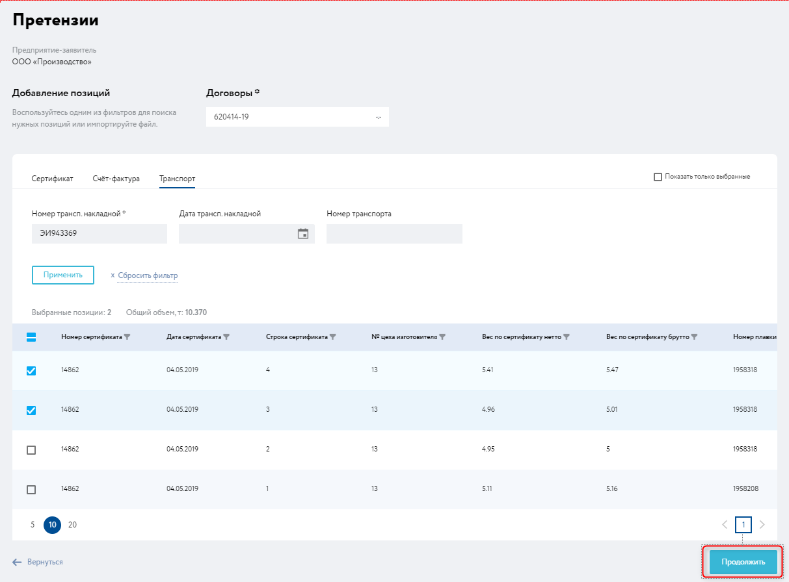

### 3. Заполнение полей претензии

Требуется заполнить поля в блоках “Общие сведения” и “Выезд представителя”

**Блок “Общие сведения” (1):**

* Исходящий номер уведомления
* Исходящая дата уведомления
* Сумма претензионного требования
* Описание претензии - обязательное поле
* Предложение покупателя по урегулированию
* Вид несоответствия - обязательное поле
* Группа дефекта (отображается только при выборе Вида несоответствия - “По качеству”)
* Условия выявления несоответствия - обязательное поле
* Дата выявления несоответствия - обязательное поле

Для создания претензии с видом несоответствия «по качеству», в поле «Вид несоответствия» следует выбрать «по качеству». Для вида несоответствия «по качеству» доступна для выбора группа дефекта и соответствующие поля для каждой группы во вкладке «Дефект».

Для создания претензии с видом несоответствия «по количеству», в поле «Вид несоответствия» следует выбрать «по количеству».

Для создания претензии с видом несоответствия «по пересортице», в поле «Вид несоответствия» следует выбрать «по пересортице».

Для создания претензии с видом несоответствия «нарушение сроков поставки в поле «Вид несоответствия» следует выбрать «нарушение сроков поставки».

Для создания претензии с видом несоответствия «прочее» в поле «Вид несоответствия» следует выбрать «прочее».

Опционально рекомендуется  сразу на этом этапе создания претензии приложить фотографии и другие документы подтверждающие фактическое состояние металла и дефекта на нем.

::: tip Примечание
Функции добавления, удаления и редактирования фотографий и других медиа файлов доступны только на этапе создания претензии.
Допустимы только файлы формата doc, docx, xls, xlsx, pdf, png, jpeg, jpg, gif, zip, rar, размером не более 29 Мб
Максимально допустимое количество файлов - 50
:::

**Блок “Выезд представителя” (2):**

* Фактическое место нахождения продукции - обязательное поле
* Наименование предприятия - обязательное поле
* Адрес представителя - обязательное поле

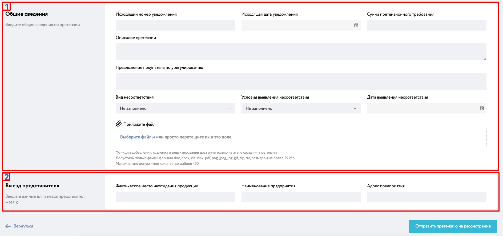

### 4. Отправка претензии на рассмотрение

Для отправки претензии на рассмотрение необходимо нажать на кнопку “Отправить на рассмотрение”. После чего претензия "уйдёт" на рассмотрение менеджеру УТПП

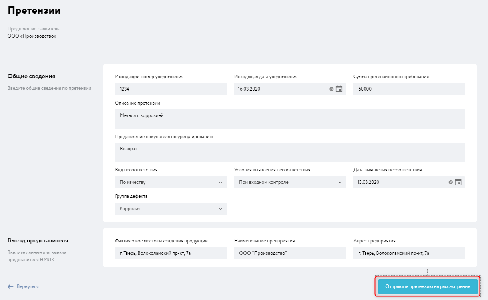

После отправки отобразится страниц детальной информации по претензии и сообщение об успешной отправке на рассмотрение.

::: tip Примечание
Если не выполнить отправку претензии на рассмотрение, черновик претензии не будет сохранен.
:::

::: danger Предупреждение
В случае возникновения ошибки при отправке претензии на рассмотрение рекомендуется обратиться в техническую поддержку.
:::

До того, как менеджер УТПП возьмет претензию в проработку, статус претензии - “Черновик”.

::: warning Важно понимать
После отправки претензии на рассмотрение нет возможности отредактировать претензию.
:::

### 5. Просмотр списка претензий

Страница детальной информации по претензии содержит блоки:

* Добавленные позиции
* Общие сведения
* Претензия
* Дефекты
* Фото и документы
* Выезд представителя
* Итоги по претензии

Информация в блоке “Итоги по претензии” будет заполняться по мере обработки претензии на стороне НЛМК.

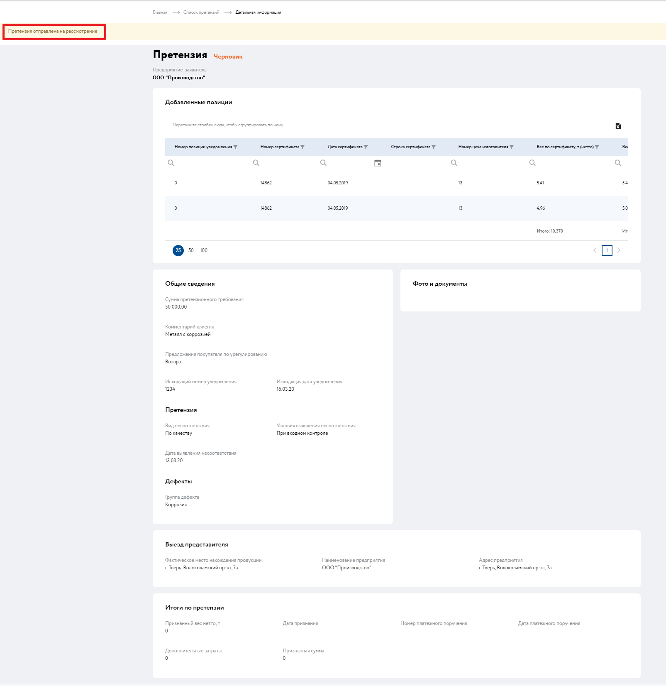

После того, как менеджер УТПП взял направленную претензию в проработку, данной претензии будет присвоен номер (1) и установлен статус “Проработка решения о выезде представителя НЛМК” (2).

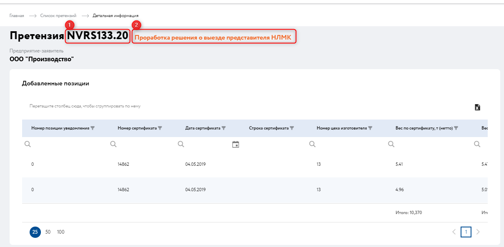

6. Вернуться к списку претензий можно по навигационной цепочке (пункт “Список претензий”) или из меню (пункт меню “Претензии” → пункт меню “Список претензий”)

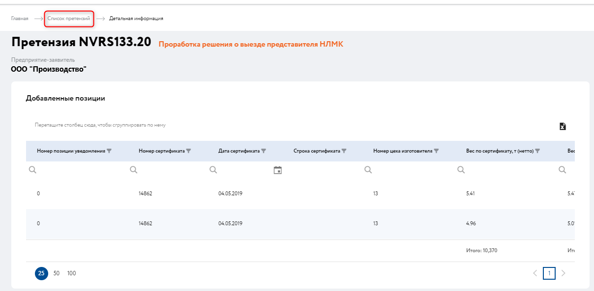

На странице списка претензий доступна сводная информация по претензиям:

* номер претензии
* дата уведомления
* статус
* вид несоответствия
* ответственный от НЛМК
* договор
* исх. номер уведомления

Доступна функция фильтрации, сортировки и группировки по столбцам.

Номер претензии является кликабельным, при нажатии открывается страница деталей претензии.

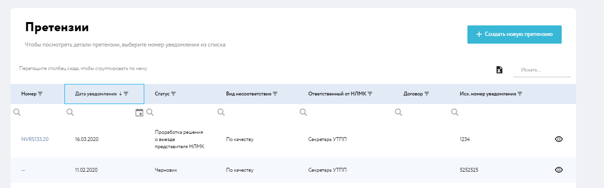
