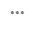
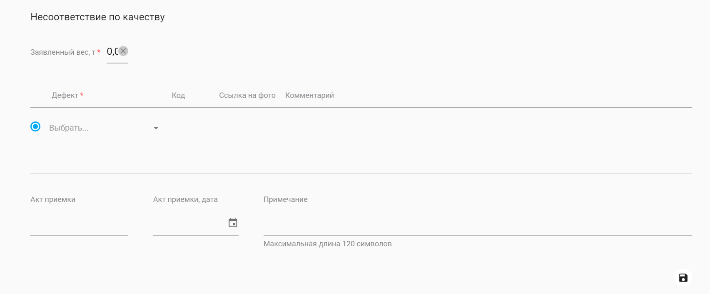
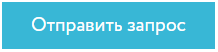

# Аннотация

Настоящая инструкция предназначена для ознакомления клиента ПАО «НЛМК», АО "НЛМК-Урал", АО "НЛМК-Калуга", ООО "НЛМК-Метиз или ООО "ВИЗ-сталь" с процессом создания новой претензии и с процессом работы с претензиями в системе Клиент Инфо [https://b2b.nlmk.shop](https://b2b.nlmk.shop/).

# Общие сведения

Функционал работы с претензиями предназначен для самостоятельной работы с претензиями B2B клиентов ПАО «НЛМК», АО "НЛМК-Урал", АО "НЛМК-Калуга", ООО "НЛМК-Метиз или ООО "ВИЗ-сталь".  Функционал включает в себя: создание, редактирование, удаление, отправку на рассмотрение и просмотр претензий.

# Работа с функционалом

Доступ к работе с функционалом "Претензии" имеют только пользователи со специальной группой прав. Для предоставления прав доступа для работы с претензиями-обратитесь в службу поддержки  [clientinfo@nlmk.shop](mailto:clientinfo@nlmk.shop).

Инструкция по работе с табличными данными находится по ссылке - [Работа с табличными данными | Клиент инфо 2 (nlmk.online)](https://doc.nlmk.online/guide/dx.html).

Процесс работы с функционалом претензий включает в себя выполнение следующих процедур:

1.  Переход на страницу "Создание претензии"
2.  Поиск позиций по фильтрам
4.  Выбор позиций для добавления в претензию
5.  Выбор несоответствия (по качеству, по количеству, по пересортице, прочее)
6.  Ввод информации о несоответствии
7.  Подтверждение введенных данных
8.  Просмотр списка претензий
9.  Просмотр добавленных позиций
10.  Заполнение полей  в блоке "Общие сведения"
11.  Заполнение полей в блоке "Выезд представителя"
12.  Прикрепление файлов в блоке "Фото и документы"
13.  Удаление черновика претензии
14.  Сохранение черновика претензии
15.  Редактирование черновика претензии
16.  Отправка претензии на рассмотрение
17.  Отправка запроса на отзыв претензии

# Сценарий использования

**Предусловия:**

У клиента имеется договор с ПАО «НЛМК», АО "НЛМК-Урал", АО "НЛМК-Калуга", ООО "НЛМК-Метиз или ООО "ВИЗ-Сталь".

Клиент авторизован на сайте  [https://b2b.nlmk.shop](https://b2b.nlmk.shop/).

У клиента есть  полученные поставки (товар, поступивший на склад к заказчику)  по заказам от ПАО “НЛМК”, АО "НЛМК-Урал", АО "НЛМК-Калуга", ООО "НЛМК-Метиз или ООО "ВИЗ-Сталь".

У клиента есть специальные права доступа для работы с функционалом претензий.

# Создание претензии

## _1. Переход к созданию претензии_

Переход к форме создания претензии возможен:

-   с главной страницы (вкладка “Претензии” → кнопка “Создать новую претензию”(рис. 1)).
    

Рис. 1. Переход к созданию новой претензии.

-   из списка претензий, путем нажатия на иконку  (рис.2).

Рис. 2. Создание новой претензии.

-   путем перехода  по прямой ссылке [https://b2b.nlmk.shop/b2b/claims/new](https://b2b.nlmk.shop/b2b/claims/new)

После перехода отображается страница "Создание претензии (рис. 3)".

Рис. 3. Создание претензии.

Страница "Создание претензии" содержит элементы из табл.1.

Табл. 1. Элементы страницы "Создание претензии".
|№|Описание|
|--|--|
|1|Таблица поиска позиций по заданным критериям|
|2|Кнопка "Отменить претензию" |
|3|Кнопка "Найти" |
|4|Меню доступных действий в тулбаре таблицы |
|5|Поиск по таблице |
|6|Иконка для удаления строки |

Красным цветом в таблице выделены поля, обязательные для заполнения (пример такого поля отмечен цифрой 7 на рис.4), белым цветом окрашены необязательные для заполнения поля (пример такого поля отмечен цифрой 8 на рис. 4).

Тулбар таблицы содержит иконки, которые представлены в табл. 2.

Табл. 2.  Меню доступных действий в тулбаре таблицы.

|№|Описание|
|--|--|
|1|Иконка для сброса настроек |
|2|Иконка для очистки таблицы фильтров|
|3|Иконка для вставки информации из буфера обмена |
|4|Иконка для добавления новой строки|
|5|Иконка для экспорта информации в excel|
|6|Иконка для выбора столбцов |
|7|Иконка для сохранения изменений |
|8|Иконка для отмены изменений |

## _2. Внесение информации в поля таблицы для поиска  позиции, по которой требуется оформление претензии._

При переходе к созданию новой претензии открывается форма подбора позиций.

Форма допускает следующие виды заполнения данными:
1.  Ручное заполнение
2.  Вставка массива данных из буфера обмена через контекстное меню:  вставка происходит начиная с той ячейки, в которой стоит курсор.
3. Вставка массива данных из  буфера обмена через иконку в тулбаре таблицы  : вставка происходит в пустую строку.
4.  Для корректной работы функционала требуется разрешить вставку данных в диалоговом окне.
5.  При заполнении обязательного поля остаётся доступным только блок выбранной фильтрации на уровне строки. Остальные блоки деактивируются. На следующей строке доступно использование любого фильтра.
6. Поля с невалидными данными подсвечены красным, при наведении отображается текст ошибки в тултипе.

	      Возможные тексты ошибок:
	      - Одно из полей должно быть заполнено (рис. 6)
	      - Введены недопустимые символы (рис. 7)
	      - Максимальное количество символов - n, где n=Макс.длина поля (рис. 8)

Форма допускает  5 вариантов  фильтров для поиска позиций. По умолчанию открывается блок фильтрации по сертификату.

Также возможна фильтрация  по счет-фактуре, по номеру плавки/партии и номеру рулона, по транспортной накладной, по QM-объекту(рис. 5).  При заполнении полей по одному из способов фильтрации остальные способы фильтрации становятся недоступны.

-   При фильтрации по сертификату информацию необходимо вводить в поля: Номер (обязательное поле), Дата, Строка, № цеха изготовителя;
-   При фильтрации по счету-фактуре информацию необходимо вводить в поля: Номер (обязательное поле), Позиция;
-   При фильтрации по номеру плавки/партии и номеру рулона информацию необходимо вводить в поля: № плавки/№ партии (необходимо заполнить хотя бы одно из полей), № рулона;
-   При фильтрации по транспортной накладной информацию необходимо вводить в поля: Номер (обязательное поле), Дата, № транспорта;
-   При фильтрации  по QM-объекту  информацию необходимо вводить в поля: Номер заказа (обязательно поле), Позиция заказа;
-   При фильтрации по номеру заказа информацию необходимо вводить в поля:  Номер заказа и Позиция заказа;

Рис. 4. Таблица с фильтрацией для поиска позиций.

Для того, чтобы открыть/скрыть блоки фильтрации необходимо воспользоваться настройками видимости столбцов таблицы .

Рис. 5. Настройка видимости столбцов таблицы.

Можно очистить форму, нажав на соответствующую иконку в тулбаре таблицы . Удаляются только данные в таблице, к  настройке  формата таблицы эта функция не применяется.

Можно сбросить настройки таблицы, нажав на соответствующую иконку в тулбаре  . Если дополнительные настройки не производились, то иконка остается неактивной  .

Для сохранения настройки формата таблицы используется иконка  . Если сохранить фильтры, покинуть страницу и потом вернуться на нее, то вся сохраненная информация останется.

Заполнить форму, а затем скачать её можно с помощью стандартной выгрузки в Excel  . В выгрузку попадают все поля таблицы, независимо от настройки в интерфейсе, кроме скрытых столбцов. Можно скачать пустую форму, заполнить её вне системы, а затем перенести данные в таблицу при помощи копирования массива данных и вставке через буфер обмена.

По умолчанию на форме открыта 1  строка. Можно увеличить их количество с помощью кнопки  "Добавить строки"    (максимум 100 строк).

_Необходимым и достаточным для формирования запроса является заполнение одного из обязательных полей фильтров или заполнение обязательного и дополнительных полей одного блока фильтрации. Обязательные поля отмечены звёздочкой и  подсвечены  красным при добавлении строки. Это поля: **Номер сертификата, Номер счет-фактуры, Номер плавки и номер партии, Номер заказа**._

Если ни одно обязательное поле не заполнено, то система отображает подсказку с текстом  _"Одно из полей должно быть заполнено"_ (рис. 6).

Рис. 6. Ошибка при создании претензии.

При этом заполнение двух и более блоков фильтрации в одной строке файла не допускается.

Каждая строка формы учитывается отдельно, блок фильтрации на каждой строке может быть заполнен разный. Например, две первые строки блок по сертификатам, две вторые строки по транспортной накладной и т.д.

Можно вставить значения из буфера обмена. Вставляемые данные должны соответствовать формату полей, иначе система их не сохранит и на уровне ячейки отобразится ошибка _"Введены недопустимые символы"_ (рис. 7).

Рис.7. Введение в строку поиска недопустимых символов.

В  случае  введения в строку недопустимого количества символов- отобразится ошибка, в которой будет указано, какое допустимое количество символов предусмотрено для данной строки (рис. 8).

Рис. 8. Введение в строку недопустимое количество символов.

При вставке информации из буфера обмена  удаляются  пустые строки, на форме сохраняется порядок строк при заполнении.

После заполнения формы любым из способов, на форме становится доступна кнопка "Найти"(рис.3). Кнопка активируется, если заполнено обязательное поле хотя бы в 1 строке поиска.

**После нажатия на кнопку "Найти" выполняется поиск позиций для составление претензии и выбора вида несоответствия.**

Если блок фильтрации был заполнен, а затем скрыт, то данные в этом фильтре будут очищены. При этом вверху страницы отображается статичное уведомление формата "Предупреждение" с текстом  _"Обратите внимание, что поиск позиций выполняется только по тем фильтрам, которые отображены в интерфейсе на момент запроса. При скрытии блока фильтрации, значения будут удалены."(рис. 9)._

Рис. 9. Предупреждение.

При необходимости, создание претензии можно отменить. Для этого используется кнопка "Отменить претензию" (рис. 3).

## _3. Выбор одной или нескольких позиций товара из таблицы результатов для составления претензии_

Таблица результатов содержит найденные по Фильтру позиций результаты, позволяет просматривать всю полную информацию по позиции, выполнять сортировку и фильтрацию, осуществлять поиск по таблице.

Рис. 10.  Таблица результатов.

При нажатии на   можно посмотреть дополнительные сведения по позиции (рис 11).

Рис. 11. Дополнительные сведения по позиции.

Табл. 3.  Меню доступных действий в тулбаре таблицы поиска позиций.
|№|Описание|
|--|--|
|1|Иконка "Экспортировать все" |
|2|Иконка "Выбор столбцов"|
|3|Поиск|
|4|Просмотр дополнительных сведений по позиции|

Нажатием на иконку "Выбор столбцов", можно выбрать столбцы, которые будут отображены в таблице.

Список 1. Столбцы Таблицы результатов, отображаемые по умолчанию.
1.  "Несоответствие"
2.  "№ сертификата"
3.  "Строка сертификата"
4.  "Дата сертификата"
5.  "Нетто, т"
6.  "Партия"
7.  "Рулон"
8.  "История"
9.  "Признанный вес"

Список 2. Столбцы, которые при масштабировании экрана могут перемещаться в область под строкой, по умолчанию скрытую и отображаемую по кнопке "...".

1.  "Завод"
2.  "Договор"
3.  "Цех"
4.  "Брутто, т"
5.  "Плавка"
6.  "Пачка"
7.  "Толщ, мм"
8.  "Шир, мм"
9.  "Длина, мм"
10.  "Группа прод-и"
11.  "С-ф (счёт-фактура)"
12.  "Дата с-ф"
13.  "Строка с-ф"
14.  "Цена без НДС по с-ф"
15.  "№ заказа"
16.  "Поз. заказа"
17.  "№ транспорта"
18.  "Грузополучатель"

Список 3. По умолчанию скрытые столбцы, которые можно активировать, поставив галочку в  чекбокс, напротив столбца.

1.  "Стандарт"
2.  "Марка"
3.  "Схема упак."
4.  "№ исправления"
5.  "Внешний № КСФ"
6.  "Дата КСФ"
7.  "№ ТН"
8.  "Дата ТН"
9.  "Канал сбыта"  
10.  "Ставка налога по позиции"
11.  "Валюта"
12.  "Ед. прод."

Для сохранения настройки формата таблицы необходимо воспользоваться разделом "Представления" (рис. 12).  Необходимо ввести наименование для настроек  и выбрать будет ли это представление личным или общим. После этого необходимо сохранить настройки, нажав на кнопку  . Новое представление можно не создавать, а воспользоваться, ранее созданным личным или общим.

Рис. 12. Настройка представлений.

В таблице результатов необходимо выбрать позиции, которые будут включены в претензию.

Для выбора позиций,  на которые будет заведена претензия-необходимо поставить галочки в чекбокс напротив этих позиций  (рис. 13). После этого появится возможность выбрать вид несоответствия  позиций их выпадающего списка.

Рис. 13. Выбор позиций товара, на которую будет составлена претензия.

## _4. Выбор вида несоответствия позиции (по качеству, по количеству, по пересортице, прочее)_

Для каждой, выбранной ранее позиции, необходимо проставить вид несоответствия (рис. 14).

Рис.14. Выбор вида несоответствия.

## _5.  Заполнение полей несоответствия_

После выбора вида несоответствия становится доступной для заполнения область дополнительной информации в зависимости от вида несоответствия.

**Несоответствие по качеству**

В случае несоответствия позиций по качеству необходимо заполнить поля на рис. 16 (Заявленный вес,т., Дефект, , Код, Ссылка на фото, Комментарий, Акт приемки, Акт приемки, дата, Примечание). Обязательными полями являются :

-   "Заявленный вес, т". (Заявленный вес не может превышать фактический, иначе выводится сообщение об ошибке : "Заявленный вес превышает допустимый". Пользователь может указать вес до трёх знаков после запятой). Заявленный вес не может превышать фактический. Если он превышает, то выводится сообщение об ошибке (рис. 15).
-   "Дефект"

Рис. 15. Сообщение об ошибке.

Для выбора дефекта доступно значение из списка дефектов, ранее заведенных в системе Quality Management (при наличии). По ним отображается название дефекта,  код, ссылка на фото и комментарий.  Либо можно выбрать дефект из справочника дефектов. По ним отображается только название дефекта.  Если в системе QR-кодирования ранее не был заведен дефект по данной позиции - то он указывается вручную выбором значения из списка. В этом случае поля Код, Ссылка на фото, Комментарий будут пустыми и недоступными к редактированию.

Если по позиции ранее был заведен дефект через систему QR-кодирования, то значения для полей: Дефект, Код,Ссылка на фото,Комментарий - подтянутся автоматически.

Рис. 16. Несоответствие по качеству.

Рис. 16.1 Несоответствие по качеству с данными из системы QR-кодирования

**Несоответствие по количеству**

В случае несоответствия по количеству необходимо заполнить поля на рис. 17 (Вес нетто по вх. контролю, т или Вес брутто по вх. контролю, т., Акт приемки, Акт приемки, дата, Примечание). Обязательными полями являются: Вес нетто по вх. контролю, т или Вес брутто по вх. контролю, т.

Рис. 17. Несоответствие по количеству.

**Несоответствие по пересортице**

В случае несоответствия по пересортице необходимо заполнить поля на рис. 18 (Плавка, факт., Партия, факт., № рулона/пачки/сляба факт., Вид продукции, факт., Стандарт, факт., Длина факт, мм, Марка факт., Толщина факт., Ширина факт., мм, Вес нетто факт., т, Вес Брутто факт., т, Акт приемки, Акт приемки, дата, Примечание). Обязательными полями являются: Вид продукции, факт., Толщина факт., Ширина факт., мм, Вес нетто факт., т.

Рис. 18. Несоответствие по пересортице.

**Прочие несоответствия**

С случае обнаружения прочих несоответствий необходимо заполнить поля, которые представлены на рис. 19 (акт приемки, акт приемки, дата,  примечание  (максимальная длина примечания 120 символов)). Обязательным является поле: примечание.

Рис.19. Прочие несоответствия.

## _6. Сохранение изменений_

Сохранение внесенных изменений возможно нажатием на иконку .

## _7. Подтверждение_

Для подтверждения корректности введенных данных и перехода к заполнению заголовочной части претензии необходимо нажать на кнопку "Подтвердить"(рис.20).

Весь набор позиций будет поделен на черновики претензий в зависимости от вида несоответствия и площадки. Если в результате был создан 1 черновик, то отобразится страница черновика претензии.

Если было создано 2 и более претензий, то отобразится список претензий.

Рис. 20. Кнопка для подтверждения отправки претензии.

# Работа со списком претензий

 1. На странице списка претензий  по умолчанию отображаются следующие столбцы:

		1.  № Уведомления
		2.  Статус
		3.  Ответственный от НЛМК
		4.  Вид несоответствия
		5.  Заявленный вес, т
		6.  Признанный вес, т
		7.  Признанная сумма с НДС
		8.  Доп. затраты
		9.  Дата признания
		10.  № Платежного поручения
		11.  Дата платежного поручения
		12.  Дата завершения работ
		13.  Исх. № уведомления
		14.  Исх. дата уведомления
		15.  Исх. № претензии
		16.  Исх. дата претензии
		17.  Сумма требования
		18.  Автор претензии
		19.  Дата уведомления
		20.  Создано в ЛК
		21.  Сбытовая организация

	Скрытые столбцы,  которые можно активировать поставив галочку в чекбокс, напротив столбца: 
	- Канал
	- Претензия составлена

2. Для таблицы списка претензий доступны следующие функции:  фильтрация, группировка, сортировка, поиск.

3. Для добавления новой претензии необходимо нажать на иконку (более подробно см в [п. 1]"Переход к созданию претензии").

4. Для отзыва претензии необходимо нажать на иконку  (более подробно в  [п.3] "Отправка запроса на отзыв претензии"). Отзыв претензии доступен во всех статусах, кроме : "Черновик", "Ожидает отправки на рассмотрение", "Перечисление денежных средств", "Урегулировано без денежных выплат", "Отклонено", "Оплачено", "Отозвано", "Отправлен запрос на отзыв претензии", "Ошибка при отправке на рассмотрение", "Передача запроса на отзыв претензии".

5. Для удаления позиции претензии необходимо нажать на иконку  .  Удаление доступно в статусе "Черновик", "Ошибка при отправке на рассмотрение".

6. Для  экспорта  всех претензий в Excel-файл  необходимо нажать на иконку .   В выгрузку  попадают все поля таблицы, отмеченные чекбоксами. По умолчанию отмечены все поля, кроме "Канал" и "Претензия составлена".

7.  Для сохранения настройки формата таблицы необходимо воспользоваться разделом "Представления"(рис. 12). Необходимо ввести наименование для настроек и выбрать будет ли это представление личным или общим. После этого необходимо сохранить настройки, нажав на кнопку . Новое представление можно не создавать, а воспользоваться, ранее созданным личным или общим.

8. Для доступа к деталям претензии необходимо нажать на номер уведомления из списка претензий. В случае, если номер уведомления отсутствует в строке таблицы претензий будет отображаться символ "-", при нажатии на него также осуществится переход к странице деталей претензии.

Рис. 21. Список претензий.

# Работа с черновиком претензии

На странице черновика претензии отображаются следующие блоки: "Добавленные позиции", "Общие сведения", "Выезд представителя", "Фото и документы". По умолчанию блоки развернуты. В заголовке претензииуказывается договор и тип претензии, а также отображаются кнопки: "Удалить", "Сохранить", "Отправить на рассмотрение".

Рис. 22. Отображение кнопок "Удалить", "Сохранить", "Отправить на рассмотрение".

## _1. Просмотр позиций, добавленных в претензию (блок "Добавленные позиции")_

1.  Для выгрузки формы претензионных позиций в Excel необходимо нажать на иконку  .  Выгружаются только столбцы, отмеченные чекбоксами.
2.  Для изменения ширины столбца необходимо навести курсор мыши на  границу заголовка столбца, нажать на иконку    и двигать.
3.  Для просмотра и редактирования деталей несоответствия по позиции претензии  необходимо нажать  на  символ детального просмотра строки  .
4.  Для просмотра дополнительной информации по претензии необходимо нажать на иконку  .
5.  Для удаления позиции претензии из списка добавленных позиций необходимо нажать на иконку  .

Рис. 23. Добавленные позиции.

Табл. 4.  Меню доступных действий в блоке "Добавленные позиции".
|№|Описание|
|--|--|
|1|Иконка "Экспортировать все"|
|2|Иконка "Выбор столбцов"|
|3|Поиск по таблице|
|4|Иконка детального просмотра строки|
|5|Иконка для удаления позиции претензии|
|6|Иконка  просмотра дополнительной информации по претензии|

При открытии области деталей несоответствия по позиции претензии в зависимости от вида несоответствия отображаются поля, заполненные  на шаге 5  с возможостью редактирования.  Редактирование полей дефекта для претензии по качеству недоступно. Для выбора другого вида дефекта у позиции претензии пользователю необходимо заново добавить позицию с корректным видом дефекта.

При внесении изменений нажать на иконку сохранить  .

## _2.  Заполнение полей в блоке "Общие сведения":_

> :warning:  Обязательные для заполнения поля отмечены  звездочкой* на скриншотах и на страницах сайта

В блоке "Общие сведения" для заполнения доступны следующие поля:

1.  Составлена ли претензия? - чек-бокс (По умолчанию галочка в чек-боксе не проставлена.  При проставлении галочки  разворачивается область для ввода суммы претензионного требования, предложения по урегулированию, исходящего номера и даты претензии. При снятии галочки область сворачивается, значения суммы претензионного требования, предложения по урегулированию, исходящего номера и даты претензии очищаются). Если "ДА", то заполнить необходимые поля:
    1.  "Сумма претензионного требования".  Указывается сумма в рублях, два знака после запятой (обязательное поле, если проставлена галочка в чекбокс).
    2.  "Исходящий номер претензии". Поле для ввода, доступен ввод букв, цифр, специальных символов, пробел (ввод символов юникода запрещен, при вставке из буфера символы форматирования не вставляются), длина поля ограничена 255 символами (обязательное поле, если проставлена галочка в чекбокс).
    3.  "Исходящая дата претензии". Выбор из календаря/ввод с клавиатуры по маске  ДД/ММ/ГГГГ  вставка из буфера. Выбор даты позднее текущей даты недоступен (обязательное поле, если проставлена галочка в чекбокс).
    4.  "Предложение по урегулированию". Доступен ввод букв, цифр, специальных символов, пробел (ввод символов юникода запрещен, при вставке из буфера символы форматирования не вставляются), длина поля ограничена 255 символами (обязательное поле, если проставлена галочка в чекбокс).
2.  Далее необходимо заполнить поля:
    1.  "Исходящий номер уведомления". Доступен ввод букв, цифр, специальных символов, пробел (ввод символов юникода запрещен, при вставке из буфера символы форматирования не вставляются), длина поля ограничена 40 символами (необязательное поле).
    2.  "Исходящая дата уведомления". Выбор из календаря/ввод с клавиатуры по маске  ДД/ММ/ГГГГ  вставка из буфера. Выбор даты позднее текущей даты недоступен. (Необязательное поле)
    3.  "Условия выявления несоответствия".  Выбор из выпадающего списка (рис. 23)  (обязательное поле).
    4.  "Дата выявления несоответствия". Выбор из календаря/ввод с клавиатуры по маске  ДД/ММ/ГГГГ  вставка из буфера. Выбор даты позднее текущей даты недоступен (обязательное поле).
    5.  "Комментарий". Доступен ввод букв, цифр, специальных символов, пробел (ввод символов юникода запрещен, при вставке из буфера символы форматирования не вставляются), длина поля не ограничена (необязательное поле).

Наверху страницы отображается уведомление   

Рис. 24. Условия выявления несоответствия.

Рис. 25. Общие сведения.

## _3. Заполнение полей в блоке "Выезд представителя":_

1.  Требуется выезд представителя - чек-бокс (по умолчанию галочка в чек-боксе не проставлена. При проставлении галочки разворачивается область для ввода фактического места нахождения продукции, наименования предприятия и адреса предприятия. При снятии галочки область сворачивается, значения фактического места нахождения продукции, наименования предприятия и адреса предприятия очищаются. Если "ДА", то заполнить необходимые поля:
    1.  "Фактическое место нахождения продукции". Доступен ввод букв, цифр, специальных символов, пробел (ввод символов юникода запрещен, при вставке из буфера символы форматирования не вставляются), длина поля ограничена 255 символами.
    2.  "Наименование предприятия". Доступен ввод букв, цифр, специальных символов, пробел (ввод символов юникода запрещен, при вставке из буфера символы форматирования не вставляются), длина поля ограничена 120 символами.
    3.  "Адрес предприятия". Доступен ввод букв, цифр, специальных символов, пробел (ввод символов юникода запрещен, при вставке из буфера символы форматирования не вставляются), длина поля ограничена 120 символами.

Рис. 26. Выезд представителя.

## _4. Загрузка вложений (блок "Фото и документы")_

> :warning: Примечание:  
> + Допустимы только файлы формата doc, docx, xls, xlsx, pdf, png, jpeg, jpg, gif, zip, rar размером не более 30 MB суммарно.
> + При попытке загрузить файл формата, отличающегося от doc, docx, xls, xlsx, pdf, png, jpeg, jpg, gif, zip, rar под областью.  
    загрузки отображается сообщение "Файлы недопустимого формата не были добавлены во вложение".     	 
  > + Если максимальный объем файла превышен, при добавлении файла, под областью загрузки отображается сообщение: "Файлы недопустимого размера не были добавлены во вложение. Максимальный размер файла (30) Мб.
> + Максимально допустимое количество файлов - 50.
> + Если загружено 49 файлов, при добавлении файла, под областью загрузки отображается сообщение: "Максимально  
    допустимое количество файлов -50".
> + Загрузка вложений является обязательной для претензий по виду несоответствия "По качеству", "По количеству", "По  
    пересортице".
> + Актуальная информация по максимальному количеству, размеру и формату загружаемых файлов указана в подсказке на вкладке "Фото и документы".

1.  Прикрепить файл нажатием на надпись либо перетащить файл в указанное поле.

Рис. 27.  Прикрепление файлов.

2. Для удаления загруженных файлов нажать на иконку.

3. Для просмотра загруженных файлов нажать на файл  .

Рис. 28. Просмотр и удаление прикрепленных файлов.

## _5. Сохранение черновика претензии_

> :warning: Примечание:  Пользователю доступно сохранение черновика претензии без отправки на рассмотрение

1.  При внесении изменений в черновик претензии отображается сообщение "В черновик претензии были внесены изменения".
2.  Для сохранения изменений в шапке претензии нажать на кнопку  "Сохранить" (Рис. 29. Сохранение изменений).
3.  При успешном сохранении претензии отображается сообщение с текстом  "Изменения успешно сохранены"(рис. 30).

Рис. 29. Сохранение изменений.

Рис. 30. Сообщение с текстом  "Изменения успешно сохранены".

При неуспешном сохранении претензии отображается модальное окно с текстом "Страница будет перезагружена.  
Претензия с кодом <код претензии> не найдена" с кнопкой "Ок", по клику на которую осуществляется  
перезагрузка страницы.

## _6. Удаление черновика претензии_

1.  Для удаления черновика претензии нажать на иконку  .
2.  При нажатии отображается модальное окно подтверждения удаления.
    1.  Для завершения удаления нажать Да.
    2.  Для отмены удаления нажать "Нет"/ нажать на пиктограмму "крест"/кликнуть вне области диалогового окна/ нажать "Esc" на клавиатуре.

Рис. 31. Окно подтверждения удаления.

## _7. Отправка претензии на рассмотрение_

1.  Для отправки черновика претензии на рассмотрение нажать кнопку " Отправить на рассмотрение"   или   
2.  После нажатия кнопки "Отправить на рассмотрение" страница блокируется, отображается спиннер. Статус претензии "Черновик" меняется на статус "Ожидает отправки на рассмотрение". Далее система отображает страницу детальной информации по претензии, статус претензии меняется на "Передано на рассмотрение".

В случае возникновения следующих ошибок выполнить приведенные действия:

Табл. 5. Необходимые действия при возникновении ошибок.
| Ошибка | Необходимое действие |
|--|--|
| "Необходимо заполнить обязательные поля" | Одно или несколько обязательных полей не были заполнены (поля, требующие заполнения, подсвечены красной рамкой и иконкой красного восклицательного знака). Обращаем внимание, что вложения для качества,  количества и пересортицы также являются обязательными.  Заполните необходимые поля и отправьте претензию на рассмотрение повторно. |
| "Возникла ошибка при отправке претензии на рассмотрение. Повторите попытку позже или обратитесь в службу поддержки  [clientinfo@nlmk.shop](mailto:clientinfo@nlmk.shop)"|  Обновите страницу, повторно отправьте претензию на рассмотрение или обратитесь в службу  поддержки  по указанной ссылке.|
|"Произошла непредвиденная ошибка. Повторите попытку позже или обратитесь в службу  поддержки  [clientinfo@nlmk.shop](mailto:clientinfo@nlmk.shop)"| Обновите страницу, повторно отправьте претензию на рассмотрение или обратитесь в службу поддержки по указанной ссылке.|
|"Заявленный вес превышает допустимый"| Допустимый претензионный объем по позиции превышен. 														Варианты решения проблемы: 																		a. изменить заявленный вес по позиции претензии и выполнить повторную проверку позиций 																				b. удалить позицию претензии и выполнить повторную проверку позиций |
|"Не удалось отправить на рассмотрение черновик претензии. Статус претензии был изменен." | Черновик претензии уже был отправлен на рассмотрение другим пользователем. Отображается страница деталей претензии в актуальном статусе.|
| "Не удалось отправить на рассмотрение черновик претензии, так как он был удален ранее." |Черновик претензии уже был удален другим пользователем. При необходимости выполните создание черновика претензии заново.|

Рис. 32.  Отображение подсказки об обязательности заполнения поля.

  

# Работа с претензией, отправленной на рассмотрение

В верхней части отображается текущий актуальный статус претензии и сотрудник НЛМК, назначенный ответственным за обработку претензии.

Информация в блоках "Добавленные позиции", "Общие сведения", "Выезд представителя", "Итоги по претензии" доступны для просмотра без возможности редактирования.

## _1. Дозагрузка вложений в блок "Фото и документы"_

> :warning: Примечание: 
> + Возможность отправки файла предусмотрена только для претензий в статусах:  "Проверка информации потребителя по уведомлениям", "Получение недостающей информации от потребителя", "Проработка решения о выезде представителя НЛМК", "Совместная приемка у потребителя", "Односторонняя приемка", "Техническая экспертиза", "Подготовка предложения по урегулированию", "Ожидание ответа от потребителя по урегулированию", "Получение оригиналов документов от потребителя", "Экономическая экспертиза", "Возврат продукции в НЛМК", "Правовая экспертиза", "Подготовка ответа по претензии", "Ошибка при отправке на рассмотрение".
> + При работе с претензией доступно неограниченное количество дозагрузок файлов в пределах установленного лимита на общее кол-во файлов, которые можно прикрепить к претензии. По умолчанию установлено 50.
> + Если загружено количество файлов 49, при добавлении файла, под областью загрузки отображается сообщение: "Максимально допустимое количество файлов - 50".
> + Если загружено количество файлов 50 - то область загрузки и кнопка "Загрузить" неактивна.
> + Максимальный размер прикрепляемого к претензии файла 100 Мб.
> + Если максимальный объем файла превышен, при добавлении файла, под областью загрузки отображается сообщение: "Файлы недопустимого размера не были добавлены во вложение. Максимальный размер файла 100 Мб".
> +При попытке загрузить файл формата, отличающегося от одного из следующих форматов, (doc, docx, xls, xlsx, pdf, png, jpeg, jpg, gif, zip, rar) под областью загрузки отображается сообщение "Файлы недопустимого формата не были добавлены во вложение".
> + При нажатии на иконку "корзина" документ удаляется, без дополнительного подтверждения пользователем. Удаление возможно до нажатия кнопки "Загрузить".
> + Для замены подгруженных (но не отправленных) файлов необходимо сначала удалить файлы, требующих замены, а затем загрузить новые.
> + Актуальная информация по максимальному количеству, размеру и формату загружаемых файлов указана в подсказке на вкладке "Фото и документы".

Шаги, необходимые для дозагрузки вложений, указаны в п.4 "Загрузка вложений (блок "Фото и документы")".

## _2. Отображение полей в блоке "Итоги по претензии"_  

Следующие поля доступны для просмотра, без возможности редактирования:

1.  Заявленный вес
2.  Признанный вес
3.  Признанная сумма с НДС
4.  Добавка доп. затрат
5.  Доп. затраты
6.  Дата признания
7.  № платежного поручения
8.  Дата платежного поручения
9.  Дата завершения работ

## _3. Отправка запроса на отзыв претензии_

> :warning: Примечание: Отправка запроса на отзыв доступна в следующих статусах: "Передано на рассмотрение", "Проверка информации потребителя по уведомлениям", "Получение недостающей информации от потребителя", "Проработка решения о выезде представителя НЛМК", "Совместная приемка у потребителя", "Односторонняя приемка", "Техническая экспертиза", "Подготовка предложения по урегулированию", "Ожидание ответа от потребителя по урегулированию", "Получение оригиналов документов от потребителя", "Экономическая экспертиза", "Возврат продукции в НЛМК", "Правовая экспертиза", "Подготовка ответа по претензии", "Перечисление денежных средств", "Ошибка при отзыве претензии"

1.  Перейти на страницу списка претензий.
    1.  Нажать на иконку отзыва претензии  .
2. Либо перейти на страницу детальной информации по претензии
    1.  Нажать на кнопку отзыва претензии.
3.  При нажатии откроется окно "Запрос на отзыв претензии".
    1. Вести комментарий к отзыву претензии в появившемся окне.
    2. Нажать кнопку Отправить запрос.
		 1. Для отмены отправки претензии нажать Отмена или нажать на крестик или нажать "Esc" на клавиатуре.
	 3. Появится сообщение "Отправлен запрос на отзыв претензии".
4.  При успешной отправке запроса на отзыв претензии страница перегружается, статус претензии меняется на "Отправлен запрос на отзыв претензии",  пиктограмма "Отозвать претензию" не отображается.
5.  При неуспешной отправке запроса на отзыв претензии отображается окно с текстом  "Страница будет перезагружена. Не удалось изменить статус претензии на "Отозвано", так как статус претензии уже был изменен на  _<актуальный статус>_ и кнопкой "Ок". Отображается статус претензии "Ошибка при отзыве претензии".

Рис. 33.  Запрос на отзыв претензии.

# Техническая поддержка

При любых технических ошибках и проблемах при работе с системой "Клиент инфо", вы можете отправить обращение по адресу  [clientinfo@nlmk.shop](mailto:clientinfo@nlmk.shop).
