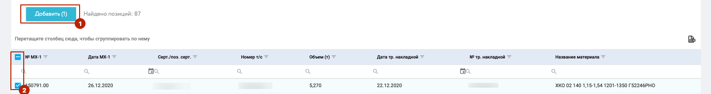

# Ответственное хранение

## Общие сведения
Функционал «Ответственное хранение» предназначен для предоставления клиенту возможности самостоятельно через личный кабинет, посредством ручного или массового ввода:

* принимать на хранение продукцию ОАО «НЛМК»,
* выкупать принятую на хранение продукцию ОАО «НЛМК».

## Работа с функционалом ответственного хранения

Работа с функционалом Ответственного хранения доступна только клиентам с ролью Ответственный хранитель.

Процесс работы с функционалом ответственного хранения включает в себя выполнение следующих процедур:

1. **[Принятие товара на ответственное хранение](/guide/custodian.html#_1-принятие-товара-на-ответственное-хранение)**

   1. Вызов формы оформления акта МХ-1
   2. Заполнение заголовочной части акта МХ-1
   3. Заполнение табличной части акта МХ-1
   4. Сохранение и работа с черновиком акта
   5. Отправка акта МХ-1 на рассмотрение
   6. Загрузка подписанного акта МХ-1
   7. Просмотр страницы «Список актов МХ-1»
   8. Выгрузка списка актов МХ-1 за период

2. **[Принятие товара на ответственное хранение массовым вводом](/guide/custodian.html#_2-принятие-товара-на-ответственное-хранение-массовым-вводом)**

   1. Вызов формы оформления акта МХ-1
   2. Выбор файла
   3. Загрузка файла и создание актов МХ-1
   4. Работа с журналом загрузки
   5. Отправка акта МХ-1 на рассмотрение массово одной кнопкой
   6. Просмотр результата обработки

3. **[Отмена (возврат) уже принятого металла на ответственное хранение](/guide/custodian.html#_1-принятие-товара-на-ответственное-хранение)**
   1. Аннулирование актов МХ-1 new
   2. Копирование аннулированных актов МХ-1 new

4. **[Выкуп заказа с ответственного хранения](/guide/custodian.html#_4-выкуп-заказа-с-ответственного-хранения)**

   1. Создание заявки на выкуп заказа
   2. Заполнение заголовочной части акта МХ-3
   3. Заполнение табличной части акта МХ-3
   4. Сохранение и работа с черновиком акта
   5. Отправка акта МХ-3 на рассмотрение
   6. Загрузка подписанного акта МХ-3
   7. Просмотр страницы «Список актов МХ-3»
   8. Выгрузка списка актов МХ-3 за период

5. **[Выкуп заказа с ответственного хранения массовым вводом](/guide/custodian.html#_5-выкуп-заказа-с-ответственного-хранения-массовым-вводом)**

   1. Вызов формы оформления акта МХ-3
   2. Выбор файла
   3. Загрузка файла и создание актов МХ-3
   4. Работа с журналом загрузки
   5. Отправка актов МХ-3 в обработку массово
   6. Просмотр результата обработки

## Сценарий использования

Пункт содержит описание работы с функционалом по всем перечисленным пунктам 

### **1. Принятие товара на ответственное хранение**

**Предусловия:**\
Данным клиентом создана заявка на производство по договору Хранения (заказы должны находиться в статусе ”Началась отгрузка” и последующие)

**Шаги:**

1. Перейти к созданию документа МХ-1.

Переход к форме создания документа МХ-1 возможен:

* с главной страницы (вкладка “Документы МХ-1” → кнопка “Создать новый документ МХ-1”)
* из меню (пункт меню “ОХ” → пункт меню “МХ-1” → пункт меню “Добавить документы МХ-1”)
* со страницы списка документов МХ-1 (кнопка “Создать новый документ МХ-1”)

\
2. На появившейся форме заполнения заголовочной части документа МХ-1 заполнить необходимые поля:

* **Договор** (список доступных договоров ограничен типов “Договор Хранения”. -
* **Грузополучатель** (отображается после заполнения поля “Договор” и ограничен сбытовой организацией, с которой заключен договор). При выборе грузополучателя происходит автоматическое определение склада
* **Номер акта МХ-1**
* **Дата акта МХ-1**

и нажать на кнопку **“Создать черновик”**

Если не все поля заполнены, система показывает предупреждение.

Перед сохранением документа со статусом «Черновик» проводится проверка на уникальность номера и даты документа МХ-1 в рамках одного договора. Если уникальность не соблюдена, на экран выведется сообщение:

Результат успешного создания черновика документа МХ-1.

Доступна область поиска позиций поставок с возможностью фильтрации по номеру т/с и сертификату.

3. Выполнить поиск позиций поставок нажатием на кнопку “**Применить**”.

Для поиска позиций отгрузки можно использовать буфер обмена (вставка массива данных из Excel и Word с удалением дубликатов) для мультипоиска.

Нажатие на кнопку “Применить” запускает поиск позиций поставок, которые еще не приняты на хранение.

Если для данного договора, склада и даты отсутствуют позиции, не принятые на хранение, отобразится сообщение “Нет данных”.

По умолчанию позиции поставок сгруппированы по номеру т/с и номеру заказа. Для настройки другой группировки есть возможность вынести необходимые столбцы из шапки таблицы/ вернуть необходимые столбцы, по которым выполнена группировка, в шапку таблицы.

В таблице найденных позиций поставок имеется возможность постраничного отображения записей с возможностью выбора количества отображаемых записей на странице: 25, 50 или 100 записей.

На записи позиции поставки, отобразятся поля записи (по умолчанию - дата тр. накладной и станция назначения).

4. Отметить необходимые строчки (проставить галочки в чекбоксе слева) и добавить их в табличную часть нажатием на кнопку “**Добавить**”

При выборе позиции поставки автоматически выбираются все позиции поставки из одного заказа.

После добавления позиции поставки перемещаются в табличную часть документа МХ-1

Есть возможность удалить строку из табличной части документа МХ-1 нажатием на иконку “Урна”.

5. Выполнить сохранение документа в статусе “Черновик” (нажатием на кнопку “**Сохранить**”) или отправку документа в обработку (нажатием на кнопку “**На рассмотрение**”)

Также есть возможность удалить документ нажатием на кнопку “**Удалить**” (доступна для документов в статусе “Черновик”)

6. При отправке документа МХ-1 на рассмотрение осуществляется смена статуса на “Готов синхронизации”. После подтверждения документа во внутренней учетной системе НЛМК осуществляется смена статуса на “**Принято на ОХ**”.

При отображении статуса “Ошибка синхронизации” или “Ошибка SAP синхронизации” просим вас обратиться в техническую поддержку.

7. Выполнить загрузку подписанной заявки на хранение, сформированной в учетной системе клиента.

Для этого необходимо кликнуть на текст “**Выберите файл**” и указать файл или переместить документ в область выбора файла. Файл загрузки должен иметь формат JPEG, PNG, PDF или TIF и размер не более 8 МБ.

После того, как файл загружен, его код отображается над областью выбора файла.

При необходимости можно заменить загруженную подписанную заявку. Для этого необходимо повторить действия из п.7. Удаление предзагруженного файла не требуется.

8. Вернуться к списку документов МХ-1 можно по навигационной цепочке (пункт “**Документы**”)

9. Список документов МХ-1 поддерживает возможность фильтрации, сортировки значений и группировку по столбцам.

По каждому документу отражена следующая информация:

* Номер акта
* Дата акта
* Статус
* Договор
* Площадка
* Грузополучатель
* Кол-во по акту (т)
* Склад

В нижней части списка отображается общий объем по всем документам МХ-1. При настройке фильтрации объем пересчитывается.

Для формирования отчета “Список актов МХ-1 за период” необходимо::

* нажать на фильтр в столбце “Дата акта”,
* выбрать необходимый временной диапазон,
* нажать кнопку “ОК”,
* для выгрузки списка в формате .xlsx нажать на иконку

Для просмотра документа необходимо нажать на наименование документа МХ-1, после чего откроется форма существующего документа МХ-1.

Редактирование доступно только для документов МХ-1 в статусе “Черновик”.

### **2. Принятие товара на ответственное хранение массовым вводом**

**Предусловия:**\
Данным клиентом создана заявка на производство по договору Хранения (заказы должны находиться в статусе ”Началась отгрузка” и последующие)

**Шаги:**

1. Перейти к созданию документа МХ-1 массовым вводом

Переход к форме создания документа МХ-1 массовым вводом возможен:

* с главной страницы (вкладка “Документы МХ-1” → кнопка “Импортировать документ из файла”)
* из меню (пункт меню “ОХ” → пункт меню “МХ-1” → пункт меню “Массовый импорт МХ-1”)
* со страницы списка документов МХ-1 (кнопка “Импортировать документ из файла”)

2. На появившейся странице импорта выбрать сбытовую организацию из выпадающего списка

При выборе сбытовой организации отобразится ссылка на скачивание шаблона файла загрузки

Входной файл для ПАО должен содержать следующую информацию: 

* Вагон
* Сертификат/Позиция сертификата
* Номер МХ-1
* Дата МХ-1

Входной файл для Сортовых площадок должен содержать следующую информацию: 

* Вагон
* Номер МХ-1
* Дата МХ-1
* Договор

Первая строка заголовочная, то есть она должна содержать названия столбцов.

3.Выполнить загрузку файла, кликнув на текст “**Выберите файл**” и указав файл или переместив документ в область выбора файла. Файл загрузки должен иметь формат .xlsx или .csv 

Далее нажать кнопку “**Загрузить**”.

При загрузке файла выполняется проверка корректности заполнения данных. Если ошибки будут найдены, то на экран выведутся сообщения по каждой строке и каждому полю, в которых обнаружены ошибки. Загрузка файла останавливается.

4. При успешной загрузке файла будет доступен журнал загрузки. В журнале отображаются созданные акты или описание ошибок в акте.

По клику на номера успешно созданных актов есть возможность перейти к просмотру документа.

Для созданных актов МХ-1 отображается активный чекбокс. Акты, отмеченные галкой в чекбоксе, можно массово отправить в обработку.

Для отправки актов на рассмотрение необходимо нажать кнопку «**На рассмотрение**».

При успешном результате обработки на стороне внутренней учетной системы НЛМК отобразится статус обработки “Принято на ОХ”.

При отображении статуса “Ошибка при отправке” просим вас обратиться в техническую поддержку.

### **3. Отмена (возврат) уже принятого металла на ответственное хранение**

Вам доступна самостоятельная аннуляция ранее отправленных актов МХ-1 если они уже в статусе приняты вами на ответственное хранение и по ним еще не сделаны выкупы (акты МХ-3)[*](/guide/custodian.html#_1).
Это может быть полезно если, например, вы ошиблись с номером акта, датой акта или требуется полностью переделать акт.

#### Аннулирование актов МХ-1

Для аннуляции в интерфейсе просмотра акта предусмотрена кнопка «Аннулировать»

Имеется защита от случайного нажатия. Действие необходимо подтвердить во всплывающем окне.

 При подтверждении действия, запускается процесс аннуляции и статус акта сразу же меняется на «Ожидает аннулирования».

После успешной отправки информации в учетную систему НЛМК статус меняется на «Выполняется аннулирование»

::: warning Обратите внимание
Необходимо дождаться ответа и конечного результата операции.
:::

В случае успешного подтверждения аннуляции, статус акта меняется на «Аннулировано».

На этом этапе операция полностью завершена и позиции раннее принятые на хранение становятся доступными для нового акта.

Для быстрого создания нового акта с теми же данными (позициями), но новым номером или датой можно в один клик, нажав на кнопку «[Скопировать](/guide/custodian.html#копирование-аннуnированных-актов-мх-1)»

В случае возникновения ошибок во время процесса аннулирования, статус акта меняется на «Ошибка во время аннуляции» или «Запрос об аннуляции отклонен» в зависимости от ситуации на каком этапе произошла ошибка.

###### *1
::: tip Примечание
Проверяется статус передачи документа МХ-1 в ЭДО. Если документ уже передан в ЭДО, аннулировать такой акт можно только через обращение к вашему мидл офицеру или в поддержку Клиент инфо.
:::

#### Копирование аннулированных актов МХ-1

После аннуляции акта становятся доступными для принятия на ответственное хранение позиции из аннулированного акта.

Если вам нужно создать новый акт с теми же позициями, чтобы были в ранее аннулированном акте, это можно сделать в один клик, нажав на кнопку «Скопировать»
и в появившемся окне указать новый номер акта и дату.

После подтверждения создается новый черновик уже с заполненными позициями и копируемого акта.

Если же в процессе копирования вы указали номер и дату акта совпадающим с уже имеющимся в системе[**](/guide/custodian.html#_2) черновик не будет создан и появится ошибка проверки данных.

###### *2
::: tip Примечание
При копировании акта МХ-1 проверяется полное совпадение номера и даты акта в рамках одной вашей организации.
:::

### **4. Выкуп заказа с ответственного хранения**

**Предусловия:**\
У данного клиента имеется подтвержденная заявка по принятию на ответственное хранение продукции НЛМК.

**Шаги:**

1. Перейти к созданию документа МХ-3.
2. Переход к форме создания документа МХ-3 возможен:

   1. с главной страницы (вкладка “Документы МХ-3” → кнопка “Создать новый документ МХ-3”)
   2. из меню (пункт меню “ОХ” → пункт меню “МХ-3” → пункт меню “Добавить документы МХ-3”)
   3. со страницы списка документов МХ-3 (кнопка “Создать новый документ МХ-3”)

2. На появившейся форме заполнения заголовочной части документа МХ-3 заполнить необходимые поля:

* **Договор** (список доступных договоров ограничен типов “Договор Хранения”.
* **Грузополучатель** (отображается после заполнения поля “Договор” и ограничен сбытовой организацией, с которой заключен договор). При выборе грузополучателя происходит автоматическое определение склада.
* **Номер акта МХ-3**
* **Дата акта МХ-3**

и нажать на кнопку **“Создать черновик”**

Если не все поля заполнены, система показывает предупреждение.

Перед сохранением документа со статусом «Черновик» проводится проверка на уникальность номера и даты документа МХ-3 в рамках одного договора. Если уникальность не соблюдена, на экран выведется сообщение:

Результат успешного создания черновика документа МХ-3.

Доступна область поиска позиций поставок с возможностью фильтрации по номеру т/с, материалу и сертификату.

3. Выполнить поиск позиций поставок нажатием на кнопку “**Применить**” для поиска всех остатков, хранящихся на указанном складе на выбранную дату.

Для поиска позиций отгрузки можно использовать буфер обмена (вставка массива данных из Excel и Word с удалением дубликатов) для мультипоиска.

Для поиска лучше использовать фильтр «Сертификат/позиция» (пачка), а остальные поля фильтра использовать как дополнительные в случае дублирования данных Сертификат/позиция.

Нажатие на кнопку “Применить” запускает поиск позиций поставок, которые приняты на хранение, но не выкуплены.

Если для данного договора, склада и даты отсутствуют позиции, принятые на хранение и не выкупленные, отобразится сообщение “Нет данных”.

Есть возможность настроить группировку по столбцам. Для этого необходимо вынести столбцы из шапки таблицы.

В таблице найденных позиций поставок имеется возможность постраничного отображения записей с возможностью выбора количества отображаемых записей на странице: 25, 50 или 100 записей.

На записи позиции поставки, отобразятся поля записи (по умолчанию - № тр. накладной и название материала). 

4. Отметить необходимые строчки (проставить галочки в чекбоксе слева) и добавить их в табличную часть нажатием на кнопку “**Добавить**”

После добавления позиции поставки перемещаются в табличную часть документа МХ-3.

Есть возможность удалить строку из табличной части документа МХ-3 нажатием на иконку “Урна”.

Для позиций поставок в документах МХ-3 по договорам с Сортовыми площадками предусмотрена возможность редактирования тоннажа при добавлении в табличную часть

5. Выполнить сохранение документа в статусе “Черновик” (нажатием на кнопку “**Сохранить**”) или отправку документа в обработку (нажатием на кнопку “**На рассмотрение**” внизу страницы)

Также есть возможность удалить документ нажатием на кнопку “**Удалить**” (доступна для документов в статусе “Черновик”)

6. При отправке документа МХ-3 на рассмотрение осуществляется смена статуса на “Готов к синхронизации”. Затем после подтверждения документа во внутренней учетной системе НЛМК отображается статус “**Подтверждено в SAP**”.

При отображении статуса “Ошибка синхронизации” или “Ошибка SAP синхронизации” просим вас обратиться в техническую поддержку.

7. Выполнить загрузку подписанной заявки на выкуп, сформированной в учетной системе клиента.

Для этого необходимо кликнуть на текст “**Выберите файл**” и указать файл или переместить документ в область выбора файла. Файл загрузки должен иметь формат JPEG, PNG, PDF или TIF и размер не более 8 МБ.

После того, как файл загружен, его код отображается над областью выбора файла.

При необходимости можно заменить загруженную подписанную заявку. Для этого необходимо повторить действия из п.7. Удаление предзагруженного файла не требуется.

8. Вернуться к списку документов МХ-3 можно по навигационной цепочке (пункт “**Документы**”)

9. Список документов МХ-3 поддерживает возможность фильтрации, сортировки значений и группировку по столбцам.

По каждому документу отражена следующая информация:

* Номер акта
* Дата акта
* Статус
* Договор
* Грузополучатель
* Кол-во по акту (т)
* Склад

В нижней части списка отображается общий объем по всем документам МХ-3. При настройке фильтрации объем пересчитывается.

Для формирования отчета “Список актов МХ-3 за период” необходимо:

* нажать на фильтр в столбце “Дата акта”,
* выбрать необходимый временной диапазон,
* нажать кнопку “ОК”,
* для выгрузки списка в формате .xlsx нажать на иконку

Для просмотра документа необходимо нажать на наименование документа МХ-3, после чего откроется форма существующего документа МХ-3.

Редактирование возможно только для документов МХ-3, находящихся в статусе “Черновик”.

### **5. Выкуп заказа с ответственного хранения массовым вводом**

**Предусловия:**\
У данного клиента имеется подтвержденная заявка по принятию на ответственное хранение продукции НЛМК.

**Шаги:**

1. Перейти к созданию документа МХ-3 массовым вводом

Переход к форме создания документа МХ-3 массовым вводом возможен:

* с главной страницы (вкладка “Документы МХ-3” → кнопка “Импортировать документ из файла”)
* из меню (пункт меню “ОХ” → пункт меню “МХ-3” → пункт меню “Массовый импорт МХ-3”)
* со страницы списка документов МХ-3 (кнопка “Импортировать документ из файла”)

2. На появившейся странице импорта выбрать сбытовую организацию из выпадающего списка.

При выборе сбытовой организации отобразится ссылка на скачивание шаблона файла загрузки.

Входной файл для ПАО должен содержать следующую информацию: 

* Вагон
* Сертификат/Позиция сертификата
* Номер МХ-3
* Дата МХ-3
* Договор

Входной файл для Сортовых площадок должен содержать следующую информацию: 

* Вагон
* Код ОЗМ
* Объем
* Номер МХ-3
* Дата МХ-3
* Договор
* Склад

Первая строка заголовочная, то есть она должна содержать названия столбцов.

3.Выполнить загрузку файла, кликнув на текст “**Выберите файл**” и указав файл или переместив документ в область выбора файла. Файл загрузки должен иметь формат .xlsx или .csv

Далее нажать кнопку “**Загрузить**”.

При загрузке файла выполняется проверка корректности заполнения данных. Если ошибки будут найдены, то на экран выведутся сообщения по каждой строке и каждому полю, в которых обнаружены ошибки. Загрузка файла останавливается.

4. При успешной загрузке файла будет доступен журнал загрузки. В журнале отображаются созданные акты или описание ошибок в акте.

По клику на номера успешно созданных актов есть возможность перейти к просмотру документа.

Для созданных актов МХ-3 отображается активный чекбокс. Акты, отмеченные галкой в чекбоксе, можно массово отправить в обработку.

Для отправки актов на рассмотрение, необходимо нажать кнопку «**На рассмотрение**».

При успешном результате обработки на стороне внутренней учетной системы НЛМК отобразится статус обработки “Успешно”.

При отображении статуса “Ошибка при отправке” просим вас обратиться в техническую поддержку.

