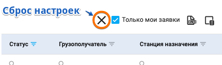
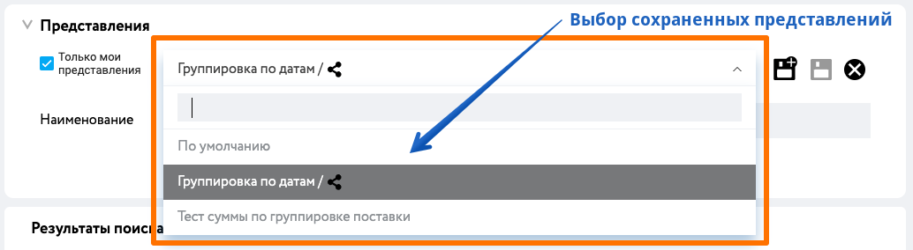

# Работа с табличными данными

Большая часть интерфейсов личного кабинета Клиент инфо 2 построена на табличном представлении данных, поэтому важно потратить немного времени и изучить все основные возможности работы над таблицами.

## Поиск и фильтрация данных
При работе с данным в таблице имеется широкий функционал поиска и фильтрации данных

### Фильтры в колонках
Для фильтрации данных в любой колонке имеется иконка, при нажатии на которую открывается диалоговое окно со всеми вариантами значений в данной колонке. 

В зависимости от типа данных в выбранной колонке, значения фильтров могут отличаться.

Так, например, для полей с датами, данные группируются иерархично год -> месяц -> день. Что позволяет одним кликом выбрать сразу все даты нужного месяца или год целиком.

Для обычных чисел и строк, данные отображаются плоским списком.

### Поиск в колонках
Для быстрого поиска данных в любой колонке имеется поле ввода поискового запроса.

Данные будут найдены в таблице автоматически сразу после ввода любого символа в поисковую строку.
По умолчанию, поиск осуществляется в режиме частичного совпадения строки без учета регистра.

Для настройки режима поиска, пожалуйста, воспользуйтесь выбором оператора сравнения.

В зависимости от типа данных в выбранной колонке, значения операторов режима поиска могут отличаться.

Так, для полей с числами и датами, можно искать в режиме сравнения больше или меньше. 
И даже есть режим поиска в диапазоне 

Кроме того, для полей с датами, вы можете выбирать конкретные значения дат используя визуальный календарь.
Для этого достаточно нажать на соответствующую иконку календарика.

Для обычных строк доступны варианты режимов "содержит", "не содержит", "начинается", "заканчивается" и другие. 

Таким образом, вам доступна гибкая настройка операторов сравнения практически для любого варианта поиска.

### Общий (сквозной) поиск в таблице
Кроме поиска по конкретным колонкам, система предлагает общий (сквозной) поиск в таблице.
Здесь нет выбора операторов сравнения и поиск всегда осуществляется в режиме частичного совпадения строки без учета регистра.
Но при этом поиск ведется сразу по всем колонкам таблице.
Для поиска достаточно кликнуть в строку поиска в правом верхнем углу таблицы и ввести поисковую строку.
При этом найденные элементы в ячейках таблицы будут визуально "подсвечены" голубым цветом.
Строки с ненайденными данными будут скрыты.

### Постраничный переход (пагинация)

В случае если данных много, таблица отображает только часть данных.

Вы можете указать количество для отображения строк таблицы на одной страницы от 10 до 100.
В зависимости от этой настройки пересчитается количество страниц.

Для перехода между страницами внизу под таблицей вам доступен постраничный переход (пагинация).

## Группировка по колонкам
Вы можете самостоятельно сгруппировать данные практически по любой колонке и даже нескольким колонкам.

В сгруппированном виде данные выглядят следующим образом:

Даже можно сделать многоуровневую группировку просто перетащив несколько колонок.

Например, в списке заявок группировка сначала по виду продукции, а вторым уровнем по станции назначения.

При выгрузке в Excel данные выгружаются также в сгруппированном виде.

::: tip Примечание
В Excel имеется ограничение по максимально возможному количеству уровней группировок. Максимум 5 уровней.
:::

## Сортировки
По умолчанию данные отсортированы по требуемой дате поставки (чем раньше дата, тем выше строчка)

Но вы можете переопределить сортировку кликнув на любом из заголовков колонки, по которой нужно отсортировать.

Повторный клик сортирует в обратном порядке.

Если кликнуть при зажатой клавише `Ctrl`, то включается режим мультисортировки и для следующего уровня сортировки отображается выбор направления сортировки

Таким образом можно сортировать сразу по нескольким колонкам (мультисортировка)

## Настройка колонок таблиц
Вы можете выбрать нужные только вам колонки

Просто нажмите на иконку

И выберите столбцы нужные только вам.
Если колонок много, воспользуйтесь быстрым поиском.

Также кроме выбора списка колонок, вы можете настраивать и их порядок.

Просто нажмите на заголовок колонки и не отпуская кнопку мышки перетащите в новое место (drag&drop)

## Cохранение настроенного вида таблиц

Для еще более удобной работы с таблицами в системе имеется функционал сохранения ваших персональных настроек для каждой таблицы.

В зависимости от того раздела системы в котором вы находитесь существует два разных способа сохранения настроек.

В большинстве случаев используется [автоматическое сохранение](/guide/dx.html#автоматическое-сохранение-по-умоnчанию).

Но для раздела [отчеты](/guide/report) мы реализовали более продвинутый вариант ["Представления"](/guide/dx.html#сохранение-в-представnения-дnя-отчетов)

### Автоматическое сохранение (по умолчанию)
Все что вы настроите, автоматически сохраняется, следовательно, настройка внешнего вида табличного представления данных зависит персонально от вас.

При перезагрузке или следующем посещении страницы, данные будут отображены в таблице ровно в том виде, который вы настроили в прошлый раз.

Для сброса настроек на установленные в системе по умолчанию, пожалуйста, нажмите кнопку "Сброс настроек".

::: warning Важно понимать!
Настройки сохранятся не в системе и в вашей учетной записи, а непосредственно на вашем устройстве (в браузере). Таким образом, в случае если вы очистите кэш браузера, настройки внешнего вида сбросятся на установленные по умолчанию.
Однако для системы отчетов применяется иной принцип сохранения настроек - представления
:::

### Сохранение в представления (для отчетов)

Для отчетов и некоторых других страниц, где активно используется табличный вид данных, разработан специальный более удобный вариант сохранения пользовательских настроек внешнего вида таблиц в виде отдельных представлений.

Что бы вы не делали с настройками внешнего вида таблиц отчета группируя колонки, настраивая сортировку или фильтрацию данных в отчете, выбирая только необходимые вам для работы столбцы, теперь вы можете сохранить состояние таблицы в отдельное представление:

Можно делать много представлений с различными настройками. Создавать копии представлений, удалять ненужные и, при желании, даже предоставить доступ к некоторым из них вашим коллегам сделав представление общим.

Для работы с представлениями вам необходимо сделать три простых шага:

**Шаг 1. Настройте внешний вид таблицы**

Отсортируйте данные, сгруппируйте или отфильтруйте как вам удобно. Настройте нужные вам порядок столбцов

**Шаг 2. Сохраните представление**

Заполните форму в блоке "Представления" указав наименование представления, а также при необходимости отметьте опцию "Сделать представление общим" в том случае, если вы хотите чтобы ваше представление могли использовать другие сотрудники внутри вашей организации. Далее нажмите иконку сохранить представление.

**Шаг 3. Используйте сохраненные представления**

При повторном построении отчета вы можете выбрать любое из представлений.

Для этого выберите в выпадающем списке один из вариантов сохраненных ранее представлений.

Таблица и данные в ней мгновенно перестроятся согласно настройкам в данном представлении. 

::: tip Примечание
Обратите внимание, что при смене представления изменяется лишь внешний вид таблицы. Повторно отчет не скачивается. Ожидание не требуется.
:::

