# Аннотация

Настоящая инструкция предназначена для ознакомления клиента ОАО «НЛМК» с процессом настройки справочников и позиций Избранного в ЛК.

# Общие сведения

**Electronic Data Interchange (EDI) —** система электронного обмена данными, которая включает в себя набор стандартов представления данных и конвенций по передаче цифровой информации между контрагентами. Обмен сообщениями EDI происходит через EDI-провайдера.

**EDI-провайдер —**  организация, которая обеспечивает техническую возможность электронного обмена данными. Провайдер контролирует и своевременно обновляет форматы передаваемых документов, управляет настройками, подключает новых контрагентов, проводит проверку сообщений на валидность.

Существует несколько видов EDI-документов.:
|Тип| Описание |
|--|--|
| ORDERS |Заявка|
| DESADV |Уведомление об отгрузке
| RECADV | Уведомление о приемке |
| RETANN | Уведомление о возврате |
В настоящий момент в системе реализован обмен видом документов ORDERS, на основе которого в  личном кабинете (ЛК) B2B "Клиент инфо 2" создается черновик заявки, который далее реплицируется из ЛК в систему ERP НЛМК, для формирования заказа/заказов на основании заявки. По итогу верификации входяещго EDI-документа система формирует обратное сообщение с итогом проверки заявки и списком ошибок и предупреждений, если не все данные корректны или полные. Другие виды EDI-документов предпологается реализовать в системе ERP НЛМК.

**Для сообщения ORDERS:**
 1. Клиент заблаговременно настраивает в своем ЛК "Клиент инфо 2" маппинг клиентских кодов своей информационной системе (ИС) и кодов ЛК  "Клиент инфо 2" (Справочники + Избранное).
 2. Клиент в своей ИС создает заявку со своими клиентскими кодами и в формате своей системы и отправляет заявку в  ЛК  "Клиент инфо 2" через  EDI провайдера.
	2. 1. Если клиент не пользуется услугами EDI-провайдера "Контур", требуется согласовать и настроить со своим провайдером роуминг данных между своим провайдером и EDI-провайдером "Контур".
 3. EDI провайдер проверяет все сообщения на корректность и переводит документы из формата ИС клиента в формат входящего EDI-сообщения  ЛК  "Клиент инфо 2"  и отправляет документы заявок в  ЛК  "Клиент инфо 2".
 4. ЛК  "Клиент инфо 2" получает EDI-заявку и формирует в ЛК клиента её черновик.
 5. Пользователь входит в ЛК  "Клиент инфо 2", проверяет черновик заявки, дополняет заявку обязательными и другими данными, которые не были переданы в EDI-сообщении и отправляет заявку в SAP ERP НЛМК.

**Общая схема обмена EDI сообщениями по заказу клиента:**
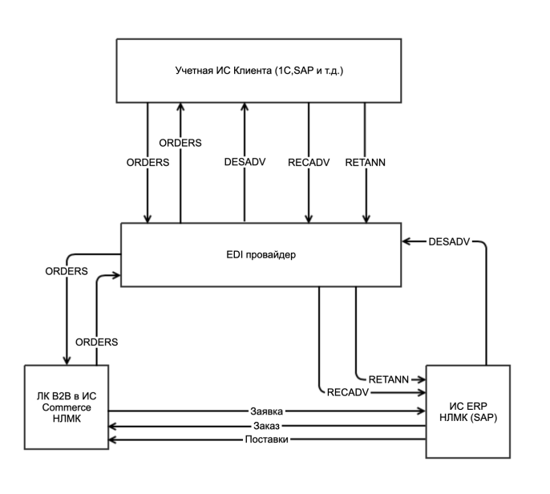

# Работа с функционалом передачи EDI-заявок

Процесс работы с функционалом передачи EDI-заявок из ИС клиента включает в себя выполнение следующих действий:

 1.  Создать заявку на подключение к EDI-обмену, путем заполнения опросника  (см. ниже)  и отправить опросник на арес электронной посты службы поддержки Клиент-инфо (СП)  [clientinfo@nlmk.shop](mailto:clientinfo@nlmk.shop).
**Опросник клиентов**:
		
	        1. Используете ли портал  ЛК  "Клиент инфо 2"
	        2. Укажите учетные данные администратора EDI-обмена (существующую учётную запись или данные для новой учётной записи)
	        3. Данные сотрудника-администратора EDI-обмена
	         a. ФИО
	         b. Email
	        4. Реализован ли в ИС клиента EDI-обмен с другими системами?
	        5. Получен ли GLN-код(ы)
	        6. Есть ли действующее соглашение с EDI-провайдером?
	         a. Наименование EDI-провайдера
	        7. Ваша учетная система ERP?  (SAP ERP, 1С и т.д.)
	        8. Планируемое количество заявок в месяц
	        9. Среднее количество позиций в заявке (опциональный вопрос)
	        10. Количество номенклатуры, с которым вы работаете в  ЛК  "Клиент инфо 2" (позиции Избранного)
	        11. С какими группами продукции НЛМК вы работаете в ЛК "Клиент инфо 2"?
	        12. С какими пунктами отгрузки НЛМК вы работаете?
	        13. Какими видами доставки продукции вы пользуетесь?
        
2. Если отсутствует код GLN клиента, следует код GLN у официального оператора международной системы GS1        
 **Как получить номер GLN**
        
        Реестр кодов Global Location Number ведется в международной системе GS1. В каждой стране есть официальные операторы указанной системы, которые занимаются проверкой заявок и документов, присвоением GLN. Также эти услуги могут оказывать официальные провайдеры международной системы электронного документооборота EDIN.
        
        Процесс получения Global Location Number заключается в следующем:
		 - юридическое лицо или ИП должны иметь действующую усиленную квалифицированную электронную подпись (если ЭЦП нет, ее можно получить через один из удостоверяющих центров);
		 - нужно обратиться к официальному провайдеру GS1 или EDIN, заполнить заявку, направить документы и сведения на организацию, структурное подразделение или объект;
		 - при заключении договора можно сразу выбрать срок обслуживания (например, можно получить идентификатор на 1 или 3 года, в зависимости от целей заказчика);
		 - заказчик оплачивает услуги провайдера;
		 - после проверки заявки будет присвоен уникальный Global Location Number, а сведения о нем включат в реестр.
        
        Есть еще один вариант получения кодов. Для этого можно вступить в ассоциацию  [GS1](https://www.gs1ru.org/), после чего коды будет присваиваться бесплатно. Но членство в ассоциации GS1 обязывает платить вступительные и ежегодные взносы. Поэтому такой вариант подойдет только крупным компаниям.
        До истечения срока действия Global Location Number его можно продлить. Для этого также необходимо обращаться к провайдерам GS1. При продлении числовая комбинация не изменится, поэтому вносить изменения в договоры, документы и маркировку не придется."
        
3. Если клиент не сотрудничает ни с одним EDI-провайдером, следует заключает соглашение с EDI-провайдером "[Контур](https://kontur.ru/edi)", так как этот провайдер обрабатывает и передает в ИС НЛМК получаемые извне EDI-заявки - напрямую от клиента или через другого EDI-провайдера
4. Клиент настраивает свою ИС для формирования EDI-сообщения в требуемом формате.
	1. Формат, правила заполнения и пример EDI-заявки см. раздел Технические требования (ниже)
5. Клиент настраивает интеграцию ИС клиента - ИС Контур.
6. Клиент передает в СП  ЛК  "Клиент инфо 2" код GLN для настройки EDI-обмена в продуктивной среде ИС НЛМК.
7. СП  ЛК  "Клиент инфо 2"  настраивает обмен EDI-сообщениями в бэкофисе  ЛК  "Клиент инфо 2", на сонове GLN-кода клиента и выдает требуемые права на настройку справочников и позиций избранного для материалов пользователю со стороны клиента.
8. Клиент настраивает справочники и позиции избранного, путем присвоения своих внутреннх кодов элементам справочников  ЛК  "Клиент инфо 2" и позициям Избранного для материалов
9. Клиент формирует EDI-заявку в своей системе и реплицирует заявку в ЛК чепез клиент EDI в своей ИС.
10. Клиент получает подтверждение корректности обмена и отсутствия ошибок от СП
11. Клиент проверяет корректность формирования заявки в Клиент Инфо в ЛК

## Настройка справочников и позиций изборанного

Система справочников в ЛК  ЛК  "Клиент инфо 2"  НЛМК служит для настройки обмена справочной информацией в EDI-заявке, передаваемой из ИС клиента в ИС поставщика (НЛМК). Система отображает в виде справочников данные НСИ НЛМК и данные, введенные самим клиентом, например, грузополучатели, данные и п веткам при ЖД доставке и пр. Суть настройки справочников состоит в присвоении требуемым позициям справочников кодов из ИС клиента для корректного сопоставления кодов из EDI-сообщения с записями справочников в ИС НЛМК. В случае, если в EDI-сообщении будет код справочника или позиции избранного не настроенного в ЛК для EDI-обмена, система не сможет обработать такую запись и сформирует  обратное  сообщение об ошибке. Сформированное сообщение об ошибке содержит указание на справочник, в котором возникла ошибка в процессе проверки и категорию ошибки. Ошибки бывают двух категорий - критические ошибки, при которых черновик ошибки не создается в  ЛК  "Клиент инфо 2", и некритические ошибки-предупреждения, при которых черновик заявки создаются, но ошибочные данные в заявку не записываются и указываются в теле сообщения об ошибки с указанием сути проблемы. Предпологается, что некритические ошибки, после формирования черновика заявки в ЛК "Клиент инфо 2" будут дополнены пользователем вручную при проверке сформированного черновика.

## Настройка справочников

### Доступ к списку справочников

В ЛК пользователь с правами администратора EDI выбирает пункт меню Справочники и в выпадающем списке выбирает нужный ему справочник (Рисунок 2),

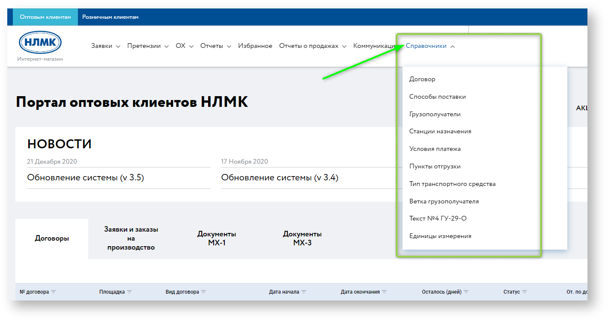
_Рис.2 Меню "Справочники"_

### Элементы экранной формы справочника

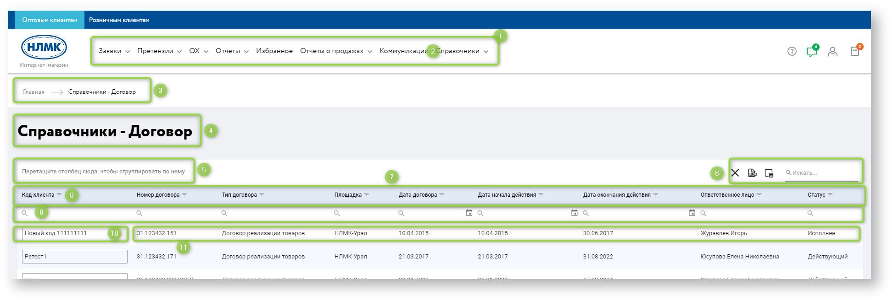
_Рис.3 Элементы экранной формы справочника_

  |№| Описание |
|--|--|
| 1 |Блок общего меню ЛК|
| 2 |Пункт общего меню "Справочники"|
| 3 |Строка меню "хлебные крошки" к странице текущего справочника|
| 4 |Наименование текущего справочника|
| 5 |Область группировки по столбцам|
| 6 |Область сервисных функций справочника|
| 7 |Область заголовков таблицы справочника|
| 8 |Пиктограмм открытия формы настройки фильтрации по столбцу|
| 9 |Область поиска по значениям в столбцах справочника|
| 10 |Поле ввода/редактирования кода (клиента) справочника|
| 11 |Область данных справочника|

### Список  доступных для настройки справочников и ссылки на справочники:

   |№| Название справочника |URL справочника | Примечание | Порядок сортировки|Порядок вывода колонок справочника (по умолчанию)|Описание функционала|
|--|--|--|--|--|--|--|
|1|Договор|[https://b2b.nlmk.shop/b2b/client-codes/contract](https://b2b.nlmk.shop/b2b/client-codes/contract)|Отображаются все активные договоры иежду клиентом и НЛМК|Поле номер договора. По алфавиту| - Код клиента - Номер договора - Тип договора - Площадка - Дата договора - Дата начала действия - Дата окончания действия - Ответственное лицо - Статус|Статичный справочник. Справочник служит для отображения текущего списка заключенных с НЛМК договоров. Записи справочника передаются в  ЛК  "Клиент инфо 2" из системы SAP ERP НЛМК и не пользователем редактируются в ЛК "Клиент инфо 2". При настройке передачи EDI-заявок в ЛК "Клиент инфо 2" от пользователя требуется настроить коды договорв из своей ИС для маппинга с договорами в ЛК "Клиент инфо 2".|
|2|Способы доставки|[https://b2b.nlmk.shop/b2b/client-codes/delivery-mode](https://b2b.nlmk.shop/b2b/client-codes/delivery-mode)|Отображаются все способы доставки доступные для клиента|Поле код. По алфавиту|- Код клиента - Код - Наименование|Статичный справочник. Справочник служит для отображения доступных для клиента способов доставки. Записи справочника настроены в  ЛК  "Клиент инфо 2" и не редактируются пользователем в ЛК "Клиент инфо 2". При настройке передачи EDI-заявок в ЛК "Клиент инфо 2" от пользователя требуется настроить коды способов доставки из своей ИС для маппинга с записями способобов доставки в ЛК "Клиент инфо 2".|
|3|Тип транспортного средства|[https://b2b.nlmk.shop/b2b/client-codes/vehicle-type](https://b2b.nlmk.shop/b2b/client-codes/vehicle-type)|Отображаются все  типы транспортных средств доступные клиенту|Поле наименование По алфавиту|- Код клиента - Код - Наименование|Статичный справочник. Справочник служит для отображения доступных для клиента способов доставки. Записи справочника настроены в  ЛК  "Клиент инфо 2" и не редактируются пользователем в ЛК "Клиент инфо 2". При настройке передачи EDI-заявок в ЛК "Клиент инфо 2" от пользователя требуется настроить коды способов доставки из своей ИС для маппинга с записями способов доставки в ЛК "Клиент инфо 2".|
|4|Грузополучатели|[https://b2b.nlmk.shop/b2b/client-codes/consignee](https://b2b.nlmk.shop/b2b/client-codes/consignee)|Отображаются все грузополучатели клиента|Поле наименование По алфавиту|- Код клиента - Код SAP - Наименование - ИНН (Для нерезидентов номер налогоплательщика) - КПП - ОГРН - Адрес |Справочник доступный для расширения (Только для договоров реализации товаров. Для договоров хранения и выкупа выводится статический список грузополучателей, заполняемый и поддерживаемый на стороне НЛМК). Справочник служит для отображения доступных для выбора грузополучателей клиента. Новые записи справочника создаются в  ЛК  "Клиент инфо 2" при добавлении грузополучателей в процессе создания заявок. При настройке передачи EDI-заявок в ЛК "Клиент инфо 2" от пользователя требуется настроить коды грузополучателей из своей ИС для маппинга с записями грузополучателей в ЛК "Клиент инфо 2".|
|5|Станции назначения|[https://b2b.nlmk.shop/b2b/client-codes/destination-station](https://b2b.nlmk.shop/b2b/client-codes/destination-station)|Отображаются все станции назначения соответствующих грузополучателей клиента (для способа доставки ЖД-транспортом)|Поле  наименование на русском языке По алфавиту (сначала русские затем латинские символы)|- Код клиента - Код РЖД - Наименование|Статичный справочник. Справочник служит для отображения доступных для выбора станций назначения, при способе доставки железнодорожным транспортом. Обязательный справочник, если выбран способ доставки ж.д.-транспортом Новые записи справочника создаются в  ЛК  "Клиент инфо 2" через запрос мидл-офицеру и не редактируются в ЛК "Клиент инфо 2". При настройке передачи EDI-заявок в ЛК "Клиент инфо 2" от пользователя требуется настроить коды станций назначения из своей ИС для маппинга с записями станций назначения в ЛК "Клиент инфо 2".|
|6|Пункты отгрузки|[https://b2b.nlmk.shop/b2b/client-codes/shipping-point](https://b2b.nlmk.shop/b2b/client-codes/shipping-point)|Отображаются все пункты отгрузки Поставщика. В случае отсутсвия пунктов отгрузки в заявке в ИС клиента, при формировании сообщения используется механизм автоматического определения пункта отгрузки на стороне EDI-провайдера Контур|Поле наименование По алфавиту|- Код клиента -Код - Наименование|Статичный справочник. Справочник служит для отображения доступных для клиента пунктов отграузки релевантных договорам с клиентом. Записи справочника настроены в  ЛК  "Клиент инфо 2" и не редактируются пользователем в ЛК "Клиент инфо 2". При настройке передачи EDI-заявок в ЛК "Клиент инфо 2" от пользователя требуется настроить коды способов доставки из своей ИС для маппинга с записями способов доставки в ЛК "Клиент инфо 2".|
|7|Условия платежа|[https://b2b.nlmk.shop/b2b/client-codes/pay-terms](https://b2b.nlmk.shop/b2b/client-codes/pay-terms)|Отображаются все условия платежа доступные клиенту. Настроить необходимо только актуальные для клиента условия платежа.|Поле наименование По алфавиту|- Код клиента - Код - Наименование|Статичный справочник. Справочник служит для отображения доступных для клиента условий платежа. Записи справочника настроены в  ЛК  "Клиент инфо 2" и не редактируются пользователем в ЛК "Клиент инфо 2". При настройке передачи EDI-заявок в ЛК "Клиент инфо 2" от пользователя требуется настроить коды условий платежа из своей ИС для маппинга с записями способов доставки в ЛК "Клиент инфо 2".|
|8|Ветка грузополучателя|[https://b2b.nlmk.shop/b2b/client-codes/branch](https://b2b.nlmk.shop/b2b/client-codes/branch)|Опциональные данные. Отображаются  все ветки грузополучателей  данного клиента (для способа доставки ЖД-транспортом)|Поле наименование По алфавиту|- Код клиента - Код - Наименование|Справочник доступный для расширения. Справочник служит для отображения доступных для выбора веток грузополучателя при способе доставки железнодорожным транспортом. Опциональный справочник, если выбран способ доставки ж.д.-транспортом, то есть, отсутствие данных по ветке грузополучателя не помешает процессу создания черновика заявки из EDI-заявки. Новые записи справочника создаются в  ЛК  "Клиент инфо 2" при добавлении или редактировании грузополучателей. При настройке передачи EDI-заявок в ЛК "Клиент инфо 2" от пользователя требуется настроить коды веток грузополучателей из своей ИС для маппинга с записями веток грузополучателей в ЛК "Клиент инфо 2".|
|9|Текст №4 ГУ-29-О|[https://b2b.nlmk.shop/b2b/client-codes/text4](https://b2b.nlmk.shop/b2b/client-codes/text4)|Опциональные данные. Отображаются  все варианты Текст №4 ГУ-29-О грузополучателей  данного клиента (для способа доставки ЖД-транспортом)|Поле наименование По алфавиту|- Код клиента - Код - Наименование|Справочник доступный для расширения. Справочник служит для отображения доступных для выбора текстов  №4 ГУ-29-О,  при способе доставки железнодорожным транспортом. Опциональный справочник, если выбран способ доставки ж.д.-транспортом, то есть, отсутствие данных текстов  №4 ГУ-29-О  не помешает процессу создания черновика заявки из EDI-заявки. Новые записи справочника создаются в  ЛК  "Клиент инфо 2" при добавлении или редактировании грузополучателей. При настройке передачи EDI-заявок в ЛК "Клиент инфо 2" от пользователя требуется настроить коды текстов №4 ГУ-29-О из своей ИС для маппинга с записями текстов №4 ГУ-29-О в ЛК "Клиент инфо 2".|
|10|Единицы измерения|[https://b2b.nlmk.shop/b2b/client-codes/unit](https://b2b.nlmk.shop/b2b/client-codes/unit)|Отображаются единицы измерения килограммы и тонны.|Поле наименование По алфавиту|- Код клиента - Код - Наименование|Статичный справочник. Справочник служит для отображения списка единиц измерения. Записи справочника настроены в  ЛК  "Клиент инфо 2" и не редактируются пользователем в ЛК "Клиент инфо 2". При настройке передачи EDI-заявок в ЛК "Клиент инфо 2" от пользователя требуется настроить коды единиц измерения из своей ИС для маппинга с записями единиц измерения в ЛК "Клиент инфо 2".|

### Пользовательские настройки таблиц справочников

Доступны следующие функции работы с экранными формами справочников:

-   фильтрация;
-   сортировка;
-   группировка;
-   пагинация (количество строк на странице по умолчанию 10, с возможностью выбрать 25 и 50 записей);
-   контекстный поиск по столбцу;
-   контекстный поиск по таблице;
-   настройка видимости столбцов таблицы;
-   выгрузка в Excel.

#### Фильтрация

Для фильтрации (отбора) элементов справочника по любому столбцу, необходимо нажать на пиктограмму отбора рядом с именем столбца. Открывается форма отбора элементов со списком всех уникальных значений в столбце и флагами выбора отдельных элментов, по которым будет произведен отбор данных (см. Рис. 4). Также есть возможность выбрать все элементы или убрать выделение со всех элементов.

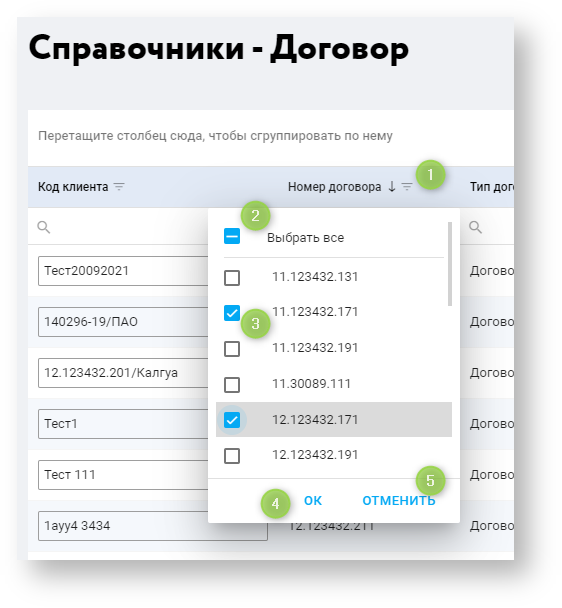
_Рис.4 Форма настройки фильтрации по столбцу_
  
|№|Элемент|Описание|
|--|--|--|
|1|Пиктограмма открытия формы фильтрации |При выборе открывается форма фильтрации с элементами управления|
|2|Пиктограмма выбора/снятия выбора со всех элементов отбора|При первом нажатии, выбираются все элементы данных столбца. При повторном нажатии выделение со всех элементов отбора по столбцу снимаются|
|3|Пиктограмма выбора/снятия выбора с отдельного элемента отбора|При первом нажатии, выбирается элемент данных столбца. При повторном нажатии выделение с элемента отбора по столбцу снимаются|
|4|Кнопка подтверждения отбора|При нажатии применяется отбор, форма отбора закрывается|
|5|Кнопка отмены/закрытия формы отбора|При нажатии применяется отбор не производится, форма отбора закрывается|  

#### Сортировка

Таблица с элементами справочника позволяет производить сортировку одновременно по нескольким столбцам. Для сортировки элементов справочника по любому столбцу, необходимо нажать на заголовок столбца. Для множественной сортировки необходимо произвести щелчок на других заголовках с нажатой клавишей Shift или воспользоваться контекстным меню, отображаемого при правом щелчке мышью на заголовке столбца таблицы.

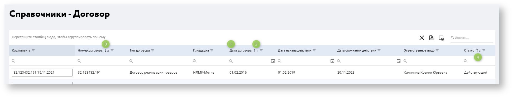
_Рис.5 Настройка множественной сортировки по столбцам_

|№|Элемент|Описание|
|--|--|--|
|1|Заголовок столбца справочника|При выборе производится сортировка по возрастанию значений элементов в столбце. При повторном нажатии, производится обратная сортировка, то есть, если сортировка была по возрастанию, данные будут отсортированы по убыванию, и наоборот. Если был сделан множественный выбор, щелчок по заголовку снимает сортировки в других столбцах и меняет направление сортировки в текущем столбце|
|2|Пиктограмма направления сортировки и порядковый номер сортировки|При нажатии на заголовок,  производится сортировка по полю. Повторный щелчок на заголовок изменяет направление сортировки. Пиктограмма стрелки и число отображают направление сортировки (по возрастанию или убыванию) и порядковый номер сортировки. До использования дополнительной сортировки, число около пиктограммы направления сортировки отображается без цифры. Также можно использовать для сортировки контекстное меню, отображаемое при правом щелчке на заголовке столбца 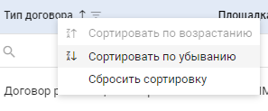|
|3|Пиктограмма направления дополнительной сортировки и порядковый номер сортировки|При нажатии на заголовок  с нажатой клавишей Shift производится сортировка по дополнительному полю. Повторный щелчок с нажатой клавишей Shift изменяет направление дополнительной сортировки. Также можно использовать для дополнительной сортировки контекстное меню, отображаемое при правом щелчке на заголовке столбца 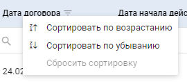|
|4|Пиктограмма направления дополнительной сортировки и порядковый номер сортировки (2)|Аналогично п. 3|

#### Группировка

Таблица с элементами справочника позволяет производить группировку, в том числе, вложенную, с использовнием нескольких полей. Для группировки по полям, необходимо перетащить мышкой заголовки в область группировки над таблицей (см. Рис 6). Вложенность группировки определяется последовательностью меток с наименованиеями полей группировки (см. рис. 7, 8). Также на метках группировки можно настроить отбор и сортировку аналогично описанию в предыдущих разделах. Отмена группировки производится путем перетаскивания мышкой меток из области группировок на строку заголовка справочника (см. Рис. 9)

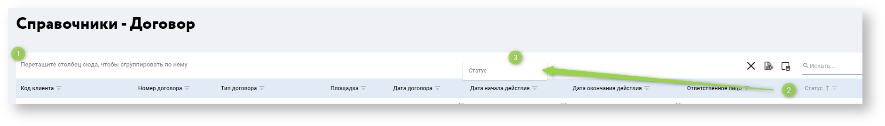
_Рис.6 Настройка группировки по столбцам_

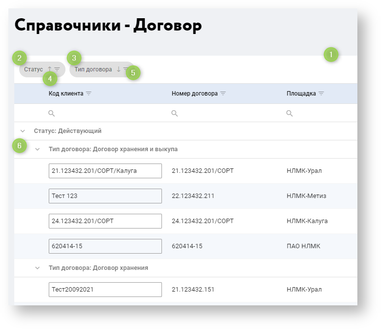
_Рис.7 Настройка вложенной группировки_
|№|Элемент|Описание|
|--|--|--|
|1|Область группировки|Для группировки по полям в эту область необходимо перетащить мышкой заголовки полей, в требуемой последовательности|
|2|Метка с наименованиеями поля группировки 1|
|3|Метка с наименованиеями поля группировки 2|
|4|Пиктограмма направления сортировки|Аналогично разделу описания сортировки, за исключением возможности настройки последовательности сортировки. Сортировка производится на основе последовательности полей группировки|
|5|Пиктограмма отбора (фильтрации)|Аналогично разделу описания группировок|
|6|Дерево группировок|Отображается согласно последовательности группировок в области группировок|

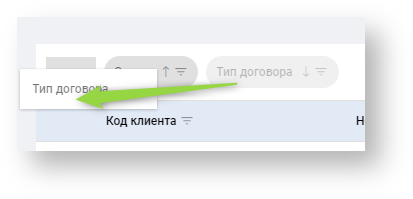
_Рис.8 Изменение вложенной группировки_

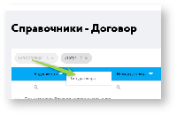
_Рис.9 Отмена группировки_

#### Пагинация (количество строк на странице по умолчанию 10, с возможностью выбрать 25 и 50)

По умолчанию, справочники выводятся на экран с табличной частью ограниченной 10-ю строками, с возможностью расшиения количество строкдо 25 или 50. Управлющий элемент пагинации распологается под таблицей.

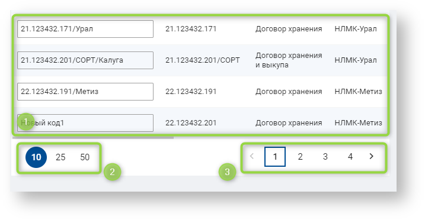
_Рис.10 Управление пагинацией_

|№|Элемент|Описание|
|--|--|--|
|1|Область данных справочника||
|2|Область пагинации|Выбор между одного из трех значений количества строк, выводимых на странице справочника|
|3|Область навигации по страницам||

#### Контекстный поиск по столбцу

Области поиска данных в справочнике по полю. Распологается под наименованием столбца. Отбор производится по мере набора текста.

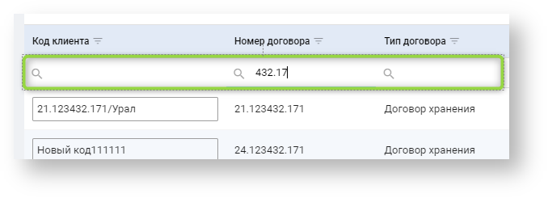
_Рис.11 Поиск по полю_

#### Контекстный поиск по таблице

Поле ввода поиска данных во всем справочнике по полю. Распологается в области сервисных функций формы справочника (см. (1) на Рис. 12)

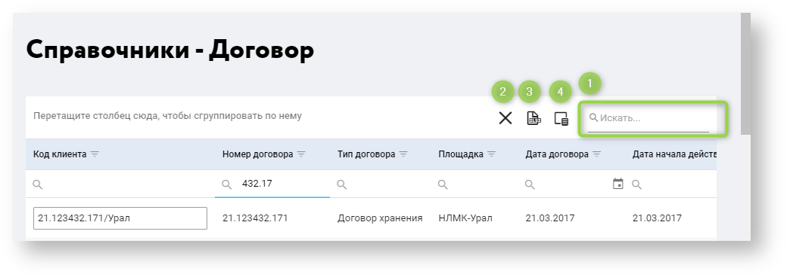
_Рис.12 Сервисные функции формы справочника_

|№|Элемент|Описание|
|--|--|--|
|1|Поле поиска данных в справочнике|Записи отбираются по мере ввода текста|
|2|Пиктограмма сброса всех настроек таблицы до значений по-умолчанию||
|3|Пиктограмма выгрузки справочника в файл Excel|Файл формата MS Ecel создается и загружается на компьютер пользователя|
|4|Пиктограмма Видимость столбцов|Открывается форма настройки отображения столбцов таблицы|

#### Настройка видимости столбцов таблицы

 Форму справочника можно настроить отображая или скрывая определенные поля. Отображение полей управляется через форму настройки видимости полей (см. Рис.13). Форма открывается через пиктограмму Выбор столбцов (см. (4) на Рис 12). Форма настройки видимости также содержит поле контекстного поиска для поиска определенного поля.

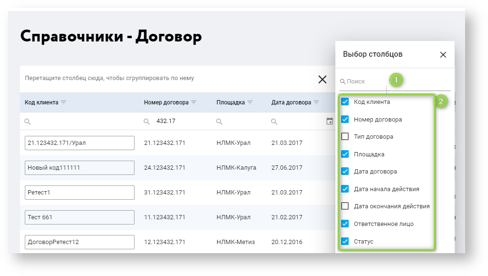
_Рис.13 Настройка видимости солбцов справочника_

|№|Элемент|Описание|
|--|--|--|
|1|Поле поиска данных в списке отображаемых полей|Записи отбираются по мере ввода текста|
|2|Список полей с флагами|Список полей с флагами для включения или отключения их видимости в форме справочника|

#### Выгрузка данных в файл Excel.

Система позволяет выгрузить на компьютер пользователя справочник полнотстью в формате файла MS Excel. Файл создается и загружается в системную папку загрузок через пиктограмму Экспортировать всё (см. (3) на Рис 12). Форма настройки видимости также содержит поле контекстного поиска для поиска определенного поля.

### Добавление/изменение кодов справочника

При выборе в меню справочника открывается страница с таблицей справочника, в которой отображается необходимая пользователю информация по данному справочнику (см. (11) на Рис. 3)  и доступны и активны поля (см. (10) на Рис. 3) для добавления клиентских кодов в записи справочника .

_Примечание. Для пользователя с ролью  Авторизованный B2B-пользователь доступен только просмотр справочников, поля для добавления клиентских кодов не доступны для редактирования._

 1. Если код клиента был заполнен и пользователь изменяет кода в любом справочнике,  отображается всплывающая плашка зеленого цвета с надписью _"Код изменен"._ В случае, если на момент изменении кода у пользователя нет прав Администратора EDI, система возвращает ошибку 403 и Код клиента не меняется. 
 2. Поле Код клиента обязательное. Если код клиента уже был уже создан, то, при удалении данных из поля Код клиента, пользователю отображается всплывающая  плашка красного цвета с надписью  _"Необходимо ввести код", а  значение поля остается  прежним._ При вводе/добавлении из буфера обмена значения клиентского кода, по краям  обрезаются пробелы (при сохранении). 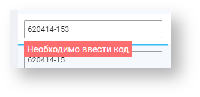
 3. Поле Код клиента - уникальное. Если пользователь ввел не уникальный код, то в поле Код клиента отображается всплывающая плашка красного цвета с надписью "_Код_ _не уникален_", а значение поля остается прежним, в случае изменения кода или пустым, при начальном (первом) вводе кода.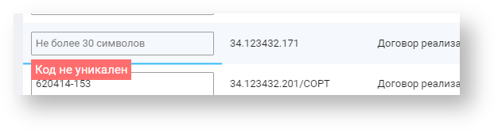
 4. Допустимый размер клиентского кода ограничен 30-ю символами в полях на фронте и в BackOffice. Код клиента должен быть уникален в рамках клиента и текущего справочника. При вводе/добавлении из буфера обмена значения клиентского кода по краям обрезаются пробелы.

## Настройка позиций избранных материалов в ЛК для EDI-обмена

Позиции Избранного для материалов настраиваются в ЛК аналогично Справочникам. То есть, для каждого элемента из материалов списка Избранного необходимо указать его участие в формировании EDI-заявок и внести клиентский код в соответствующее поле. Списки Избранного формируются различным способом для конфигурируемых материалов ПАО НЛМК и сортовых площадок НЛМК. Для конфигурируемой продукции ПАО и ВИЗ сталь для добавления продукции в избранное, ее необходимо сконфигурировать и указать код клиента для позиции избранного. Для готовой продукции СОРТовых площадок НЛМК отображается весь каталог продукции, где, далее, необходимые позиции добавляются в избранное.

Подробнее о процессе добавления позиций избранного для конфигурируемой и продукции сортовых пощадок, см. документ  [Шаблоны продукции (избранное)](https://doc.nlmk.online/guide/order/favorite.html).

### Доступ к позициям Избранного в ЛК

Доступ к настройке позиций избранного производится через пункт общего меню ЛК "Избранное", см Рис.14

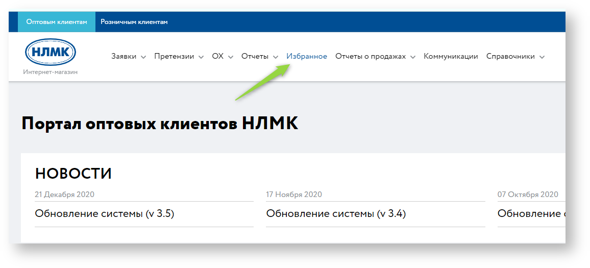
_Рис.14 Меню Избранное в ЛК_

При выборе пункта меню, происходит переход на страницу выбора позиций избранного. Для отображения списка позиций избранного пользователь должен выбрать сбытовую организацию НЛМК, с которой планируется отгрузка материала и вид продукции, к которому принадлежит материал

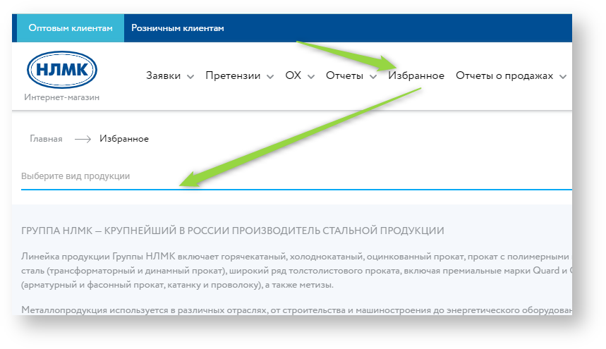
_Рис.15 Начальная страница Избранного_

  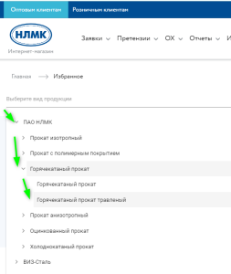
_Рис.16 Выбор сбытовой организации и вида продукции на странице Избранного_

### Заполнение и редактирование кодов клиента в позиция в Избранного

После выбора сбытовой организации НЛМК и вида продукции, пользователю отображжается экранная форма со списком избранного, см. Рис.17а, б.

  
_Рис.17а Экранная форма настройки EDI-обмена на странице Избранного для материалов ПАО НЛМК_

  
_Рис.17б Экранная форма настройки EDI-обмена на странице Избранного для сортовых материалов_

|№|Элемент|Описание|
|--|--|--|
|1|Меню "хлебные крошки" к позициям избранного|Меню "хлебные крошки" к позициям избранного, с учетом сбытовой организации и вида материала|
|2|Наименование списка позиций избранного|Заголовок списка позиций избранного, с учетом сбытовой организации и вида материала|
|3|Столбец флагов признака EDI||
|4|Столбец кодов EDI||
|5|Пиктограмма выгрузки списка Избранного в файл Excel|Выгружается полный список Избранного в формате файла MS Excel. Пример файла см приложение. [Катанка.xlsx](https://doc.nlmk.online/images/edi-docs/katanka.xlsx)|
|6|Не установленный флаг включения позиции избранного в обмен EDI|Для включения позиции избранного в EDI-обмен, необходимо выбрать флаг. Для исключения позиции избранного из EDI-обмена, необходимо снять флаг.|
|7|Активное поле избранного с установленным кодом клиента|Активное поле с введенным кодом Избранного, обведенное рамкой. Возможно редактирование значения поля|
|8|Неактивное поле избранного с установленным кодом клиента|Не активное поле с введенным кодом Избранного, обведенное рамкой. Редактирование значения поля не доступно|
|9|Незаполненное поле избранного кодом клиента|Начальное состяние поля после добавления позиции избранного. Для включения позиции избранного в EDI-обмен, необходимо заполнить поле кодом клиента|
|10|Установленный флаг включения позиции избранного в обмен EDI|Аналогично п. 6|
|11|Область настройки пагинации списка избранного|Область настройки пагинации - аналогично настройке для справочников|
|12|Область перехода по страницам списка избранного|Область перехода по страницам списка избранного - аналогично элементу управления для справочников|
|13|Пиктограмма включения сортового материала в список избранного|Для сортовых материало, так как они выводятся полным списком, требуется указать включение материала в список избранного нажатием на пиктограмму в виде зведочки|

1.  Если поле кода активно и содержит значение, значение кода можно только отредактировать, очистить поле система запретит, выдаст сообщение "Необходимо ввести код" и оставит прежнее значение кода.    
2.  Если в пустое поле кода будет внесен код уже существующий в списке избранного, система выдаст сообщение об ошибке.    
4.  Если поле содержит код клиента и при редактировании вносится неуникальный код, система выдаст сообщение об ошибке и не изменит существующий код. 

# Описание бизнес сценария формирования EDI-заявки

### Предусловия

1.  Пользователь имеет активный договор прямых поставок или ОХ с хотя бы одной из площадок ПАО/СОРТ/МЕТИЗ.

### Сценарий №1. Сохранение черновика заявки в ЛК клиента

#### Предусловия:

1.  Клиент получил уникальный GLN-код и передал его в НЛМК для настройки EDI-обмена на стороне ЛК НЛМК.
2.  Клиент настроил справочниеи в ЛКНЛМК.
3.  Клиент настроил позиции Избранного (материалы), участвующие в обмене сообщениями EDI.
4.  Для клиента в ЛК настроены параметры обмена сообщениями EDI (администратором  ЛК  "Клиент инфо 2") и предоставлены права EDI-администратора .
5.  Нас стороне клиента настроена система для передачи EDI-заявки в НЛМК через EDI-провайдера, с учетом требований к формату сообщений (см. раздел Технические требования)
6.  Пользователь сформировал заявку в своей информационной системе и отправил ее через EDI-провайдера в ЛК НЛМК.

#### Шаги процесса

| № |Тип|Исходное состояние|Действие|Результат|
|--|--|--|--|--|
|1|Основной сценарий|Заявка отсутствует в ЛК НЛМК или заявка с таким же номером уже присутствует в ЛК НЛМК в статусе Черновик.|В информационной  системе  клиента создается заявка и передается в ЛК НЛМК через EDI-провайдера. Заявка  успешно проходит  валидацию.|В  ЛК  "Клиент инфо 2"  создана заявка. Заявка проходит положительно все проверки в соответствии с правилами валидации сообщения на стороне ЛК НЛМК. Существующая ранее заявка удаляется. Заявка в статусе "Черновик" сохранена в ЛК клиента. В листинге заявок в ЛК отображается номер заявки, пришедшей сообщением EDI (Рисунок 18). На странице деталей заявки после ее номера отображается признак заявки, созданной из EDI-сообщения (Рисунок 19) В сформированной печатной форме спецификации отображается номер заявки, созданной из EDI-сообщения (Рисунок 20) Система формирует системное сообщение об успехе операции и отправляет его через EDI-провайдера в ИС клиента|
|2|Альтернативный сценарий (неуспешный сценарий)|Заявка отсутствует  в ЛК НЛМК или заявка с таким же номером есть в ЛК НЛМК в статусе Черновик.|Сформированная в информационной системе клиента заявка получена в ЛК НЛМК через EDI провайдера. Заявка  не проходит  валидацию.|В ЛК НЛМК создана заявка. Заявка не проходит положительно хотя бы одну проверку. Система формирует сообщение с описанием ошибк и отправляет его через EDI- провайдера в ИС клиента.|
|3|Альтернативный сценарий (неуспешный сценарий)|Заявка с таким же номером присутствует в  ЛК  "Клиент инфо 2" в  статусе отличном от Черновик.|Из информационной  системы  клиента передается заявка с тем же номером в ЛК НЛМК через EDI-провайдера|В ЛК НЛМК создана заявка. Поступившая заявка не сохраняется. Система формирует сообщение с описанием ошибк и отправляет его через EDI- провайдера в ИС клиента.|

### Пользовательские интерфейсы

Заявки, сформированне через загрузку EDI-сообщений имеют атрибуты на экранных и печатных формах, отбражающие данные номеров EDI-сообщений, переданных клиентом.

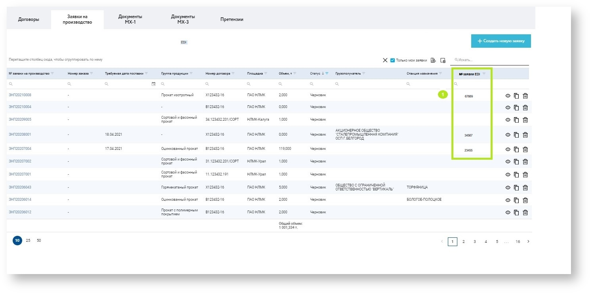
_Рис.18. Отображение заявки, пришедшей сообщением EDI._

|№|Элемент|Описание|
|--|--|--|
|1|№ заявки EDI|Номер заявки, пришедшей сообщением EDI.|
  

_Рис.19. Отображение номера заявки, пришедшей сообщением EDI, на странице деталей заявки._

|№|Элемент|Описание|
|--|--|--|
|1|Номер заявки EDI|Номер заявки, пришедшей сообщением EDI, отображается через "/" после номера заявки на производство.|

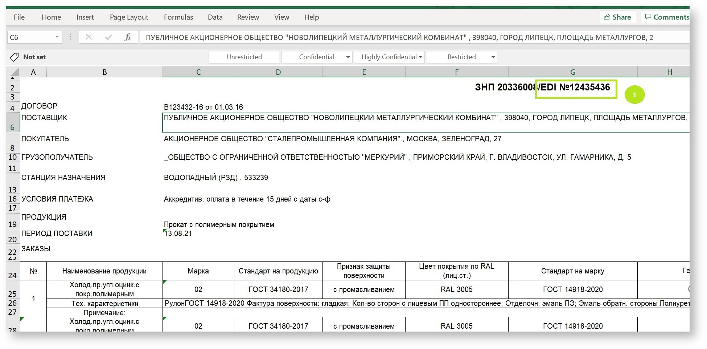
Рис.20. Отображение номера заявки, пришедшей сообщением EDI, в печатной форме спецификации.

|№|Элемент|Описание|
|--|--|--|
|1|Номер заявки EDI|Номер заявки, пришедшей сообщением EDI, отображается через "/" после номера заявки на производство.|

# Технические требования

Для формирования EDI-заявки ИС клиента должна сформировать файл определенного формата (см. спецификацию в таблице ниже) и передать в настроенный интеграционный канал EDI-провайдера, для проверки, обработки и передачи сообщения с данными заявки в ЛК НЛМК, где сообщения будет принято, провалаидировано, сформирован ответ с результатом валидации и, как итог, буде создан черновик заявки, который пользователь, проверив в ЛК, сможет реплицировать в ERP НЛМК для создания в ERP заказа.

Прмер сформированного файла - см. приложение по ссылке:  
[1 Демо ПАО полная.xml](https://doc.nlmk.online/images/edi-docs/1_Демо_ПАО_полная.xml)

Формат файла основан на документе EDI-провайдера Контур, см. вложение по ссылке  [Статусные+сообщения.doc](https://doc.nlmk.online/images/edi-docs/Статусные+сообщения.doc)

### Таблица спецификации параметров xml-сообщения с данными заголовка заявки

|№|Название поля|Сегмент EDI-xml-сообщения (ВнСист→EDI) |Поле/параметр EDI-сообщения|Тип данных|Признак обязательности|Пример записи|Сегмент EDI-сообщения (EDI→ SCPI)|Поле/параметр EDI-сообщения|Объект в ЛК "Клиент инфо 2" (SAP Commerce)(SCPI→hY)|Поле в ЛК "Клиент инфо 2"|Комментарий|
|:--:|:--:|:--:|:--:|:--:|:--:|:--:|:--:|:--:|:--:|:--:|:--:|
|1|Уникальный номер сообщения|eDIMessage|id|string (1-36)|O|`<eDIMessage id="357f97a2-61c6-42c4-b5ed-acd7e85a5dc7">...</eDIMessage>`|eDIMessage|id|EDIOrder|ediMessage|--|
|2|Номер документа (заказа)|eDIMessage→ order|number|string (1-35)|О|`<order number="009000011521T0032401" date="2021-09-28">...</order>`|order|number|EDIOrder|clientOrderNumber|--|
|3|Дата документа (заказа)|eDIMessage→ order|date|date|О|`<order number="009000011521T0032401" date="2021-09-28">...</order>`|order|date|EDIOrder|clientOrderCreateDate|--|
|4|Номер договора|eDIMessage→ order|contractIdentificator number = ""|string (1-35)|O|`<contractIdentificator number="В123456-22" date="2012-05-06" />`|contractIdentificator|number|EDIOrder|contract|--|
|5|GLN покупателя|eDIMessage→ order→ buyer|gln|int (13)|O|`<buyer><gln>2767869668359</gln>...</buyer>`|buyer|gln|EDIOrder|glnCode|--|
|6|Дата поставки по заявке|eDIMessage→ order→ deliveryInfo|requestedDeliveryDateTime|DateTime|O|`<deliveryInfo><requestedDeliveryDateTime>2021-09-28T00:00:00.000Z</requestedDeliveryDateTime></deliveryInfo>`|deliveryInfo|requestedDeliveryDateTime|EDIOrder|deliveryDate|--|
|7|Электронная почта представителя покупателя|eDIMessage→ order→ buyer→ contactInfo→ orderContact|email|string (1-35)|О|`<orderContact><email>anna.balaeva@[accenture.com](http://accenture.com/)</email>  </orderContact>`|orderContact|email|EDIOrder|email|--|
|8|Дополнительный идентификатор грузополучателя|eDIMessage→ order→ additionalInformation|keyValuePair key="consignee"|string (1-35)|O|`<additionalInformation><keyValuePair key="consignee">1000023432</keyValuePair></additionalInformation>`|additionalInformation|consignee|EDIOrder|consignee|--|
|9|Идентификатор станции назначения|eDIMessage→ order→ additionalInformation|destinationStation|string (1-35)|Н|`<additionalInformation><keyValuePair key="destinationStation">ABC_10000</keyValuePair></additionalInformation>`|additionalInformation|destinationStation|EDIOrder|destinationStation|--|
|10|Идентификатор пункта отгрузки|eDIMessage→ order|pointOfIncoterms|string (1-35)|О* _В случае отсутствия в ИС клиента объекта пункта отгрузки НЛМК, используется алгоритм определения пункта отгрузки на стороне Контур на основе данных по плщадке и виду продукции см. вложение_|`<additionalInformation> <keyValuePair key="pointOfIncoterms">НЛМК</keyValuePair></additionalInformation>`|additionalInformation|pointOfIncoterms|EDIOrder|shippingPoint|shippingPoint – пункт отгрузки, откуда будет отгружаться поставка|
|11|Дополнительная информация|eDIMessage→ order|comment|string (1-512)|Н|`<comment> текст комментария</comment>`|order|comment|EDIOrder|comment|--|
|12|Трёхбуквенный код валюты, согласно ISO4217 (3-alpha)|eDIMessage→ order→ lineItems|currencyISOCode|string (3)|Н|`<currencyISOCode>RUB</currencyISOCode>`|lineItems|currencyISOCode|EDIOrder|currency|--|
|13|Условия платежа|eDIMessage→ order→ additionalInformation|paymentTermsCode|string (1-35)|О|`<additionalInformation><keyValuePair key="paymentTermsCode">Credit15Days</keyValuePair></additionalInformation>`|additionalInformation|paymentTermsCode|Order|payTerms|--|
|14|Способы поставки|eDIMessage→ order→ additionalInformation|deliveryMode|string (1-35)|O|`<additionalInformation><keyValuePair key="deliveryMode">Самовывоз</keyValuePair></additionalInformation>`|additionalInformation|deliveryMode|EDIOrder|deliveryMode|--|
|15|Ветка грузополучателя|eDIMessage→ order→ additionalInformation|consigneeBranch|string (1-50)|Н|`<additionalInformation><keyValuePair key="consigneeBranch">Тупичок удачи</keyValuePair></additionalInformation>`|additionalInformation|consigneeBranch|EDIOrderEDI|consigneeBranch|consigneeBranch – название ж/д ветки конечного получателя поставки (текстовое значение до 50 символов)|
|16|Текст №4 ГУ-29-О|eDIMessage→ order→ additionalInformation|text4|string (1-50)|O|`<additionalInformation><keyValuePair key="text4">BFG-9000-FTW</keyValuePair></additionalInformation>`|additionalInformation|text4|EDIOrder|text4|--|
|17|Тип транспортного средства|eDIMessage→ order→ additionalInformation|typeOfTransportCode|string (1-35)|Н|`<additionalInformation><keyValuePair key="typeOfTransportCode">Автотранспорт</keyValuePair></additionalInformation>`|additionalInformation|typeOfTransportCode|EDIOrder|vehicleType|--|
|18|Признак доставки через логоцентр|eDIMessage→ order→ additionalInformation|withLogocenter|string (1)|О|`<additionalInformation><keyValuePair key="withLogocenter">0</keyValuePair></additionalInformation>`|additionalInformation|withLogocenter|EDIOrder|crossDocking|--|
 
### Таблица спецификации параметров xml-сообщения с данными позиций заявки

|№|Название поля|Сегмент EDI-xml-сообщения (ВнСист→EDI) |Поле/параметр EDI-сообщения|Тип данных|Признак обязательности|Пример записи|Сегмент EDI-сообщения (EDI→ SCPI)|Поле/параметр EDI-сообщения|Объект в ЛК "Клиент инфо 2" (SAP Commerce)(SCPI→hY)|Поле в ЛК "Клиент инфо 2"|Комментарий|
|:--:|:--:|:--:|:--:|:--:|:--:|:--:|:--:|:--:|:--:|:--:|:--:|
|1|Номер позиции|eDIMessage→ order→ lineItems|lineNumber|string (1-17)|О|`<lineItem><lineNumber>010</lineNumber>...</lineItem>`|additionalInformation|position|EDIOrderItem|positionNumber|Нумерация формируется EDI-системой. В случае отсутствия нумерации со стороны EDI-системы, на стороне SCPI формируется нумерация позиций, начиная с 1. В случае отсутствия нумерации у части позиций, сообщение считается невалидным и сообщение с позициями заявки в ЛК "Клиент инфо 2" не передается.|
|2|Номер позиции|eDIMessage→ order→ lineItems→ lineItem→ additionalInformation|position|string (1-17)|О|`<additionalInformation><keyValuePairkey="position">010</keyValuePair>....</additionalInformation>`|additionalInformation|position|EDIOrderItem|positionNumber|Ссылка на номер позиции в EDI-заявке для доп. характеристик|
|3|Позиция (клиентский код избранного)|eDIMessage→ order→ lineItems→ lineItem|internalSupplierCode|string (1-35)|O|`<internalSupplierCode>Демо_4.8_2809_с доп.хар._2</internalSupplierCode>`|lineItem|internalSupplierCode|EDIOrderItem|product|--|
|4|Объем|eDIMessage→ order→ lineItems→ lineItem|requestedQuantity|double(12.3)|O|`<requestedQuantity unitOfMeasure="TNE">5.010</requestedQuantity>`|lineItem|requestedQuantity|EDIOrderItem|quantity|--|
|5|Единица измерения|eDIMessage→ order→ lineItems→ lineItem|requestedQuantity unitOfMeasure=""|string (1-3)|O|`<requestedQuantity unitOfMeasure="TNE">5.010</requestedQuantity>`|requestedQuantity|unitOfMeasure|EDIOrderItem|unit|--|
|6|Комментарий к позиции|eDIMessage→ order→ lineItems→ lineItem|comment|string (1-256)|H|`<lineItem>...<comment>Комментарий 2 к товару ПАО</comment>...</lineItem>`|lineItem|comment|EDIOrderItem|comment|--|
|7|Признак защиты поверхности|eDIMessage→ order→ lineItems→ lineItem→ additionalInformation|keyValuePair key ="PRIZ_ZASCH_POV"|string (1-512)|H|`<additionalInformation><keyValuePair key="PRIZ_ZASCH_POV">Без защитной пленки</keyValuePair></additionalInformation>`|additionalInformation|PRIZ_ZASCH_POV|EDIOrderItem|EDIItemAdditionalInformation|=характеристике PRIZ_ZASCH_POV (Защита поверхности)|
|8|Масса (рулон, бунт, пачка) мин|eDIMessage→ order→ lineItems→ lineItem→ additionalInformation|keyValuePair key = "MAS_BUNT_MIN"|string (1-512)|H|`<additionalInformation><keyValuePair key="MAS_BUNT_MIN">3</keyValuePair>...</additionalInformation>`|additionalInformation|MAS_BUNT_MIN|EDIOrderItem|EDIItemAdditionalInformation|=характеристике MAS_BUNT_MIN (Масса (рлн,бунт,пачка) мин,т)|
|9|Масса (рулон, бунт, пачка) макс|eDIMessage→ order→ lineItems→ lineItem→ additionalInformation|keyValuePair key = "MAS_BUNT_MAX"|string (1-512)|H|`<additionalInformation> key="MAS_BUNT_MAX">12</keyValuePair></additionalInformation>`|additionalInformation|MAS_BUNT_MAX|EDIOrderItem|EDIItemAdditionalInformation|=характеристике MAS_BUNT_MAX (Масса (рлн,бунт,пачка) макс, т)|

# Техническая  поддержка

При любых технических ошибках и проблемах работы с системой "Клиент инфо", вы можете отправить обращение по адресу  [clientinfo@nlmk.shop](mailto:clientinfo@nlmk.shop).

