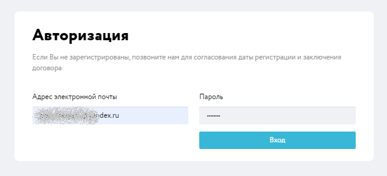

# Общая информация

## Зачем нужен личный кабинет?

В Группе компаний НЛМК внедрена, функционирует и приобретает всё более широкое распространение новая Информационная система `Клиент инфо 2`, функционал которой направлен на улучшение клиентского сервиса и подразумевает наличие Личного кабинета клиента.
Возможности кабинета предполагают:
- просмотр отгрузки в разрезе позиций заказа
- просмотр отгрузки в разрезе план/факт
- формирование оперативного акта сверки
- просмотр и сохранение первичной документации по отгруженной продукции
- претензионные уведомления
- формирование заявки на потребность в продукции.

Перечень возможностей системы постоянно расширяется.

## Как подключиться?

Выполните 3 простых шага для подключения к Клиент инфо НЛМК

1. [Скачайте заявку на подключение](https://doc.nlmk.online/new-b2b-customer-form.xlsx) и заполните контактные данные.
2. Распечатайте, поставьте печать организации и подпись руководителя.
3. Отправьте скан заявки и оригинал в Excel на нашу почту clientinfo@nlmk.shop

::: tip Примечание
Для обработки вашей заявки на подключение понадобится некоторое время. Как правило, не превышает 1-2 рабочих дня.
:::

## Авторизация в системе

При первом входе в систему, а также после длительного отсутствия система Клиент инфо 2 предложит вам авторизоваться.

В открывшейся форме авторизации необходимо указать логин и пароль, затем нажать на кнопку "Вход".

::: warning Обратите внимание
При вводе пароля важен регистр букв. После нескольких попыток ввода неправильного пароля система может заблокировать аккаунт. Для разблокировки обратитесь по адресу clientinfo@nlmk.shop
:::

## Проблемы с входом?

Если у вас не получается войти в систему, доступ заблокировался или же вы потеряли ваш пароль, для восстановления пароля, пожалуйста, напишите запрос на email clientinfo@nlmk.shop

::: danger Важно
Никому не передавайте ваш пароль. Помните, что сотрудники НЛМК имеют специальный доступ под учетную запись клиента и никогда не просят назвать ваш пароль.
:::

## Нужна помощь?

По всем вопросам и консультациям по работе в системе вы можете обратиться в службу поддержки Клиент инфо 2 по адресу clientinfo@nlmk.shop

Мы доступны с 9 до 19 часов по московскому времени, 5 рабочих дней в неделю.
