# Аннотация

Настоящая инструкция предназначена для ознакомления клиента предприятия ПАО "НЛМК" с особенностями работы функционала подписки на отчеты в системе Commerce Cloud [https://b2b.nlmk.shop](https://b2b.nlmk.shop/).

# Общие сведения

Функционал предназначен для предоставления клиенту возможности работы с настраиваемой подпиской на отчеты.

Подписка на отчеты доступна по ссылке: url сайта /b2b/report/documentsubscription

В навигационном меню: Отчеты → Подписка на рассылку документов

> :warning: Как отправляется сертификат качества:
> 1.  Каждые 30 минут отправка (при условии что создана поставка и есть сертификат в эл.архиве ERP)
> 2.  Отправляет SAP ERP от Тех.пользователя сразу клиенту
> 3.  Если подписка и не пришло письмо, значит нет поставки или сертификат в эл.архиве или подписка оформлена не на того пользователя. (распространений кейс)
> 4.  Если возникли другие трудности с получением сертификата, то добавить в переписку  [matveev_vv@nlmk.com](mailto:matveev_vv@nlmk.com)

# Сценарий использования

## Переход на страницу подписки на рассылку документов

Страница располагается в списке из списка отчетов см. Рис.1. По клику осуществляется переход на страницу подписок.

Рис.1 Переход в отчеты из навигационного меню

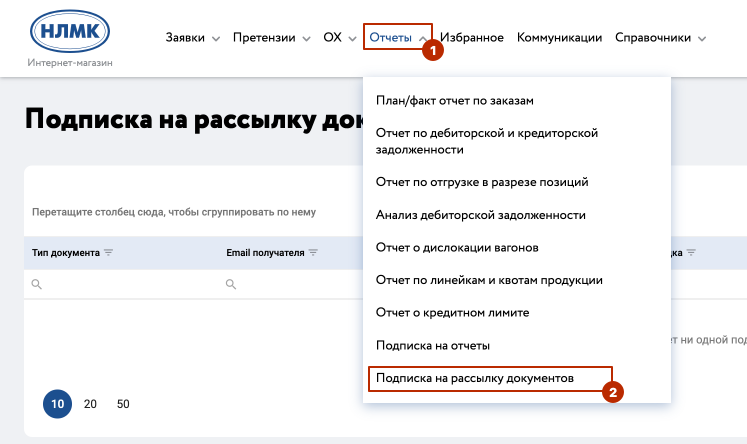

## Страница подписки на рассылку документов

На странице рассылки документов доступы следующие элементы управления и навигации (см. Рис.2):

Заголовочная часть (см. №1 на Рис.2):

1.  - добавить новую подписку

2. 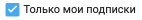  - по умолчанию при переходе на страницу подписок фильтр установлен. Отображаются только собственные подписки. Если галочку снять отображаются все подписки сотрудников компании

3. 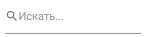- Поиск по подпискам, функционал аналогичен поиску на других страницах сайта;

4.  - экспортировать все в XLS, после нажатия запустится автоматическое скачивание файла содержащего всех отображенных на экране подписок;

5.  - изменить отображение столбцов, пользователю доступные варианты вкл/выкл столбцов из табличной части:

		- код подписки
		- тип документа
		- email получателя
		- ФИО получателя
		- Площадка
		- Договор
		- Грузополучатель

Рис.2 Страница рассылки документов
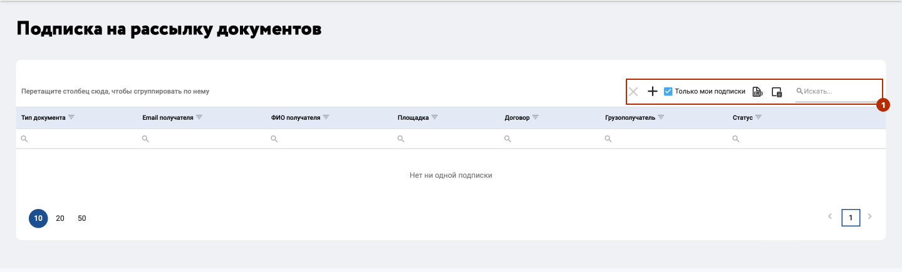

## Создание подписчике на рассылку документов

При нажатии на иконку  откроется всплывающее окно (см. Рис.3) в котором необходимо  выбрать тип документа "Сертификат качества".

Рис.3 Создание подписки
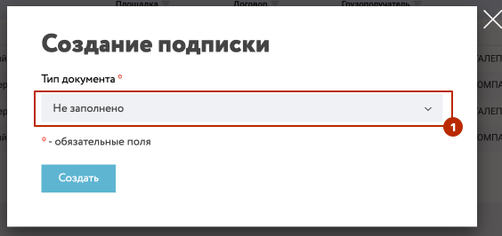

В отобразившемся окне, необходимо заполнить обязательные поля отмеченные * (см. Рис.4).

> :warning: **Обязательные поля**
> - Тип документ
> - Получатель

**Необязательные поля**
+ Площадка
+ Договор
+ Грузополучатель

Рис.4 Создание подписки - настройки
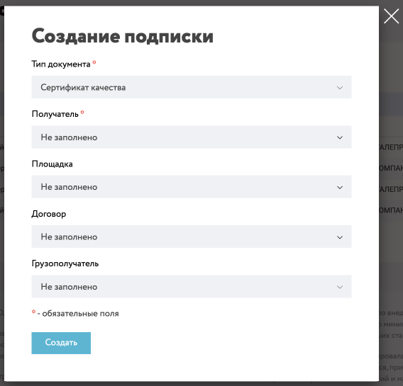

Варианты заполнения полей:

**Обязательные поля**:

-   **Тип документа**  - выбран на этапе создания подписки
-   **Получатель**  - выбрать пользователя из списка получателя отчета, если в списке получателя нет, то вы можете его добавить нажав на кнопку "Добавить нового получателя". При выборе в списке меню получателя или вариант "Добавить нового получателя" в форму создания подписки Рис.4 будут добавлены два дополнительных поля "ФИО Получателя" и "Email получателя"

**Необязательные поля**:

-   **Площадка**  - доступен выбор по какой площадке требуется сертификат.
-   **Договор**  - доступен выбор по какому договору требуется сертификат.
-   **Грузополучатель**  - доступен выбор по какому ГП требуется сертификат.

После заполнения обязательных полей для завершения настройки необходимо нажать кнопку  **"Создать"** (см. Рис.5). Окно настроек будет закрыто, в табличном списке подписок на рассылку документов, будет добавлена новая запись.

Рис.5 Создание подписки - завершение настройки

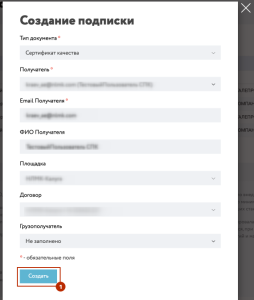

  В табличной форме страницы представлены текущие подписки (см. №2 на Рис.6) и доступны элементы управления:

 - Редактирование подписки, при нажатии осуществляется переход на страницу создания новой подписки с предзаполненными данными, параметров отчета, расписания;
 - При нажатии осуществляется Активация/деактивация подписки;
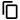 - Копирование подписки, при нажатии осуществляется переход на страницу создания новой подписки с предзаполненными данными, параметров отчета, расписания;
 - Удаление подписки. Доступно удаление только собственных подписок;

Рис.6 Элементы управления подпиской

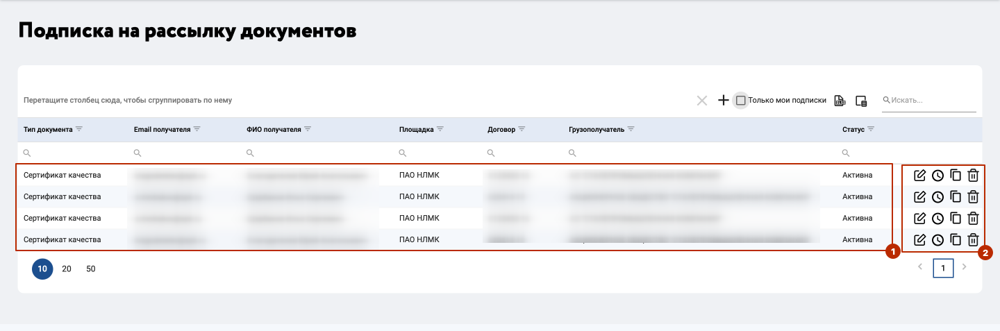

## Пример письма с сертификатом качества

Письмо с сертификатом отправляется каждые 30 минут (пример письма см. Рис.7), при условии что создана поставка и сертификат доступен в электронном архиве (внутри НЛМК). Сертификат доступен в виде вложения в письмо см. Рис.8. ВАЖНО! Если письмо не пришло, то первое что необходимо проверить, корректность данных в созданной подписке (договор/грузополучатель/площадка).

Рис.7 Пример письма
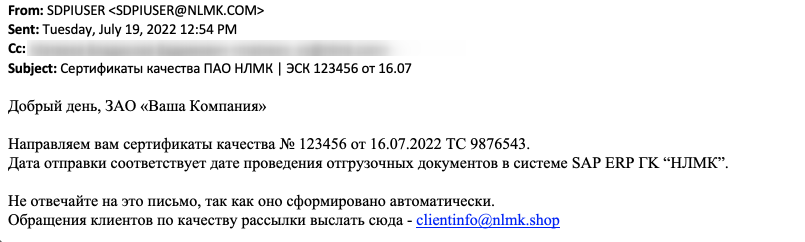

Рис.8 Пример вложения
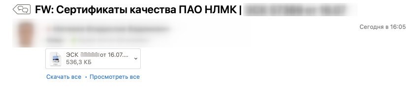
  

# Техническая поддержка

При любых технических ошибках и проблемах при работе с системой "Клиент инфо", вы можете отправить обращение по адресу  [clientinfo@nlmk.shop](mailto:clientinfo@nlmk.shop).
