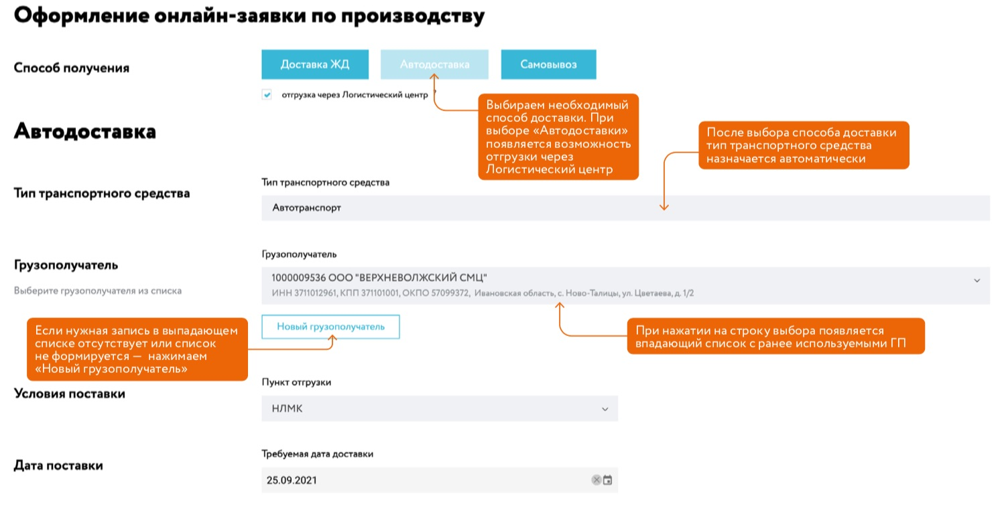

# Оформление заявки на производство (ЗНП)

После добавления необходимых позиций в заявку на производство можно перейти к оформлению заявки.

Форма оформления ЗНП состоит из двух частей:
 - [Работа с позициями в заявке](/guide/order/checkout.html#позиции-в-заявке)
 - [Оформление дополнительных полей заявки](/guide/order/checkout.html#форма-оформnения-заявки)

## Позиции в заявке
При переходе на страницу оформления отображается список позиций, добавленных в заявку. Название позиции и её основные характеристики отображаются с стандартными столбцами. 

Для управления пользователю доступен следующий функционал: 

Дополнительно можно изменить тоннаж для каждой позиции. Для каждой позиции рассчитан установленный толеранс. Если в области толеранса устанавливается курсор и можно изменить значения - это значит толеранс доступен для редактирования. Пр изменении толеранса, обязательно необходимо указать причину отклонения в поле "Комментарий".

Пока ваша заявка не отправлена, она является черновиком и вы можете в любой момент времени ее удали, скопировать целиком заявку (клонировать), добавить еще позиции, а также позиции добавить в [избранное](/guide/order/favorite.html)

::: tip Примечания
при изменении данных в позициях заявки, данные сохраняются автоматически.
:::

После того как вы закончили формировать список позиций для вашей ЗНП, для перехода к форме оформления необходимо выбрать один из способов получения продукции: Доставка ж/д транспортом, Автодоставка  или самовывоз.
См. пункт 6 на рисунке ниже

## Форма оформления заявки

В зависимости от выбранного способа получения товара становятся доступными различные дополнительные поля поля заявки:

**Оформление ЖД доставки**

- **Грузополучатель** - выбирается из списка. Для более быстрого поиска можно начать вводить название, адрес или реквизиты грузополучателя - значения будут отфильтрованы.
  - для заявок на производство **по договору хранения** список грузополучателей ограничен дополнительным соглашением к договору. Если вам нужно добавить нового грузополучателя, вы можете обратиться в сотруднику УСП сопровождающего ваш договор или в [службу поддержки Клиент инфо 2](/guide/#нужна-помощь);
  - для заявок на производство **по договору реализации товаров** доступны для выбора грузополучатели, добавленные пользователем, а также доступна [функция создания нового грузополучателя](/guide/order/consignee.html): 
- **Пункт отгрузки** - выбирается из списка. Доступен поиск по названию.
- **Станция назначения** - выбирается из списка. Доступен поиск по названию. (поле может быть недоступно, так как зависит от выбранного способа доставки)
- **Ветка грузополучателя** - выбирается из списка. Доступен поиск по названию
- **Текст №4 ГУ-29-О** - выбирается из списка, заполняется. Доступен поиск по названию.
- **Дата поставки** - заполняется из календаря или вводом значения в формате ДД.ММ.ГГГГ. 
::: warning Важно понимать
В текущей реализации, вам следует выбирать в календаре последнее число следующего месяца.
С вводом системы "календарного планирования НЛМК" в календаре будет реализована возможность отображения и выбора только возможных прогнозных дат выпуска и поставки для вашего заказа исходя из согласованных квот, объема и вида заказываемой продукции в данной заявке, возможности и загуженности на производстве и множества других факторов влияющих на сроки изготовления металла.
:::
- **Условия платежа** - выбирается из списка. Доступен поиск по названию.
- **Дополнительная информация** - заполняется при необходимости по усмотрению пользователя. Можно ввести текстовый комментарий.

**Оформление Автодоставки**

Форма оформления способом доставки "Автодоставка" отличается отсутствием полей специфичных для железнодорожной доставки, а именно:
- нет выбора ЖД Станция назначении
- нет выбора ЖД ветки и Текста №4 ГУ-29-О
- доступна галочка "отгрузка черезе Логистический центр" 

Остальные поля идентичны форме ЖД доставки выше.

::: warning Важно понимать
отгрузка черезе Логистический центр - эта схема передачи заказа доступна только для заявок ПАО.
Процесс отгрузки осуществляется через промежуточный кросс-докинг центр. Сначала товар доставляется ЖД транспортом на Маталлобазу. Далее уже перегружается на автотранспорт.
Данный способ является оптимальным с точки зрения логистики и временных затрат, благодаря которым отгрузка со склада и доставка товаров максимально точно согласуются по времени. В результате продукция доставляется в оговоренный срок. Поэтому данный способ является рекомендованный к выбору клиента.
:::

После того, как вы добавили все нужные вам матариалы в заявку и заполнили форму оформления ЗНП необходимо нажать кнопку "отправить на рассмотрение".

::: tip Примечания
при изменении данных и заполнении полей в форме оформления заявки для сохранения данных, необходимо нажать на "Сохранить черновик".
:::

При нажатии на кнопку "[Отправить на рассмотрение](/guide/order/status.html)" запускается валидация формы заявки:

Если все обязательные поля заполнены, заявка будет отправлена в учетную систему НЛМК для дальнейшего согласования производства.
Обо всех [статусах жизненного цикла заказа](/guide/order/status.html) вы будете получать уведомления. Уведомлениями можно управлять.

Если обязательное поле формы не заполнено, система отобразит предупреждение. Например:

