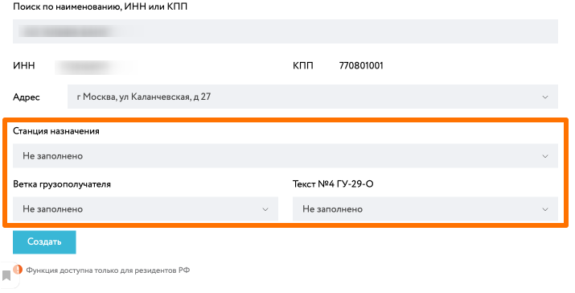

# Добавление нового грузополучателя

При оформлении заявки на производство по договору прямой реализации можно добавить нового грузополучателя в список. Для этого необходимо нажать на кнопку "Новый грузополучатель".

В открывшейся форме предоставляется пользователю два режима поиска юридических лиц грузополучателей:

  - **Быстрый поиск** - простой поиск по всем по любым данным юр.лица, если не найдено, то пользователю требуется перейти к расширенному поиску.
 
  - **Расширенный поиск** -  используя быстрый поиск найти необходимое юр.лицо. 

 ## Быстрый поиск грузополучателя

В режиме быстрого поиска отображается только одна поисковая строка. Для быстрого поиска организации клиент может искать как по названию, так и по реквизитам любой организации РФ*. 

Система отображает поисковые подсказки для облегчения процесса.

После выбора организации отображается список доступных адресов.  Если нужного адреса нет в списке,  клиент может инициировать создание нового адреса.

Для поиска адреса отображается интерактивная Яндекс-карта

::: tip Примечание*
Добавление грузополучаелей доступно только для компаний резидентов РФ. Если вам необходимо добавить грузополучаеля-нерезидента, обращайтесь к ответственному мидл офицеру сопровождающй ваш договор.
:::

После выбора адреса найденной компании, вы можете переходить к [процессу добавления грузополучателя и сохранения его в вашем списке](/guide/order/consignee.html#добавnение-грузопоnучатеnя).

 ## Расширенный поиск грузополучателя

В режиме расширенного поиска отображается форма поиска компаний по отдельным сущностям:
 - Наименованию компании
 - ИНН
 - КПП
 - ОКПО
 - Коду НЛМК (SAP)

::: tip Примечание
Искать можно по частичному совпадению, т.е. в названии компании или ее реквизитах можно указывать только часть информаци. В этом случае будут найдены все организации, которые попадают под ваш поисковый запрос.
:::

После выбора найденной компании, процесс добавления грузополучателя и его адреса идентичный как в [быстром поиске выше](/guide/order/consignee.html#быстрый-поиск-грузопоnучатеnя).

 ## Добавление грузополучателя

Когда юр.лицо найдено, вы можете заполнить поля: станция назначения, ветка грузополучателя и текст №4 ГУ-29-О, если планируете использовать данного грузополучателя в качестве ЖД доставки.

Если юр.лицо не найдено, то будет отображено сообщение об ошибке и требуется связаться с миди-офицером, для дальнейших действий. 

Не забудьте нажать кнопку "создать" для сохранения грузополучаетя и его адреса в вашем списке.

::: warning Важно понимать
В случае если в заказе был добавлен грузополучатель **с новым адресом, которого не было в списке у данного юридического лица**, данная заявка требует [проверки сотрудником мидл офиса](/guide/order/consignee.html#проверка-адреса-мидn-офисом), который ведет ваш договор используемый в заявке.
Пока идет проверка, вам как клиенту отображается новый статус «На подтверждении мидл-офицеру» как в списке заявок, так и на странице заявки.

:::

После проверки и подтверждения адреса сотрудником мидл офиса, грузополучатель с новым адресом передается в систему MDG и после подтверждения, заявка автоматически отправляется в SAP ERP после.

Если адрес был отклонен мидл офисом, в этом случае заявка возвращается в статус «Черновик» и клиенту отображается соответствующее уведомление на странице заявки.

См. далее 
- **[Оформление заявки на производство (ЗНП)](/guide/order/checkout.html)**
- **[Статусная схема заказов](/guide/order/status.html)**

## Проверка адреса мидл-офисом

Для заказов, где требуется проверка и подтверждение новых адресов, сотрудник мидл офиса получает email уведомление с информацией об организации и новом адресе и прямой ссылкой на заказ.

См. далее 
- **[Оформление заявки на производство (ЗНП)](/guide/order/checkout.html)**
- **[Статусная схема заказов](/guide/order/status.html)**
