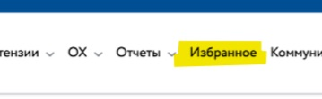
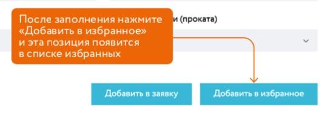
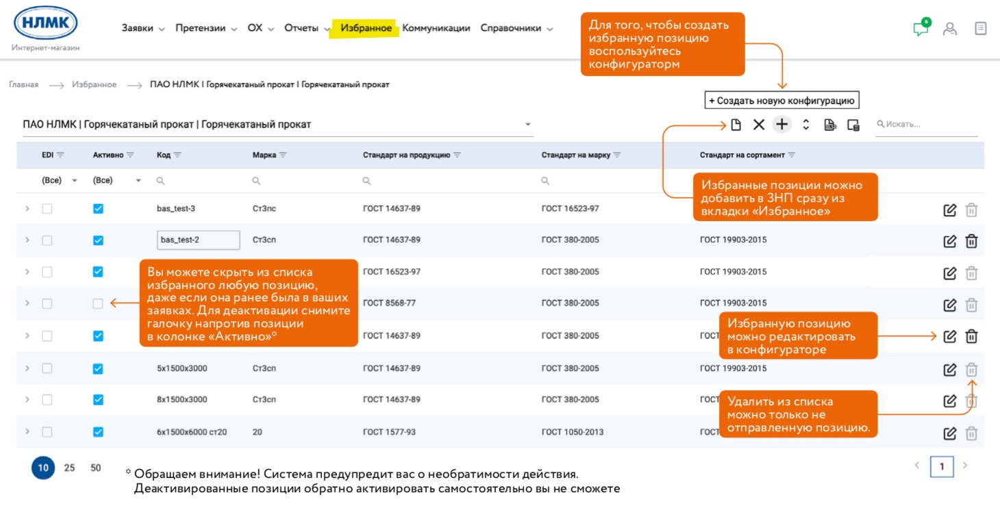
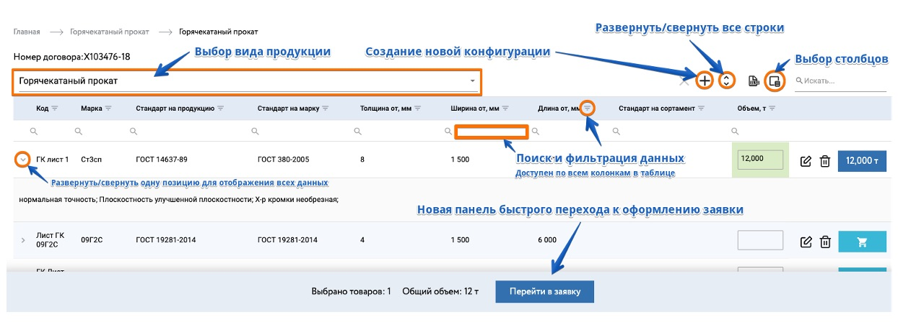
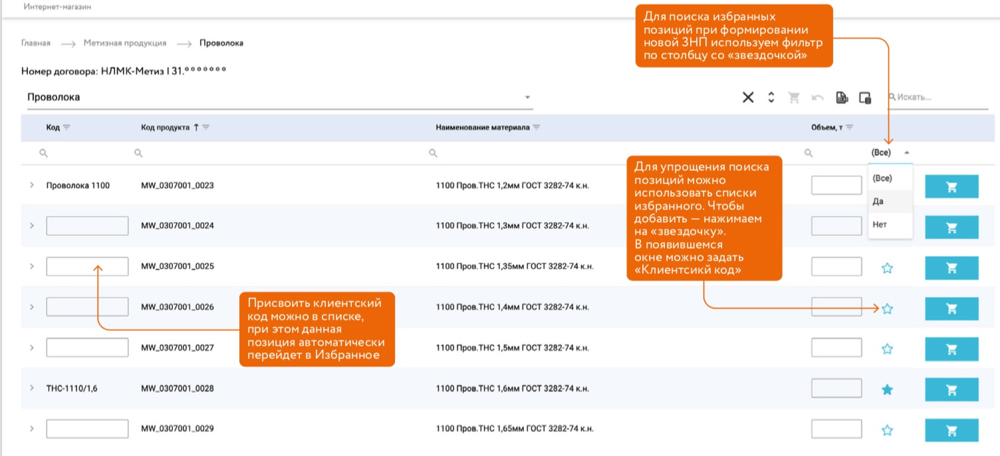
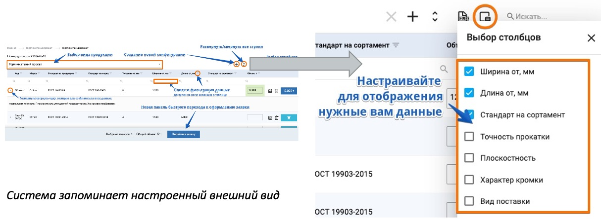
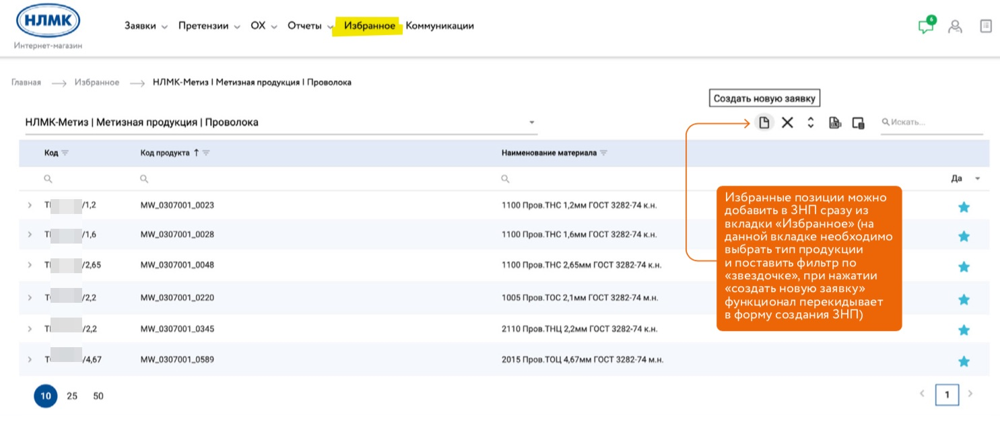

# Шаблоны продукции (избранное)

Для переиспользования материалов от одной заявки к другой, удобней всего использовать шаблоны продукции (избранное).
Основная идея заключается в том, чтобы вы могли отметить наиболее востребованные вами материалы специальным признаком (уникальный код избранного) и для следующих заявок быстро выбирать из списка материалов. 

А для конфигурируемой продукции ПАО дополнительно сократить временные затраты на конфигурирование одних и тех же матреиалов каждый раз.

Функционал работы с избранным доступен как в при оформлении заявки, так и в отдельном разделе главного меню.

При переходе в раздел "Избранное" необходимо выбрать площадку и вид продукции после чего появятся все ваши позиции избранного.
В то же время при оформлении заявки вы аналогично выбираете вид продукции и точно также вам доступны все ваши позиции избранного.

Есть небольшие отличия в работе с таблицей избранного для ПАО и СОРТа

## Избранное для конфигурируемой продукции ПАО

Для конфигурируемой продукции ПАО и ВИЗ сталь для добавления продукции в избранное, вам необходимо ее [сконфигурировать](/guide/order/pc.html).

В конфигураторе вы увидите кнопку добавления в избранное.

Таблица избранного для конфигурируемой продукции ПАО в разделе "Избранное"

::: warning Важно понимать
Если вы сделали хотя бы один заказ с использованием позиции избранного, то удалить или переименовать данную позицию избранного уже нельзя. Но ее можно деактивировать (выключить)
:::

При оформлении заявки таблица имеет похожий вид но с дополнительной возможностью указания тоннажа и добавления позиций в текущую заявку.

## Избранное для СОРТовой готовой продукции

Для готовой продукции СОРТовых площадок НЛМК отображается весь каталог продукции, где вы при помощи фильтров можете найти нужну. вам продукцию и добавить ее в избранное. 

Для этого достаточно указать **уникальный** клиентский код и нажать иконку звездочки.

Также вы можете настроить под себя удобный вид таблицы выбран необходимые вам характеристики

Смотрите подробнее [как работать с таблицами](/guide/dx.html)

В отдельном разделе "Избранное" главного меню таблица имеет похожий вид но без возможности указания тоннажа и добавления позиций в заявку. 

Если вам необходимо позицию добавить в заявку, есть функционал быстрого создания новой заявки

Далее вы перемещаетесь стандартно по [процессу оформления ЗНП](/guide/order/checkout.html)