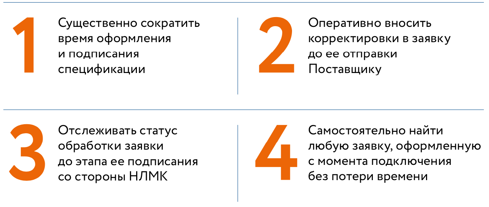
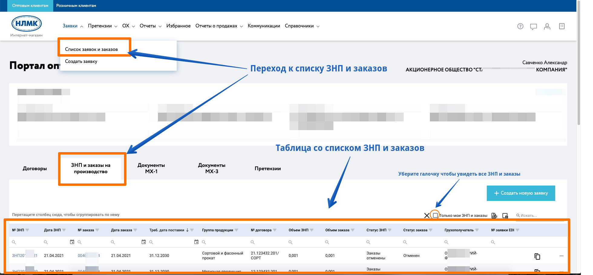
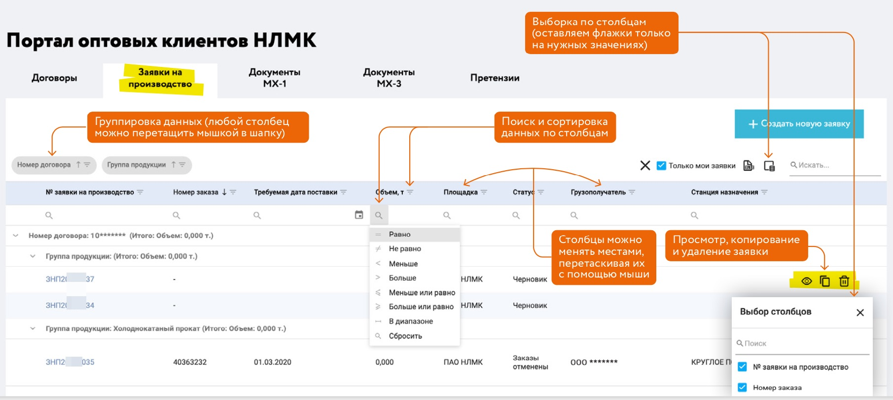

# Заявки на производство

## Общие сведения
Функционал работы с заявкой на производство предназначен для предоставления клиенту возможности самостоятельно, посредством системы через личный кабинет:

- [оформлять заявку](/guide/order/new.html) на продукцию ПАО "НЛМК", "ВИЗ Сталь", АО "НЛМК-Урал", АО "НЛМК-Калуга" или ООО "НЛМК-Метиз" под прямой выкуп или под ответственное хранение;
- [конфигурировать продукцию](/guide/order/pc.html)* для индивидуального производства под требования заказчика;
- [управлять грузополучателями](/guide/order/consignee.html)** для оформления заявок;
- скачивать и загружать спецификацию к заказу для согласования с производством***.

 ### Формирование заявок на производство через Личный кабинет Покупателя позволяет

## Список заявок и заказов

Для просмотра ваших заявок на производство (далее ЗНП), а также созданных сбытовых заказов необходимо перейти на вкладку "ЗНП и заказы на производство" или выбрать соответствующий пукнт "Список заявок и заказов" в главном меню:

Таблица имеет широкие возможности по настройке внешнего вида, а также фильтрации и поиска, что позволяем вам эффективно работать с данными так как вам удобно.

Более подробно вы можете ознакомится в соответствующем разделе нашей документации "[Работа с табличными данными](/guide/dx.html)"

::: tip Примечания
 *Конфигурирование продукцию доступно только для площадок ПАО "НЛМК" и "ВИЗ Сталь" где под ваши требования выплавляется металл с уникальными, указанными вами характеристиками. 

  **Добавление грузополучателя доступно только для оформления заявок по договорам прямой реализации. Для договоров хранения список регламентируется доп. соглашением к договору.

 ***Скачивание и загрузка спецификации доступна только для клиентов не перешедших на ЭДО.
:::

::: warning Важно понимать
Оформленные через личный кабинет заявки имеют приоритетное рассмотрение при согласовании ваших спецификаций к сбытовым заказам с отделом управления сопровождения продаж НЛМК.

[Подключайтесь к личному кабинету Клиент инфо 2](/guide/#как-подкnючиться), если вы еще не с нами.
:::