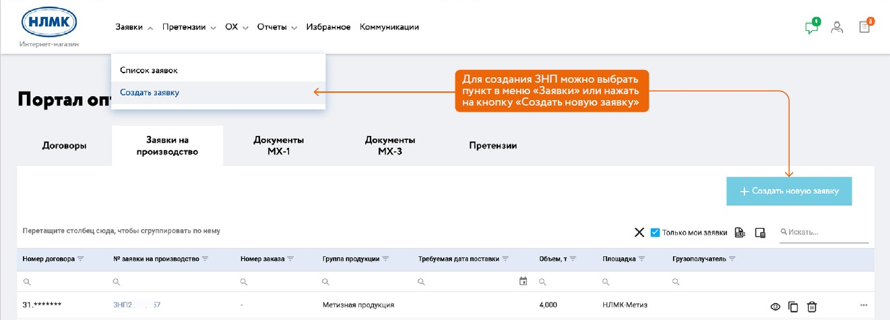
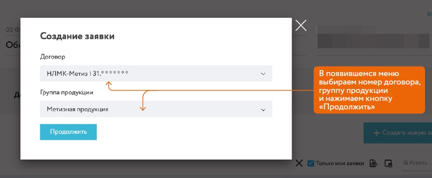
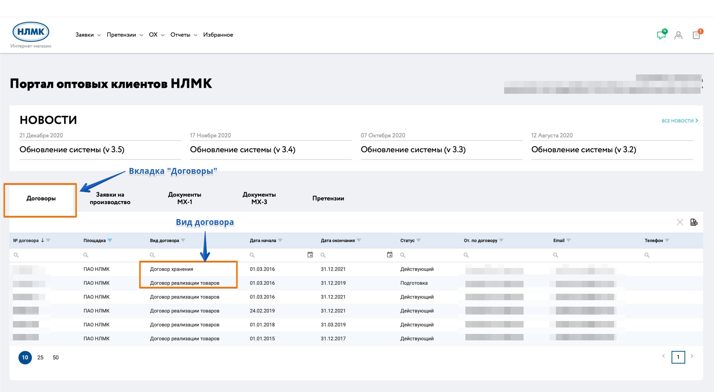
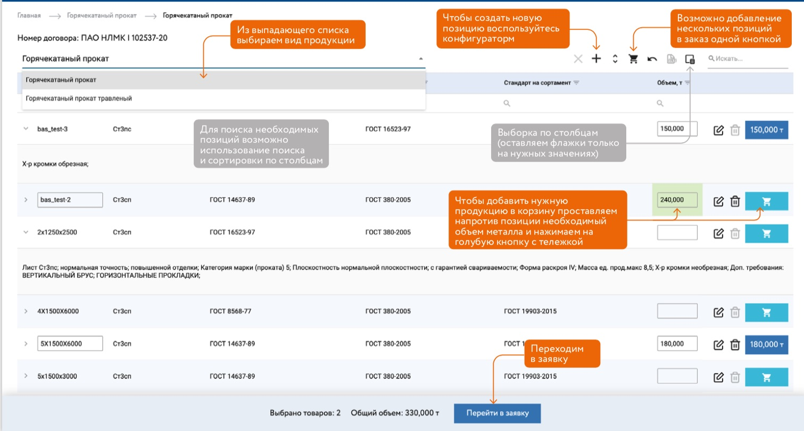
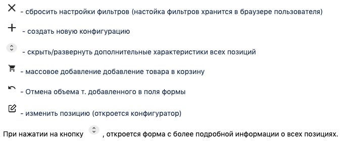
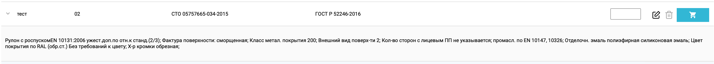
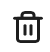
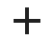
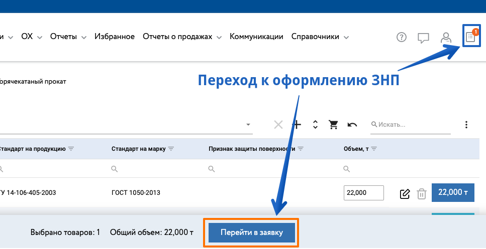
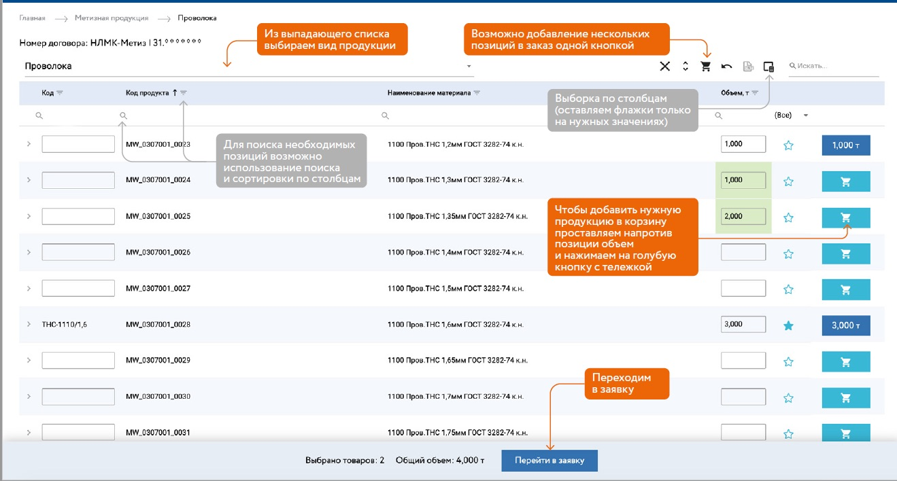

# Создание новой заявки на производство (ЗНП)

Для создания новой заявки на производство (далее ЗНП) необходимо перейти на вкладку "Заявки на производство" или вызвать функцию создания новой заявки в меню:

В открывшемся окне необходимо выбрать договор соответствующего типа и группу продукции. Затем нажать кнопку «Продолжить»:

Для оформления заявки на производство под ответственное хранение, необходимо выбрать договор с типом «Договор хранения», 

Для оформления заявки на производство под прямую реализацию, необходимо выбрать договор с типом «Договор реализация товаров».

::: tip Примечание
Тип договора можно узнать в таблице Договоров:

:::

Далее, в зависимости от выбранного договора и группы продукции открывается страница группы продукции:

### Площадки ПАО "НЛМК" и "ВИЗ Сталь" 
Для продукции ПАО "НЛМК" и "ВИЗ Сталь" открывается каталог конфигурируемой продукции.

На странице группы конфигурируемой продукции отображен список позиций, добавленных ранее в избранное (если таких позиций нет, то будет пусто). Доступен выбор вида продукции. По-умолчанию подставляется вид продукции первый из списка конфигуратора.

При добавлении позиции в список избранного можно присвоить клиентский код. [Подробнее как работать с избранным](/guide/order/favorite.html)

Для добавления позиции в заявку из списка избранного, необходимо ввести нужный объем в тоннах и нажать кнопку "Добавить к заявке".

::: tip Полезно знать
Клиент сам определяет какие ТХ (столбцы) необходимы в качестве материалообразующих и включает/отключает отображение их в таблице. Данные также сохраняются локально в браузере пользователя. Более подробно вы можете ознакомиться по ссылке "[Работа с табличными данными](/guide/dx.html)"
:::

Меню управления:

Для удаления позиции из списка избранного, необходимо нажать иконку  и подтвердить или отменить действие в открывшемся окне подтверждения (если иконка серая, то нельзя удалить позицию так как с ней связана ранее созданная заявка).

Для перехода к [конфигурированию новой позиции](/guide/order/pc.html), необходимо нажать кнопку . Кнопка доступна, если на форме выбран вид продукции.

После того, как вы добавили все нужные вам материалы в заявку для оформления ЗНП необходимо перейти на страницу корзины заявки.
Это можно сделать лиьбо по кнопке ["Перейти в заявку"](/guide/order/checkout.html) внизу страницы или иконке корзины ЗНП в правом верхнем углу, где отображается маркер с количеством SKU в вашей текущей заявке.

Быстрый переход к следующим разделам: 
- **[Конфигурирование продукции](/guide/order/pc.html)**
- **[Работа с шаблонами продукции (избранное)](/guide/order/favorite.html)**
- **[Управление грузополучателями](/guide/order/consignee.html)**
- **[Оформление заявки на производство (ЗНП)](/guide/order/checkout.html)**
- **[Статусная схема заказов](/guide/order/status.html)**

### Площадки СОРТового дивизиона 

Для продукции АО "НЛМК-Урал", АО "НЛМК-Калуга" и ООО "НЛМК-Метиз" открывается каталог готовой сортовой или метизной продукции, с уникальным ассортиментом в зависимости от выбранной организации.

Разница с с каталогом ПАО "НЛМК" или "ВИЗ Сталь" в том, что здесь нет конфигурируемой продукции. Вы работаете уже с готовым набором SKU и выбираете продукцию из наличия по вашим параметрам.

Меню управления идентично каталогу ПАО "НЛМК" за исключением кнопки конфигурируемой продукции.

Для частоиспользуемых материалов удобно добавить их в избранное. [Подробнее как работать с избранным](/guide/order/favorite.html)

Для добавления позиции в заявку, необходимо ввести нужный объем в тоннах и нажать кнопку "Добавить к заявке".

После того, как вы добавили все нужные вам материалы в заявку для оформления ЗНП необходимо перейти на страницу корзины заявки.
Это можно сделать лиьбо по кнопке ["Перейти в заявку"](/guide/order/checkout.html) внизу страницы или иконке корзины ЗНП в правом верхнем углу, где отображается маркер с количеством SKU в вашей текущей заявке.

См. далее 
- **[Работа с шаблонами продукции (избранное)](/guide/order/favorite.html)**
- **[Управление грузополучателями](/guide/order/consignee.html)**
- **[Оформление заявки на производство (ЗНП)](/guide/order/checkout.html)**
- **[Статусная схема заказов](/guide/order/status.html)**