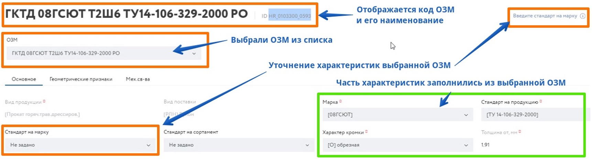

# Работа с конфигуратором продукции

Для работы с конфигуратором, нажмите иконку +

Конфигуратор продукции по своей сути является большой формой со всеми возможными характеристиками материалов.
Так как полей много, визуально форма разделена на несколько логических вкладок.
Количество полей и вкладок зависит от выбранного вида продукции.
Каждая вкладка содержит поля, в которые необходимо ввести значение или выбрать значение из списка. 

::: tip Примечание
Обязательные поля отмечены звездочкой.
Необходимо заполнить обязательные поля, следуя подсказкам на странице конфигуратора.
:::

::: warning ВАЖНО!
Использование конфигуратора подразумевает заполнение полей шаг за шагом. Между шагами необхоимо дождаться информационного сообщения "конфигурация обновлена".

:::

При введении недопустимых значений система отображает предупреждение на вкладке и значении. Перейдя в неё можно исправить значение и продолжить процесс конфигурирования. Если ошибок допущено много или они сложные, то появляется отдельная вкладка слева от остальных с названием "Ошибки конфигурации", в ней перечислены все ошибки и конфликты с возможностью исправления. 

**Ошибка (простой вид)**

Отображается, например, при вводе числа в неправильном формате.

**Ошибка (сложный вид)**

Отображается, например, при недопустимой комбинации характеристик или вводе невалидного числа выходящего за рамки диапазона допустмых значений.

Варианты типов полей конфигуратора: 

 - Выбор из списка - пользователь может выбрать одно подходящее значение
 - Произвольный ввод - пользовать может заполнить значение путем ввода необходимого значения
 - Мультивыбор из списка - пользователь может выбрать один или несколько параметров  

Когда все обязательные поля заполнены, система отображает сообщение, что конфигурация заполнена. Можно добавить её к заявке и перейти к оформлению заявки или конфигурированию следующей позиции.

### Подбор ОЗМ в процессе работы с конфигуратором продукции

Наличие подобранной ОЗМ гарантирует совместимость с производственными возможностями комбината ПАО НЛМК. В процессе работы с конфигуратором вы можете видеть подходящие ОЗМ согласно выбранным характеристикам.

После выбора ОЗМ отображается всплывающее окно с перечислением параметров выбранной ОЗМ.  Для подтверждения выбора необходимо нажать кнопку "Да"

После выбора ОЗМ и подтверждения клиентом, система автоматически заполнит поля конфигуратора значениями из выбранной ОЗМ. Дополнительное уточнение незаполненных характеристик возможно и отдается на усмотрение клиенту.

Если по итогам конфигурирования не подобралась ни одна из ОЗМ, система примет позицию, но при этом будет отображаться предупреждающий текст

Сконфигурированную продукцию можно добавить в список избранного, нажав на кнопку "[Добавить в избранное](/guide/order/favorite.html)" или можно сразу добавить позицию в заявку, нажав кнопку "[Добавить в заявку](/guide/order/checkout.html)".

См. далее 
- **[Работа с шаблонами продукици (избранное)](/guide/order/favorite.html)**
- **[Управление грузополучателями](/guide/order/consignee.html)**
- **[Оформление заявки на производство (ЗНП)](/guide/order/checkout.html)**
- **[Статусная схема заказов](/guide/order/status.html)**

