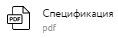

# Информация по заказам и статусы

После отправки ЗПН на рассмотрение и создание сбытового заказа в учетной системе SAP ERP компании НЛМК, вам будет доступна страница просмотра деталей ЗПН и заказа.

## Детали ЗПН

На странице деталей заявки на производство отражена следующая информация:

 - Номер заявки на производство
 - Номер договора, по которому оформлена заявка
 - Статус заявки на производство
 - На рассмотрении - заявка отправлена в учетную систему НЛМК, но заказы ещё не созданы,
 - Созданы заказы - по заявке вернулись созданные заказы из учетной системы НЛМК. Информация о заказах доступна на этой же странице ниже.
 - Ответственный по договору
 - Вид оплаты - значение, выбранное из списка при оформлении заявки
 - Способ поставки - ж/д доставка или самовывоз, выбрано при оформлении заявки
 - Требуемая дата поставки - выбрана при оформлении заявки
 - Грузополучатель
 - Пункт отгрузки
 - Станция назначения
 - Комментарий, введенный при оформлении заявки
 - Позиция и объем позиции в заявке
 - Общий тоннаж заявки на производство
 - Статус избранного
   - Если на позиции отображается иконка , значит позиция в списке избранного
   - Если на позиции отображается иконка , значит позиция ещё не добавлена в список избранного. Нажатием можно добавить позицию в список избранного со страницы деталей заявки на производство.
 - Скачать заявку
   - При нажатии на кнопку , в браузере пользователя начнется скачивание файла
   - Название файла  "ЗНП <Номер документа> <ДД.ММ.ГГГГ.><ЧЧ.ММ.СС>.XLS"

::: tip Примечание
После скачивания файл рекомендуется открывать в MS Office Excel версии 10 и более поздних.
::: 

На странице деталей заявки на производство заявку можно скопировать, нажав на функцию копирования .

## Детали заказа
На странице деталей заказа на производство отражена следующая информация:

 - Номер заказа в учетной системе НЛМК
 - Статус заказа
 - Перечень позиций заказа и объем
 - Общий тоннаж

 

 При загрузке спецификации к заказу со стороны НЛМК, на странице деталей заказа отображается статус спецификации .

На странице деталей заказа при готовности спецификации отображается иконка для скачивания спецификации . При нажатии запускается процесс скачивания файла на устройство пользователя.

Также еа странице деталей заказа также доступна функция загрузки спецификации, для этого необходимо выбрать или перетащить файл с подписанной спецификацией в область загрузки спецификации. Затем нажать кнопку загрузки спецификации:

 

При загрузке спецификации со стороны клиента на странице деталей заказа отображается статус спецификации "Подписана клиентом"

 

::: tip Примечание
При необходимости можно изменить загруженный файл, для этого необходимо загрузить новый файл со спецификацией.
::: 

## Корректировка или аннуляция заказа

Для внесения изменений в заказ необходимо нажать на функцию редактирования , заполнить форму или прикрепить файл для изменения и отправить запрос. 

Для аннулирования заказа необходимо нажать на функцию аннулирования , заполнить форму или прикрепить файл и отправить запрос.

::: tip Примечание
Отправить запрос на изменение или на аннуляцию заказа возможно и доступно в любом статусе заказа. Однако нужно понимать, что обработка запросов происходит в ручном режиме, поэтому при определенных статусах и состояних заказа уже невозможно реально внести изменения в ваш заказ. По всем интересующим вас вопросах, пожалуйста, консультируйтесь с вашим ответственным мидл офицером сопровождающий ваш договор.
::: 

