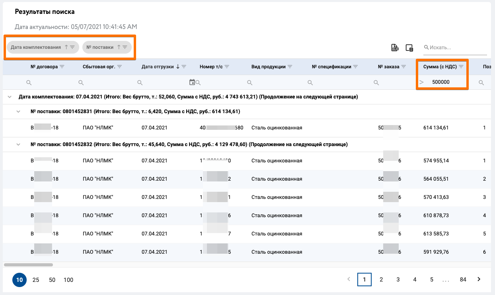
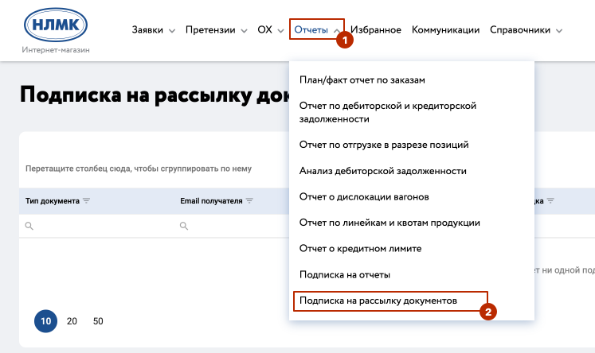
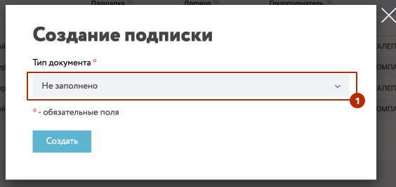

# Отчеты

## Общие сведения

Функционал работы с отчетностью предназначен для предоставления клиенту возможности самостоятельно, посредством системы через личный кабинет, формировать, просматривать и выгружать следующие отчеты:

* Отчет по дебиторской и кредиторской задолженности
* Анализ дебиторской задолженности
* План/факт отчет по заказам
* Отчет об отгрузке в разрезе позиций
* Отчет о дислокации вагонов

Кроме того, вам доступна подписка на отчеты, которые будут автоматически выгружаться на вашу электронную почту.

Для того чтобы сформировать отчет в личном кабинете Commerce Cloud, необходимо на любой странице в меню нажать на "Отчеты" и выбрать необходимый отчет:

В результате будет открыта форма для настройки выгрузки выбранного отчета.

## Отчет по дебиторской и кредиторской задолженности

В форме просмотра отчета, необходимо выбрать один или несколько договоров, а также указать период выгрузки, за который необходимо выгрузить отчет.

При нажатии на кнопку "Просмотр отчета" будет запущен запрос в учетную систему НЛМК и через некоторое время отчет отобразится на странице личного кабинета.

При нажатии на "Сброс фильтров" поля фильтрации будут очищены.

::: tip Примечание
Договоры, по которым запрашивается отчет в рамках одного запроса, должны относиться к одной сбытовой организации, иначе система выдаст предупреждение

:::

По готовности отчета данные отображаются на странице личного кабинета.

В таблице отчета отражена следующая информация:

* Номер и дата документа
* Валюта
* Сумма по дебету
* Сумма по кредиту

Значения в таблице могут быть сгруппированы по одному или нескольким столбцам. При нажатии на иконку `Excel` , отчет будет выгружен в excel файл.

Доступен функционал фильтрации данных по колонкам. Узнать как удобно и эффективно работать с таблицами вы можете прочитать по ссылке [Работа с табличными данными](/guide/dx.html)

Для повторного поиска, пожалуйста, нажмите на иконку `Фильтры`  после чего откроется форма настройки фильтров для отчета. Таким образом можно ввести новые значения и выгрузить отчет.

Кроме того, вы можете выгрузить печатную форму акта сверки на любой диапазон дат проводки.

Выгрузка доступна после формирования отчета по дебиторской кредиторской задолженности.

Формат печатной формы соответствует всем требованиям вашей бухгалтерии.

## Анализ дебиторской задолженности

Теперь вы можете отслеживать задолженность на любую дату.
 
Найти новый отчет можно в основном меню системы.

После перехода в раздел отчета, заполните форму и нажмите кнопку «Просмотр отчета».

Все поля обязательны к заполнению.

Система отображает всю вашу задолженность на указанную дату по выбранным договорам.

Доступен весь стандартный функционал при работе с таблицами отчетов (сортировки, группировки, выбор столбцов и представлений) включая выгрузку в Excel.

##  План/факт отчет по заказам

На форме настройки фильтров для отчета, необходимо выбрать один или несколько договоров, а также период выгрузки, за который необходимо выгрузить отчет. Дополнительно можно указать номер заказа.

::: tip Примечание
Договоры, по которым запрашивается отчет в рамках одного запроса, могут относиться к разным сбытовым организациям. 
:::

При нажатии на кнопку "Просмотр отчета" будет запущен запрос в учетную систему НЛМК и через некоторое время отчет отобразится на странице личного кабинета.

При нажатии на "Сброс фильтров" поля фильтрации будут очищены.

По готовности отчета данные отображаются на странице личного кабинета.

Значения в таблице могут быть сгруппированы по одному или нескольким столбцам. Для этого необходимо перетащить нужные столбцы в область группировки 

При нажатии на иконку `Excel` , отчет будет выгружен в excel файл.

Доступен функционал выбора столбцов 

Доступен функционал фильтрации данных по колонкам. 

Узнать как удобно и эффективно работать с таблицами вы можете прочитать по ссылке [Работа с табличными данными](/guide/dx)

Для повторного поиска, пожалуйста, нажмите на иконку `Фильтры`  после чего откроется форма настройки фильтров для отчета. Таким образом можно ввести новые значения и выгрузить отчет.

На рисунке представлен вид отчета с результатами группировки по столбцам "ГОСТ/ТУ Продукции", "Заказ", и фильтрации по Цене без НДС ≥ 30000, столбцы "Требуемая дата поставки" и "Вид продукции" скрыты для отображения:

## Отчет об отгрузке в разрезе позиций

На форме настройки фильтров для отчета, необходимо выбрать один или несколько договоров, а также период выгрузки за который необходимо выгрузить отчет. 

Таким образом, должна быть заполнена хотя бы одна пара полей для указания дат ("Дата отгрузки с"/"Дата отгрузки по" или "Дата комплектования с"/"Дата комплектования по" ).
В противном случае система выдаст ошибку

Дополнительно можно указать Вагон, № Сертификата, Номер заказа, Ж/Д квитанция.

::: tip Примечание
Договоры, по которым запрашивается отчет в рамках одного запроса, могут относиться к разным сбытовым организациям. 
:::

При нажатии на кнопку "Просмотр отчета" будет запущен запрос в учетную систему НЛМК и через некоторое время отчет отобразится на странице личного кабинета.

При нажатии на "Сброс фильтров" поля фильтрации будут очищены.

По готовности отчета данные отображаются на странице личного кабинета.

Значения в таблице могут быть сгруппированы по одному или нескольким столбцам. Для этого необходимо перетащить нужные столбцы в область группировки 

При нажатии на иконку `Excel` , отчет будет выгружен в excel файл.

Доступен функционал выбора столбцов 

Доступен функционал фильтрации данных по колонкам. 

Узнать как удобно и эффективно работать с таблицами вы можете прочитать по ссылке [Работа с табличными данными](/guide/dx)

После выгрузки отчета вы сможете скачивать документы, нажав на иконку скачивания .

* Колонка "№ заказа" содержит ссылки на спецификацию
* Колонка "№ поставки" содержит ссылки на сертификат и транспортные документы
* Колонка "№ счета-фактуры" содержит ссылки на счета фактур.

::: tip Примечание!
Отчет содержит много колонок и не все они разумеется помещается на экран. Поэтому для клиента доступна горизонтальная прокрутка, а также выбор колонок и сохранение настроенного представления
:::

::: warning Важно!
После нажатия на сcылку  нужно подождать 1-2 сек, пока формируется архив для скачивания.
Не нужно кликать многократно.
::: 

Для повторного поиска, пожалуйста, нажмите на иконку `Фильтры`  после чего откроется форма настройки фильтров для отчета. Таким образом можно ввести новые значения и выгрузить отчет.

На рисунке представлен вид отчета с результатами группировки по столбцам "Дата комплектования", "Номер поставки", и фильтрации по Сумме заказа > 500 000:

## Отчет о дислокации вагонов

В режиме реального времени вы можете отслеживать местонахождение вагонов и заказов в них.
 
Найти новый отчет можно в основном меню системы.

После перехода в раздел отчета, заполните форму и нажмите кнопку «Просмотр отчета» или сразу просто нажмите кнопку.

В данном отчете все поля опциональные для заполнения

Система отображает все ваши вагоны на карте находящиеся в пути.
Также доступно табличное представление отчета под картой

Для вашего удобства и единообразия интерфейсов форма имеет настройки представлений, которые работают аналогичным образом, как и в других отчетах.

::: tip Примечание
Функционал отчета дислокации вагонов доступен в экспериментальном режиме для отгрузок с площадки ПАО НЛМК г. Липецк. В ближайшее время появятся данные для отгрузок с других площадок Урал, Калуга и Метиз. Следите за анонсами в новостях на сайте.
:::

## Подписка на отчеты

Вы можете для любого отчета настроить email подписку.

Отчеты будут автоматически выгружаться и отправляться на ваш email адрес по заданному вами расписанию.

Для управления подписками, пожалуйста, перейдите по ссылке в соответствующем пункте меню

Управляйте вашими рассылками:

* Создавайте новые подписки
* Редактируйте созданные подписки
* Удаляйте или временно деактивируйте неактуальные рассылки
* Копируйте ранее созданные подписки, для настройки дополнительного расписания выгрузок

Для создания новой подписки, заполните форму.

::: tip Обратите внимание
Для настройки диапазона дат выгружаемых данных, в форме необходимо указывать количество дней (целое число от -365 до 365) относительно даты запуска по расписанию.

Так, например, указав -7 дней с активацией еженедельно в понедельник каждую неделю с датой начала подписки 01.02.2021 в 10:00, это будет означать что вы будете получать данный отчет по понедельникам в 10 утра МСК начиная с 01 февраля и с выборкой данных за прошедшие 7 дней. Таким образом в понедельник 01.02.2021 вы получите отчет с датами отгрузки с 25 января по 01 февраля, т.е. минус 7 дней относительно даты запуска.
:::

## Подписка на рассылку документов

Кроме подписок на получение отчетов, вы можете настроить email подписку на рассылку сертификатов.

Для того чтобы настроить рассылку документов в личном кабинете Commerce Cloud, необходимо на любой странице в меню нажать на "Отчеты" и выбрать пукнт меню "Подписка на рассылку документов"

Откроется страница рассылки документов

На странице рассылки документов доступны следующие элементы управления и навигации:

1.  добавить новую подписку

2.  По умолчанию при переходе на страницу подписок фильтр установлен. Отображаются только собственные подписки. Если галочку снять отображаются все подписки сотрудников компании;

3.  Поиск по подпискам, функционал аналогичен поиску на других страницах сайта;

4.  экспортировать все в XLS, после нажатия запустится автоматическое скачивание файла содержащего всех отображенных на экране подписок;

5.  изменить отображение столбцов, пользователю доступные варианты вкл/выкл столбцов из табличной части:

код подписки
тип документа
email получателя
ФИО получателя
Площадка
Договор
Грузополучатель

**Создание подписки**

При нажатии на иконку  откроется всплывающее окно, в котором необходимо выбрать тип документа "Сертификат качества".

В отобразившемся окне, необходимо заполнить обязательные поля отмеченные *.

::: tip Заполнение полей формы
**Обязательные поля**
- Тип документа
- Получатель 

**Необязательные поля**
- Площадка
- Договор
- Грузополучатель 
:::

*Варианты заполнения полей:*

**Обязательные поля:**

- Тип документа - выбран на этапе создания подписки
- Получатель - выбрать пользователя из списка получателя отчета, если в списке получателя нет, то вы можете его добавить нажав на кнопку "Добавить нового получателя". При выборе в списке меню получателя или вариант "Добавить нового получателя" в форму создания подписки Рис.4 будут добавлены два дополнительных поля "ФИО Получателя" и "Email получателя"

**Необязательные поля:**

- Площадка - доступен выбор по какой площадке требуется сертификат. 
- Договор - доступен выбор по какому договору требуется сертификат. 
- Грузополучатель - доступен выбор по какому ГП требуется сертификат. 

После заполнения обязательных полей для завершения настройки необходимо нажать кнопку "Создать" (см. Рис.5). Окно настроек будет закрыто, в табличном списке подписок на рассылку документов, будет добавлена новая запись.

**Создание подписки - завершение настройки**

**Элементы управления подпиской**

В табличной форме страницы представлены текущие подписки и доступны элементы управления: 

 -  Редактирование подписки, при нажатии осуществляется переход на страницу создания новой подписки с предзаполненными данными, параметров отчета, расписания;
 -  При нажатии осуществляется Активация/деактивация подписки;
 -  Копирование подписки, при нажатии осуществляется переход на страницу создания новой подписки с предзаполненными данными, параметров отчета, расписания;
 -  Удаление подписки. Доступно удаление только собственных подписок;

**Пример письма с сертификатом качества**

::: tip Обратите внимание как отправляется сертификат качества: 
 - Каждые 30 минут происходит отправка (при условии что создана поставка и есть сертификат в эл.архиве учетной системы ERP НЛМК)
 - Письмо отправляется непосредственно учетной системы ERP НЛМК от технического пользователя **sdpiuser@nlmk.com** сразу вам на вашу почту
 - Если подписка и не пришло письмо, значит нет поставки или сертификат в эл.архиве или подписка оформлена не на того пользователя. (распространений кейс)
:::

::: warning Обратите внимание
Если письмо не пришло, то первое что необходимо проверить, корректность данных в созданной подписке (договор/грузополучатель/площадка).

А также проверить наличие писем в папке спам.

Если возникли другие трудности с получением сертификата, вы можете обратиться в службу поддержки Клиент инфо 2 по адресу clientinfo@nlmk.shop

Мы доступны с 9 до 19 часов по московскому времени, 5 рабочих дней в неделю.
:::